# LunaFlow 小程序 UI/UX 设计与交互说明

版本：V1.0 · 设计基线日期：2026-09-23

本目录保存 U01—U20 共20张高清界面设计图。本文说明各图对应的用户任务、左右视图、主要操作、页面跳转和异常恢复，供产品、设计、前后端及测试协作使用。

**业务与技术基准：[LunaFlow 小程序技术 PRD V1.0](../report/LunaFlow_小程序技术PRD_V1.0.md)。**设计图用于表达布局、信息层级与关键交互，不是可执行前端，也不是完整状态清单。图中未画出的登录、授权、支付处理中、库存变化、退款、弱网和数据不足等状态仍须按 PRD 实现。若图片中的简化文字、日期、数值、图标或状态表达与 PRD 冲突，以 PRD 为准，并同步修订设计，不用图片覆盖业务约束。

## 1. 设计范围与示例数据

本版服务由**极简经期记录、AI个人回顾、每个已付服务期一次自主领取的护理组合**构成。首发针对“省事补给型”需求，用“记录回顾型”诉求作对照；这些是待验证画像，不是已经取得投放证明的人群结论。

| 项目 | 本套稿件约定 | 实现要求 |
| --- | --- | --- |
| 产品名 | LunaFlow | 工作名称，不代表商标或平台主体审核已经完成 |
| 服务名 | 关护月度服务 | 正式前端、订单、协议及客服使用同一命名 |
| 价格 | ¥39.90／期，图中部分简写为“月” | **仅示例价格**，生产使用已发布且不可变的方案版本；不写死在客户端 |
| AI额度 | 每期60次整理、4次回顾 | **仅示例额度**，按购买快照展示；失败不消耗成功额度，缓存不重复扣生成额度 |
| 本期 | 2026-09-23 14:30 至 2026-10-23 14:30 | 上海时区显示，区间为起点包含、终点不包含；实际时间来自服务端 |
| 下一期 | 2026-10-23 14:30 至 2026-11-23 14:30 | 提前付款不会提前开放下一期领取 |
| 续费方式 | 默认单期主动购买 | 不默认为自动续费；U16单独演示已获准、已签约的条件场景 |
| 实物费用 | 已包含约定配送费用，领取时额外应付¥0 | 不在领取阶段临时补运费、补商品差价或收“激活费” |
| 品牌与商品 | 品牌A、B、C及示例规格 | 未代表真实品牌合作、采购成交或实际库存 |
| 发货及客服时段 | 图中如“3个工作日”“工作日09:00—18:00” | 均为设计示例，正式承诺须匹配真实供应商和客服能力 |
| 用户与订单 | 图中姓名、手机、地址、订单号、健康记录 | 均为虚构或脱敏展示，不能作为真实用户案例或效果证明 |

图中护理组合统一按以下示例解释，不把数量或品牌视为已确认销售承诺：

| 组合 | 示例内容 | 选择含义 |
| --- | --- | --- |
| 轻量日用 | 品牌A日用240mm 20片＋品牌B夜用350mm 4片 | 商品规格偏好，不推断健康状况 |
| 日夜常备 | 品牌A日用240mm 16片＋品牌B夜用350mm 8片 | 日用与夜用搭配 |
| 安心夜用 | 品牌B夜用350mm 16片＋品牌C安心裤M码2条 | 夜用品类偏好，不承诺适合所有用户 |

三份组合是三选一，每个已付服务期只能成功领取其中一份；不代表同时获得全部商品。图中“推荐”“沿用上次”表示候选排序，仍需本人确认组合和收货信息。

## 2. 文件目录与页面索引

| 编号 | 页面 | 左侧视图 | 右侧视图 | 图片 |
| --- | --- | --- | --- | --- |
| U01 | 服务介绍 | 上部价值与服务内容 | 下滑后的规则与说明 | [查看](./U01_service-intro.png) |
| U02 | 订单确认 | 条款未勾选、不可付款 | 下滑阅读并主动勾选、可付款 | [查看](./U02_checkout.png) |
| U03 | 支付结果 | 服务端确认成功 | 结果待确认 | [查看](./U03_payment-result.png) |
| U04 | 今天 | 首次无记录 | 已记录开始、结束未记 | [查看](./U04_today.png) |
| U05 | 日期确认与补记 | 正常结束日期确认 | 结束早于开始的冲突 | [查看](./U05_record-edit.png) |
| U06 | 一句话整理 | 输入完成、准备整理 | 整理失败、原文保留 | [查看](./U06_record-compose.png) |
| U07 | AI整理确认 | 可核对的结构化草稿 | 日期含糊、待本人补充 | [查看](./U07_ai-confirm.png) |
| U08 | 回顾首页 | 有历史记录可比较 | 只有一条记录、数据不足 | [查看](./U08_review.png) |
| U09 | AI回顾详情 | 当前有效摘要及来源 | 来源更新、摘要待更新 | [查看](./U09_review-detail.png) |
| U10 | 权益首页 | 本期尚可领取 | 本期已领取、待发货 | [查看](./U10_benefits.png) |
| U11 | 组合详情与对比 | 单个组合详情 | 三种组合对照选择 | [查看](./U11_bundle-compare.png) |
| U12 | 领取确认 | 组合与地址待确认 | 地址不在可配送范围 | [查看](./U12_claim-confirm.png) |
| U13 | 领取与物流详情 | 已受理、等待发货 | 供应异常、补救处理中 | [查看](./U13_fulfillment.png) |
| U14 | 我的 | 登录且本期有效 | 游客状态 | [查看](./U14_me.png) |
| U15 | 会员管理 | 本期有效、下一期待购买 | 下一期提前购买、待生效 | [查看](./U15_membership.png) |
| U16 | 取消自动续费 | 已签约用户确认取消 | 外部协议确认解除 | [查看](./U16_cancel-renewal.png) |
| U17 | 订单与退款 | 已付款、未申请退款 | 申请已受理、领取暂时冻结 | [查看](./U17_refund.png) |
| U18 | 提醒设置 | 站内待办与未预约外部提醒 | 拒绝外部授权后仍保留站内任务 | [查看](./U18_reminders.png) |
| U19 | 隐私与数据 | 数据权利与处理设置 | 停止AI处理的确认层 | [查看](./U19_privacy.png) |
| U20 | 客服与帮助 | 帮助首页 | 工单提交失败、内容保留可重试 | [查看](./U20_support.png) |

各页左右状态用于解释该页面，并不代表同一个用户必须依次经历全部事件。U01、U02主要展示同页滚动及确认过程；其余页主要对照不同业务状态。

## 3. 全局视觉与组件规范

### 3.1 视觉方向

- 暖白作为页面底色，珊瑚色用于主要动作，淡紫用于辅助信息与解释卡；保持低噪声、留白和清晰分组。
- 健康记录区域以用户任务为主，不插入商品瀑布流；权益入口保持可发现，用一张简洁卡片连接服务。
- 页面标题、主结果、金额及主要动作优先；长协议采用详情入口，关键收费、领取、到期及取消规则不能只藏在详情里。
- 状态同时使用图标、文字和必要颜色；不可仅依赖红绿区分成功、处理中或错误。
- 同屏只突出一个主要动作，其余使用次按钮或文字入口；取消、退款和隐私权利不能因视觉弱化而不可发现。

建议把下列视觉值作为组件化实现的起点，最终在真机上统一校准；不要从每张PNG分别取样形成不同主题。

| 设计变量 | 建议值 / 用途 |
| --- | --- |
| 页面底色 | `#FBF9F6`，暖白 |
| 主文字 | `#35343B`，标题及正文 |
| 主要动作 | `#E97875`，珊瑚色；文字对比度需实际检验 |
| 辅助信息 | `#EEE9F5`，淡紫背景 |
| 温和状态底色 | `#E4ECE5`，配合图标与状态文字 |
| 卡片圆角 | 16px等效，组件内保持一致 |
| 正文 | 建议16px等效起步；金额、期限与失效规则不以小字隐藏 |
| 可点击区域 | 建议不低于44×44px等效；小程序按目标机型换算并验收 |

在iOS、Android、小屏和大字体设置下验收截断、换行、键盘及安全区。图片背景上的条件说明属于评审标注；正式页面根据真实能力显隐，并保留相应的用户可读规则。

### 3.2 从图片到真实组件

本目录PNG为栅格设计稿，不能作为整张图片贴进小程序代替界面。实现时应建立统一组件和设计变量，重新排版真实文字。

| 组件 | 统一要求 |
| --- | --- |
| 字体与字号 | 使用合法可用且适配目标系统的中文字体栈；统一标题、正文、辅助文字、金额层级；不要复制不同图片的字体细微差异 |
| 图标 | 选定同一套线性图标，统一尺寸、笔画、基线与选中状态；微信原生导航和授权控件依平台实际样式实现 |
| 页面容器 | 统一左右边距、卡片圆角和卡片间距；适配不同宽度、字体缩放及底部安全区 |
| 按钮 | 明确普通、按压、加载、禁用及完成态；提交中阻止重复点击但保留返回和查看状态路径 |
| 表单 | 标签持续可见；占位符不替代标签；就近显示错误并保留原输入 |
| 状态卡 | 统一待确认、已完成、处理中、失败、异常待补救的图文规则 |
| 底部固定栏 | 不遮挡最后一条内容或协议；金额与重要条款位于按钮附近；键盘弹出时布局可用 |
| 商品卡 | 使用真实合规商品图及发布版本；品牌、规格、数量、费用可读，缺货明确 |
| 弹层 | 明确标题、影响、主次按钮；关闭弹层不应意外提交；破坏性操作只做必要确认 |
| 空态与骨架屏 | 加载、暂无数据、无权限、服务错误分开，不用同一空白页混淆 |

图中字符计数、图标细节、圆角和文字换行可能存在图像生成差异。正式页面中的字数、金额、额度、时间和状态均由程序或服务端计算。例如U06的“22/500”只是画面示例，程序须按最终输入与已确定的计数规则实时计算，不照抄数值。

### 3.3 导航与返回

四个Tab为**今天、回顾、权益、我的**，分别对应U04、U08、U10、U14。子页面使用返回导航，不为了复刻图片而在每个子页面重复Tab。广告深链打开子页后，如果没有产品内上一页，返回其所属Tab或U01；退出购买不自动再次弹购买窗。

登录和授权完成后回到原任务，保留已选择方案、组合或正在填写的内容；退出账号清理本地私人健康缓存。不同账号不能看到上一个账号的记录、地址、订单或摘要。

## 4. 主要用户路径

| 用户目标 | 建议路径 | 保留的选择 |
| --- | --- | --- |
| 从广告了解并购买 | U01 → U02 → U03 → U10/U12 → U13 | 可先体验工具；购买不要求健康录入 |
| 快速记录开始/结束 | U04 → U05 → U04 | 可补记和纠错，不必使用AI |
| 用一句话记录 | U04 → U06 → U07 → U04 | AI失败或拒绝AI时可手动记录 |
| 查看自己的历史 | U08 → U09 → 对应原记录/U05 | 数据不足显示已有事实；允许修正 |
| 选择护理组合 | U10 → U11 → U12 → U13 | 选组合不立即核销；地址可手工填写 |
| 主动续购 | U14 → U15 → U02 → U03 | 明示新一期时间，不产生默认代扣授权 |
| 取消已授权代扣 | U14/U15 → U16 → U15 | 仅条件能力启用时出现；取消不等于退款 |
| 申请退款 | U14/U15/订单入口 → U17 | 申请受理前不提前冻结权益；受理后查进度 |
| 管理提醒与数据 | U14 → U18/U19 | 拒绝通知或AI不阻止其他独立功能 |
| 寻求帮助 | 页面就近入口/U14 → U20 | 公共帮助游客可读；订单问题不要求健康证明 |

H5与小程序入口能力按真实投放渠道核验。图中的短链路不代表所有广告平台都能直接唤起小程序；入口参数不能携带健康记录、症状或日期。

## 5. 页面详细说明

### U01 服务介绍

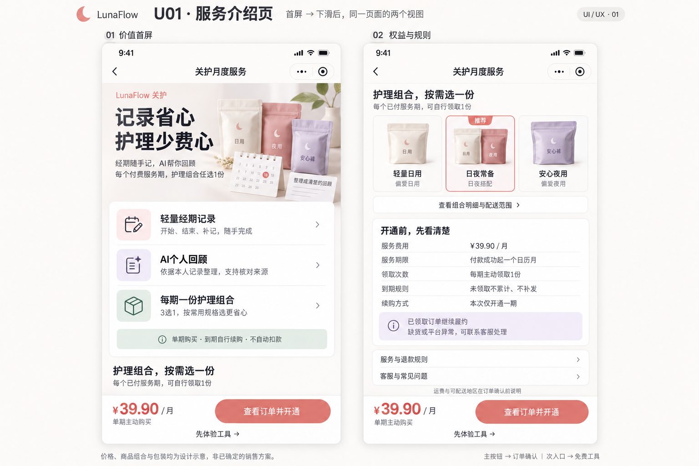

**目的：**在短时间内说明月度服务包含什么、如何收费及怎样兑现，兼容用品诉求和工具诉求进入的用户。

- **左侧：**页面上部，展示品牌、服务价值、工具/AI/护理三项能力及护理组合入口。
- **右侧：**同页下滑后的规则区，展示每期一次自主领取、到期不累计、配送与售后说明；固定操作栏保持一致。
- **主要操作：**“查看订单并开通”进入U02，仍需查看订单、主动确认必要条款并付款；不是点一下直接扣费。
- **次要操作：**“先体验工具”进入U04；查看组合可进入U11；客服、退款规则进入相关说明或U20。
- **错误恢复：**方案下架、无货或不满足服务能力时不允许继续下单；网络失败可重试，缓存文字不作实时价格依据。
- **验收重点：**收费周期、主动领取及到期规则可读；默认单期主动付款；不假冒品牌合作、虚构折扣或把已付权益叫免费礼品；AI不承诺诊断或预测准确率。

### U02 订单确认

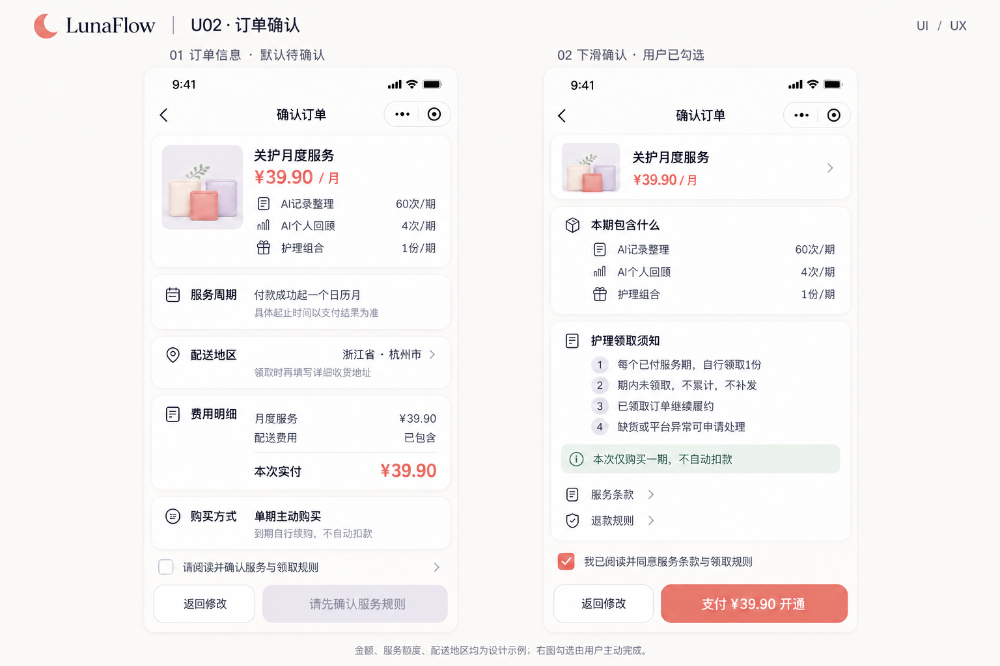

**目的：**在付款前锁定本次方案、全部应付、配送地区和关键规则，并取得针对当前报价的主动确认。

- **左侧：**条款尚未勾选，付款按钮禁用；展示服务组成、示例价格、单期主动购买、配送地区及有效期计算方式。
- **右侧：**同页下滑阅读后，用户主动勾选必要交易条款，付款按钮可用。滚动到页面底部本身不等于同意，程序不得自动勾选。
- **主要操作：**“支付¥39.90开通”代表示例金额，实际由服务端报价决定；提交当前报价和确认版本，调起可用支付能力，结果进入U03。
- **次要操作：**修改省市区、查看协议及领取/退款规则、返回U01；售前不收完整收货地址。
- **错误恢复：**报价过期或方案变化时重新展示报价与变化内容，重置相关确认；支付意图未知时先查原订单，不另建重复收费单。
- **验收重点：**首付前显示“付款成功起完整一个日历月”的计算规则，图中具体时点仅为假设示例；成功后才有最终起止。全部约定运费已计入本次报价。购买不要求经期、AI或通知授权。

### U03 支付结果

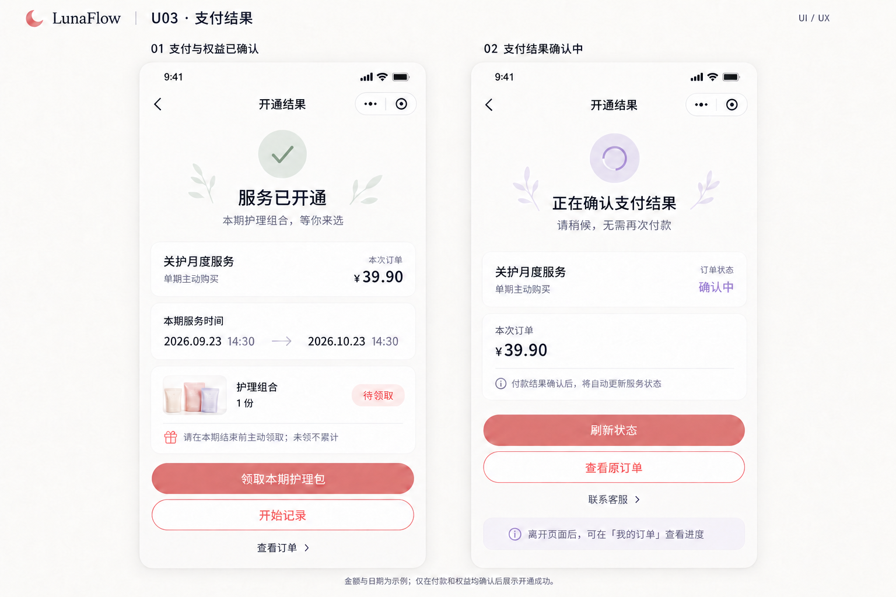

**目的：**区分已确认付款与仍待核实的交易，给用户下一步而不制造重复收费。

- **左侧：**服务端已确认成功，显示实付、本期起止、领取截止时间和单期购买方式。
- **右侧：**交易尚待确认，显示原订单和金额，说明不要重复付款；不展示成功勾号或已生效资格。
- **主要操作：**成功态“领取本期护理包”进入U10或带本期上下文的U12；待确认态“刷新状态”查询原订单。
- **次要操作：**成功态“开始记录”进入U04；查看订单进入U17；长时间未确认进入U20。
- **错误恢复：**付款成功但发期或资格创建延迟时显示处理中并继续恢复，不能要求再次付款；客户端关闭收银台也不直接等同失败。
- **验收重点：**支付、服务期生效、资格创建均以服务端状态为准；示例本期为09.23 14:30—10.23 14:30；提前续购成功时改为“已付款，待生效”，不能误写本期立即开通。

### U04 今天

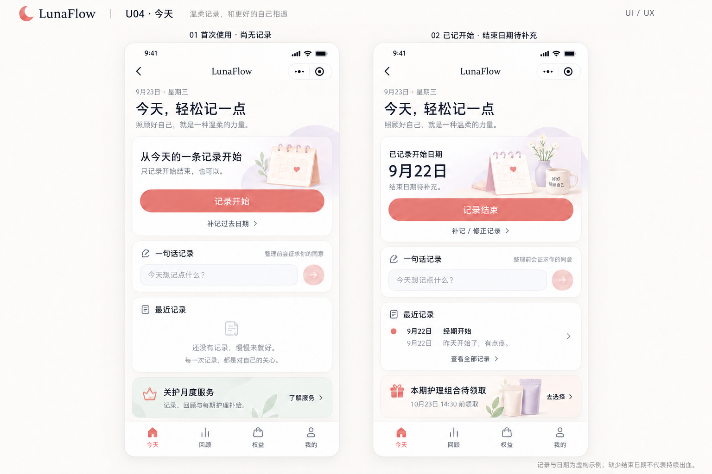

**目的：**让用户以尽量少的步骤完成当下记录，不以每日打卡或停留时长作为价值目标。

- **左侧：**首次无记录，主文案“从今天的一条记录开始”，提供开始、补记和一句话入口。
- **右侧：**已记录9月22日开始，结束尚未记录；主动作变为“记录结束”，保留修改与补记。
- **主要操作：**开始或结束进入U05确认明确日期；“写一句话”进入U06。
- **次要操作：**最近记录进入详情/编辑，回顾进入U08；服务卡未付时进入U01、已付时进入U10。
- **错误恢复：**保存前按需登录及授权；拒绝健康处理可看功能示例和其他独立服务；弱网保留编辑内容，不显示假保存成功。
- **验收重点：**“尚未记录结束”不推断为持续出血；不展示默认28天倒计时；会员卡不遮挡工具任务，基础记录不强制购买。

### U05 日期确认与补记

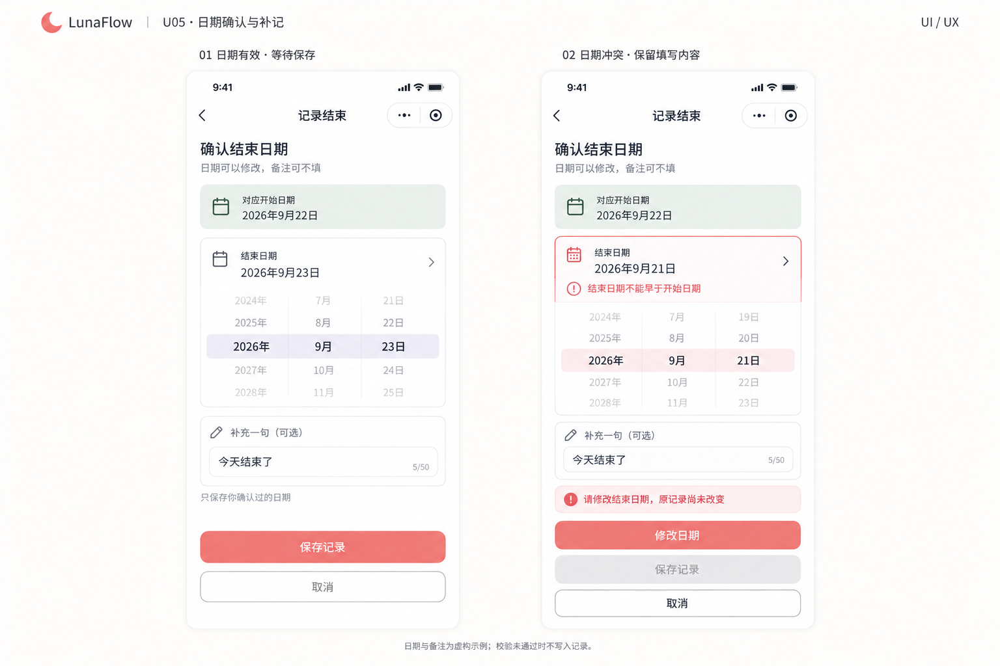

**目的：**用简洁表单确认开始、结束或补记事件，避免不经本人确认修改历史。

- **左侧：**结束记录确认，对应开始9月22日，结束选择9月23日，备注选填。
- **右侧：**结束选择9月21日，早于开始日期，展示就近错误并禁用保存。
- **主要操作：**“保存记录”成功后返回U04/原入口并刷新；冲突态先“修改日期”。
- **次要操作：**取消返回；可修改既有记录，保存后的撤销依服务端版本实现。
- **错误恢复：**重复、重叠、版本冲突或未来日期分别提示；保留备注，不静默纠正或自动合并；网络重试使用原操作标识。
- **验收重点：**界面默认今天但允许核对；未结束不能自动补结束日；同一确认重复发送只生成一条有效记录。

### U06 一句话整理

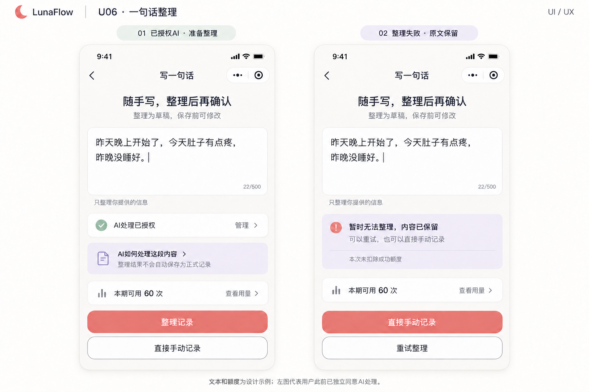

**目的：**减少复杂记录的填写负担，同时保留直接手动记录能力。

- **左侧：**已有文字输入、准备整理，展示AI说明和示例额度；“60次”及字数计数均属设计演示。
- **右侧：**AI暂时不可用，原文完整保留；清楚提供手动记录和重试路径。
- **主要操作：**正常态“整理记录”创建受控AI任务，得到草稿后进入U07；失败态优先允许直接手动记录。
- **次要操作：**查看AI处理说明、用量，或手动保存备注；不默认使用语音能力，语音仍属后续范围。
- **错误恢复：**空白、超长、额度不足、拒绝AI、超时分别说明；未知任务先查状态，避免重复生成；离开再返回保留符合隐私策略的当前草稿。
- **验收重点：**输入不是保存成功；AI失败不消耗成功额度；不将原文发送到广告和通用分析系统；是否使用AI由本人选择。

### U07 AI整理确认

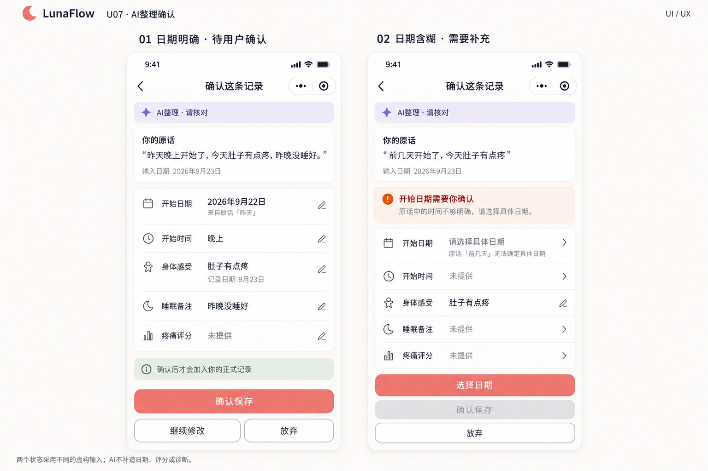

**目的：**让用户核对原话、具体日期和提取字段，只有确认后才生成正式记录。

- **左侧：**可确认草稿，原话中的“昨天”对应2026-09-22，字段可修改，来源可见。
- **右侧：**“前几天”等含糊日期待本人选择；保留其他已提取内容，不编造开始日期。
- **主要操作：**“确认保存”提交已编辑草稿及原任务版本，成功返回U04；日期缺失时先选择日期。
- **次要操作：**继续修改或放弃；放弃草稿不会写正式记录。
- **错误恢复：**草稿结构错误、与已有记录冲突、数据版本已变化时给出明确修正入口；重复确认不重复新增。
- **验收重点：**“有点疼”不能自动换算成疼痛评分；未提供字段为空；不添加病因、心理状态或医疗结论；草稿不能覆盖旧记录。

### U08 回顾首页

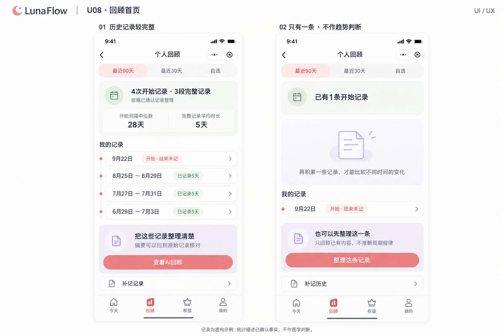

**目的：**让用户找到自己的历史及可计算事实，并理解数据覆盖程度。

- **左侧：**有4次开始、3段完整记录；示例相邻间隔28、29、28天，完整段各5天；展示时间线与AI回顾入口。
- **右侧：**只有一条开始记录，显示已有事实及“还不足以比较”的说明，不生成跨周期趋势。
- **主要操作：**查看或生成当前可用回顾进入U09；只有一条记录时只能做该条整理。
- **次要操作：**切换最近90天、30天或自选范围，进入原记录或补记。
- **错误恢复：**无记录、部分缺失、冲突、服务失败分别展示；没有足够数据时保留时间线，不把缺失填0。
- **验收重点：**统计由确定性代码计算；“5天”“28天”是示例记录事实，不是医学正常值；免费或到期用户仍可查看本人原始记录。

### U09 AI回顾详情

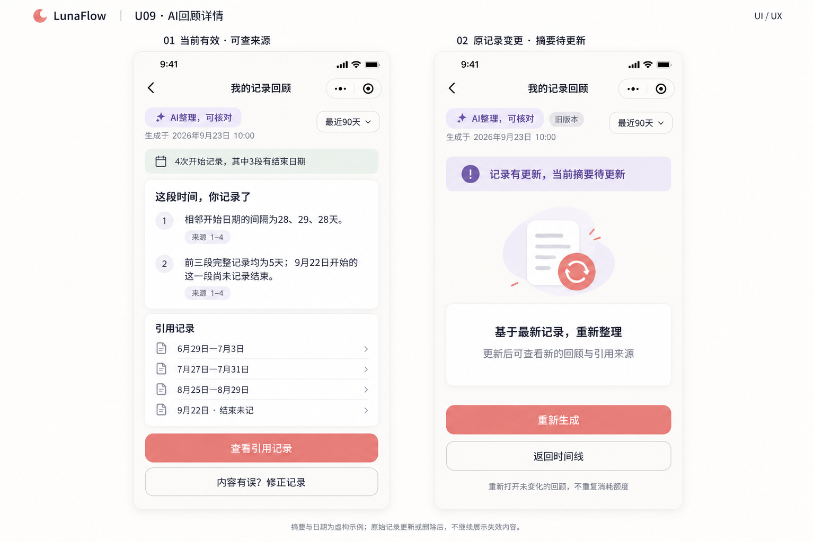

**目的：**提供能追溯到记录的个人摘要，并明确报告是否仍与当前资料一致。

- **左侧：**当前有效摘要，有AI标识、生成时间、覆盖范围、事实说明和来源入口。
- **右侧：**源记录修改后提示“记录有更新，当前摘要待更新”；不把旧内容继续当最新结果。
- **主要操作：**查看引用记录；旧版态“重新生成”对最新数据版本请求摘要。
- **次要操作：**反馈、修正原记录、返回U08；同版本再次查看缓存不重复扣生成额度。
- **错误恢复：**生成失败保留规则统计与重试入口；额度不足明示实际可用额度及刷新规则；来源删除后旧敏感正文和缓存失效。
- **验收重点：**统计与源记录相符；不输出诊断、用药、改善因果或商品疗效；AI报告是独立快照，不反写原记录。

### U10 权益首页

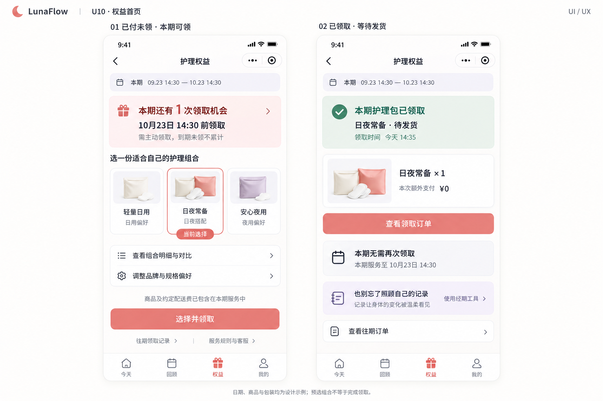

**目的：**说明本期是否可领、何时截止以及可以选择哪一份组合。

- **左侧：**本期还有一次领取资格，三组合候选与截止时间可见；上次偏好只影响当前预选。
- **右侧：**本期已领取、等待发货；显示已选组合、领取记录和本次额外支付¥0，不再显示剩余一次。
- **主要操作：**未领“选择并领取”进入U11/U12；已领“查看领取订单”进入U13。
- **次要操作：**查看组合明细、商品偏好、往期领取；进入U04使用工具。
- **错误恢复：**未开通引导U01；自然到期未领与供应/系统异常分别展示；缺货提供替代或补救，不偷偷替换。
- **验收重点：**资格来自已付服务期；领取与发货、签收分开；取消未来续费不收回本期资格；退款已受理冻结时需显示冻结状态而非普通可领。

### U11 组合详情与对比

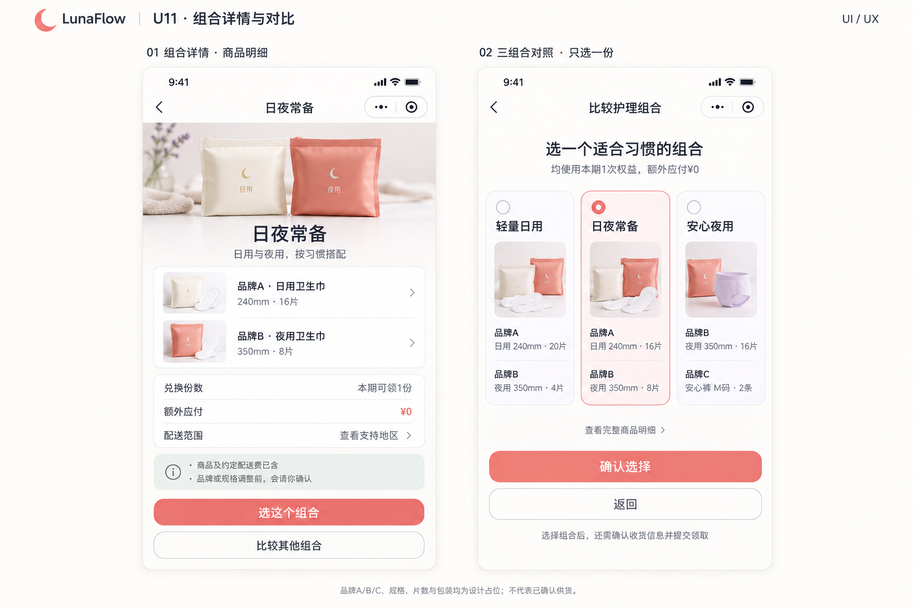

**目的：**用少量明确候选降低选择负担，并让用户看清每份实际内容。

- **左侧：**单个组合的品牌占位、规格、数量及领取说明。
- **右侧：**轻量日用、日夜常备、安心夜用三组合对照；突出当前选择，全部使用本期一次资格。
- **主要操作：**“选这个组合”或“确认选择”仅保存本次候选，进入U12确认地址和领取。
- **次要操作：**查看完整商品明细、比较其他组合或返回U10。
- **错误恢复：**商品版本变化、缺货或规格不可选时重新展示有效候选；不自动用其他品牌替代已确认内容。
- **验收重点：**按第1节示例保持片数和规格一致；不得虚构“价值199元”等对比；正式商品需真实供给；选择不是核销，不产生额外付费升级。

### U12 领取确认

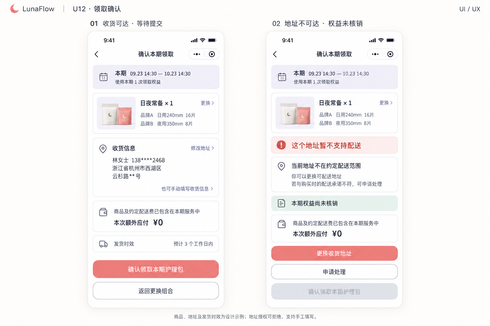

**目的：**在资格核销前最后确认服务期、组合、收货信息、费用和时效。

- **左侧：**组合与地址有效，显示本次额外应付¥0及示例出库时效。
- **右侧：**地址不可配送，明确资格尚未核销；给更换地址和申请处理入口。
- **主要操作：**正常态“确认领取本期护理包”提交幂等领取，成功进入U13；异常态“更换收货地址”。
- **次要操作：**更换组合、修改地址或进入U20申请处理；拒绝地址授权可手工输入。
- **错误恢复：**库存、地址、截止或网络变化重新查状态；超时先查是否已成功领取，不再次消耗资格。平台售前承诺错误进入补救。
- **验收重点：**完整地址仅此类履约任务需要；售前已核验地区；不临时增加运费；服务器成功提交事务后才显示已领。

### U13 领取与物流详情

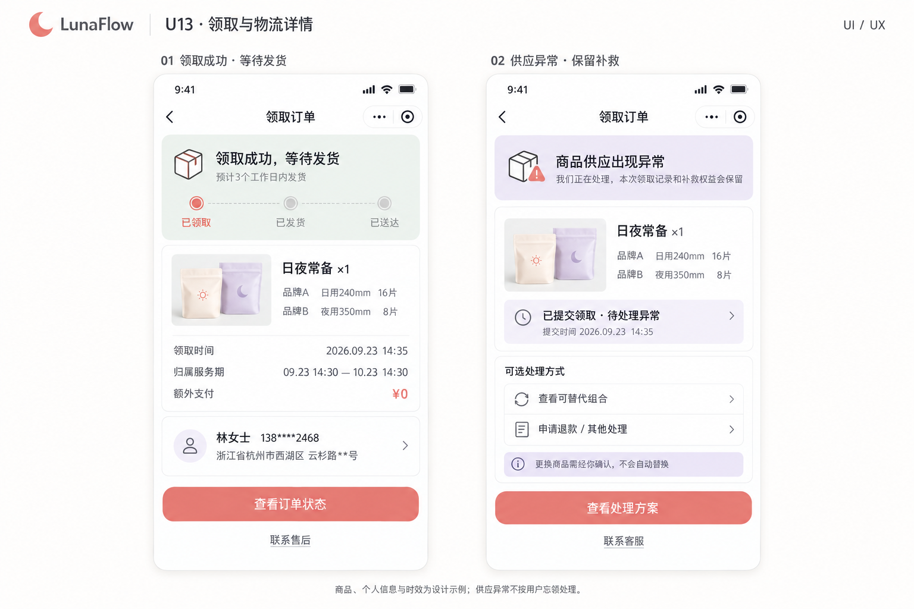

**目的：**追踪已受理领取的实际履约，给供应异常提供可执行处理路径。

- **左侧：**领取成功、等待发货，显示组合快照、归属期、脱敏地址和时间。
- **右侧：**供应异常，保留已领取记录及补救权，可查看替代或退款等处理方案。
- **主要操作：**正常态刷新/查看状态；异常态“查看处理方案”，需替代时经用户确认后继续。
- **次要操作：**联系售后、查看关联交易及退款状态。
- **错误恢复：**供应商超时为未知，先核查原单；物流未更新说明最后更新时间；跨过会员截止仍继续原履约。
- **验收重点：**已领、已发、已送达不能混用；故障不记为忘领、不消耗下一期资格；退款与出库竞态按实际仓库状态处理。

### U14 我的

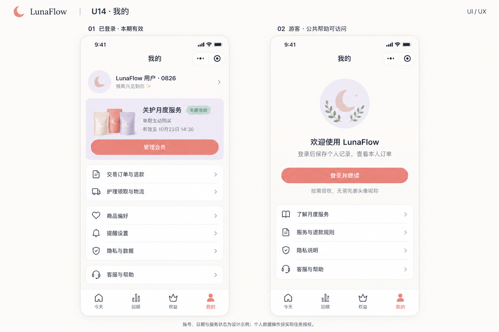

**目的：**集中展示本人服务状态、交易、设置、数据权利和帮助入口。

- **左侧：**已登录、本期有效，显示单期主动购买及截止时间。
- **右侧：**游客态，可了解服务、规则、隐私和帮助；登录后恢复本人任务。
- **主要操作：**会员进入U15；游客“登录并继续”回到原任务或当前页。
- **次要操作：**交易与退款U17、领取物流U13、提醒U18、隐私U19、客服U20以及商品偏好。
- **错误恢复：**会话过期按需重新登录；错误账户缓存必须清理；列表失败可分别重试，不影响其他已可用入口。
- **验收重点：**不强制头像昵称、手机号登录或伴侣绑定；订单、取消、退款及数据权利不因会员到期隐藏。

### U15 会员管理

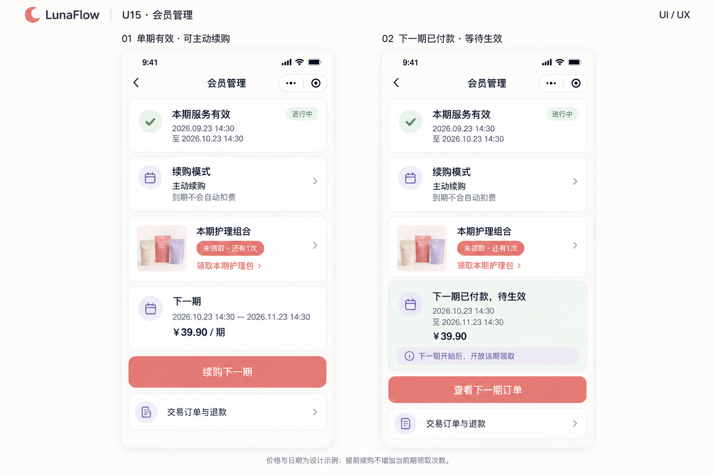

**目的：**分别说明当前服务、下期购买与续费方式，避免重复购买同一期。

- **左侧：**本期有效、下一期未买，说明到期不自动扣费，可主动续购。
- **右侧：**下一期已提前付款、待生效，显示10.23 14:30—11.23 14:30；不再显示可重复付款按钮。
- **主要操作：**未买下一期时“续购下一期”进入U02并绑定目标收费期；已买时查看下一期订单。
- **次要操作：**领取本期护理包进入U10；交易订单与退款进入U17。
- **错误恢复：**已有处理中的扣款先查清，不允许第二笔手动付款；断档后的新购买按实际成功时间开整期；成功但通知迟到按渠道事实恢复。
- **验收重点：**提前付款不提前发第二份资格；默认示例无代扣协议，因此不凭空显示“已自动续费”；条件自动续费启用且本人签约后，另显示协议状态及U16入口。

### U16 取消自动续费

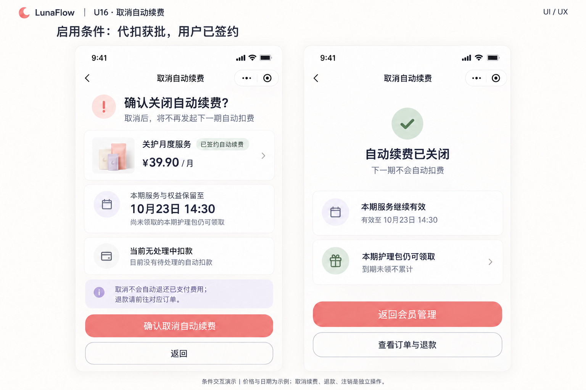

**目的：**在代扣能力已获批、用户已独立签约的前提下，便捷停止未来自动扣费。

- **条件：**画板明确“启用条件：代扣获批，用户已签约”。这不是其他页默认单期购买用户的必经步骤。
- **左侧：**用户主动进入取消页，看到协议、金额、本期保留时间、当前在途扣款情况以及取消不等于退款的说明。
- **右侧：**仅在外部协议确认解除后展示“自动续费已关闭”；本期已付服务和未领取权益仍保留。
- **主要操作：**确认取消；成功后返回U15。
- **次要操作：**返回、查看对应订单与退款U17；不要求填写原因或先找客服。
- **错误恢复：**外部解约未知时显示处理中、查询和协助入口，不提前宣告成功；已在途扣款核查真实结果，必要时退款补救。
- **验收重点：**本地停止调度与外部确认分开；单次必要确认、无循环挽留；取消不删除记录、不自动退款、不剥夺当期已付权益。

### U17 订单与退款

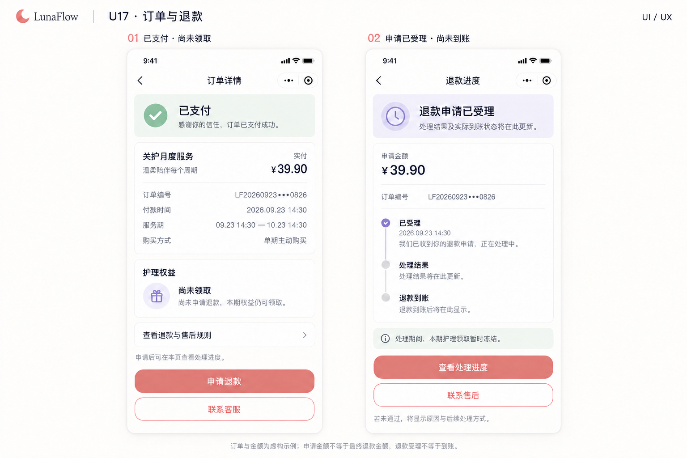

**目的：**查看收费事实、售后规则和退款进展，准确区分申请与到账。

- **左侧：**订单已付款、实物尚未领取，**此时尚未申请或尚未被服务端受理退款，符合条件的本期权益仍可领取**。打开订单、查看退款说明或点击进入申请表本身不冻结资格。
- **右侧：**服务端已受理退款申请，显示申请金额和处理进度；此时原订单及相关权益已建立退款保护，新的护理领取暂时冻结。
- **主要操作：**左侧“申请退款”按已披露规则提交；右侧“查看处理进度”查询既有申请。
- **次要操作：**退款规则、客服/售后；若存在独立自动续费协议，需要另行提供U16入口并说明退款不自动取消协议。
- **错误恢复：**提交超时先查是否已受理；拒绝、撤销或渠道明确失败按服务端结果解除相应冻结；未知处理中不重复申请另一笔退款。若处理跨过领取截止，展示后端补救决定，不静默损失资格。
- **验收重点：**申请金额不是批准金额，受理不是到账；冻结发生在服务端受理事务，不发生在页面曝光。数字服务是否暂停按事前规则处理。全额退款成功后撤销未使用资格，已履约部分保留真实售后历史。

### U18 提醒设置

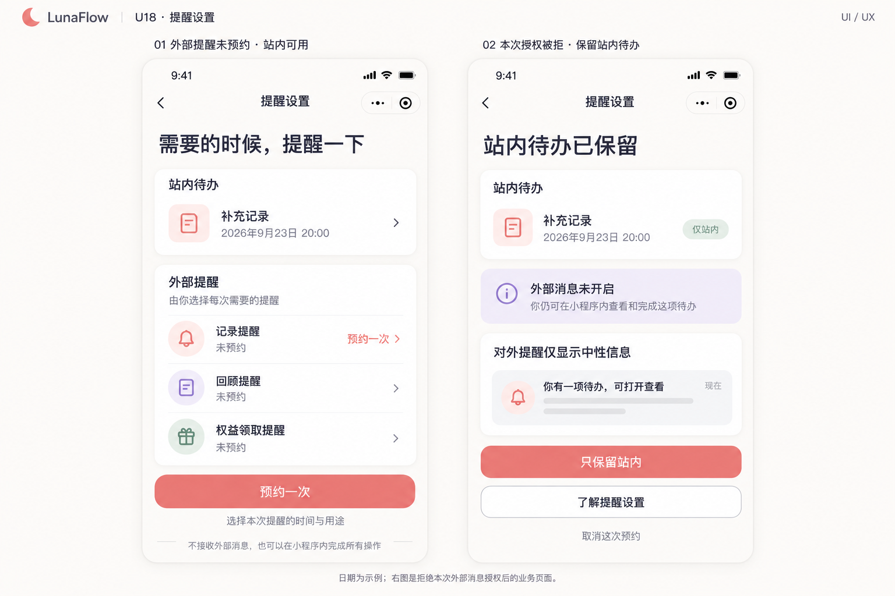

**目的：**让用户按任务选择提醒，并理解站内待办与外部消息是独立能力。

- **左侧：**站内待办可用，记录、回顾、权益领取分别预约，默认外部提醒未开启。
- **右侧：**用户拒绝本次外部授权后的业务页，任务仍保留为站内待办。
- **主要操作：**对具体任务“预约一次”；拒绝后可“只保留站内”。
- **次要操作：**了解设置、调整时间、取消该任务；不能用一个总开关代表无限发送许可。
- **错误恢复：**模板不可用、权限不足或发送未知分别说明；不反复弹授权、不擅自改发短信等其他渠道。
- **验收重点：**开通会员不授权消息；一次许可不包装为无限月度推送；已完成、取消或失效的任务不继续发送；外部正文不含症状及健康日期。

### U19 隐私与数据

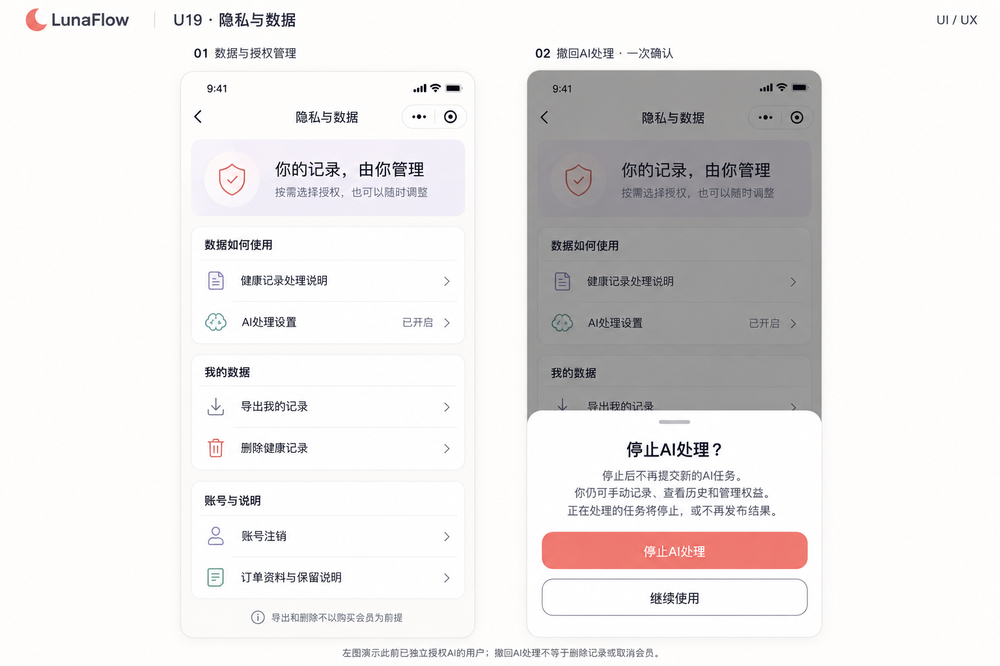

**目的：**提供可理解的处理设置、导出、删除和注销路径，保留本人对数据的控制。

- **左侧：**用途说明、AI处理设置、导出、健康数据删除、账号注销及订单留存说明；示例“已开启”只代表此前独立同意。
- **右侧：**停止AI处理的确认层，说明停止新任务，同时保留手动记录、历史与独立权益服务。
- **主要操作：**按本人选择发起数据权利任务；右侧“停止AI处理”仅撤回这一用途。
- **次要操作：**继续使用、查看处理说明、导出进度或必要交易留存说明。
- **错误恢复：**导出/删除异步任务有状态；重新核验会话后操作；删除原记录同步处理摘要、缓存和索引；注销有在途交易时给具体善后状态，不无限阻挡。
- **验收重点：**停止AI不等于删除所有数据或取消会员；非会员也可导出和删除；不宣称所有交易凭证瞬间清除；首版不启用伴侣默认共享。

### U20 客服与帮助

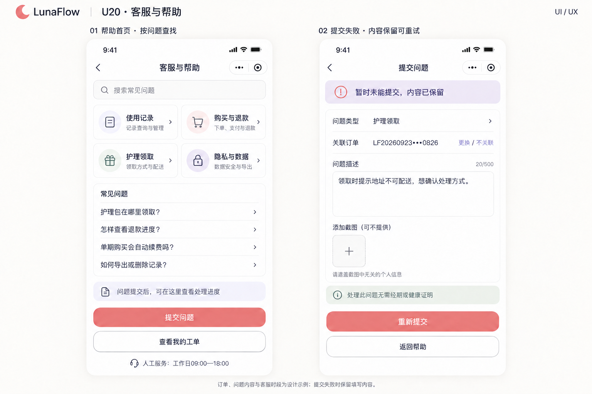

**目的：**让常见问题易查，复杂问题可以关联业务单据并跟踪处理。

- **左侧：**帮助首页，按工具、交易退款、护理领取、隐私等分类；可搜索常见问题和查看工单。
- **右侧：**提交订单问题时网络失败，填写的分类、关联订单和描述保留，提示可重试；不是已成功受理。
- **主要操作：**左侧“提交问题”打开表单；右侧重试同一提交意图，成功后进入工单详情。
- **次要操作：**查看我的工单、返回帮助、改变或取消关联订单；附件可不提供。
- **错误恢复：**必填描述为空时就近提示；未知结果先检查是否已有工单，避免重复；失败保留内容，用户可退出后按安全草稿规则恢复。
- **验收重点：**不声称24小时医生咨询；真实服务时间由配置决定；订单问题不索要健康证明、身份证或无关联系方式；游客可查看公共帮助，客服默认不访问健康正文。

## 6. 跨页面业务与权限规则

### 6.1 权限彼此独立

| 权限或操作 | 何时请求 | 拒绝后的可用能力 |
| --- | --- | --- |
| 账户登录 | 保存本人云端资料、付款及本人订单等任务发生时 | 公开介绍、条款与公共帮助 |
| 健康信息处理 | 开始保存或处理健康记录前 | 购买、领取、交易管理等独立服务 |
| AI处理 | 主动选择AI任务、首次必要确认时 | 手动记录与确定性统计 |
| 支付及必要交易条款 | 当前订单确认时 | 工具与公开内容；不产生扣款授权 |
| 自动续费协议 | 对应能力可用且用户主动选择后 | 始终保留可用的单期主动购买方式 |
| 外部订阅消息 | 用户主动预约适用任务时 | 全部站内任务及提醒列表 |
| 收货地址 | 领取实物时 | 可手填必要地址，不依赖定位权限 |

头像、通讯录、伴侣关系不是首版核心任务前提。支付、AI、消息、健康处理不能用一项勾选合并取得同意。健康原文、日期、症状、AI输出及其使用细节不回传广告系统，也不进入普通错误日志。

### 6.2 AI与健康事实

1. 开始、结束、备注和日期以用户确认事实为准；AI提取必须确认后保存，未知保持为空。
2. 时长、间隔和次数由代码计算，AI整理已有事实与来源；不生成疾病、怀孕或疗效结论。
3. 数据不足时展示已有记录及缺少的条件，不用统一28天假装个性化。
4. 修改、删除或撤回处理授权后，相关任务、报告和缓存按PRD失效；不能让旧结果重新发布。
5. 手动降级保障工具可用，但AI作为已售服务内容时不能长期以未接入替代交付；销售承诺与能力必须一致。

### 6.3 账期、领取及主动续购

- 每期按首次支付成功锚定的周年月计算，不按自然月截断，也不随用户生理周期改变。
- 月末不存在原锚点日时裁剪到当月最后一天，后续月份恢复原锚点；由后端计算，前端只展示。
- 首付或断档新购的最终时间在成功后确定；提前续购可明确展示下一期既定起止。
- 已付款未生效、有效可领、已领、到期未领、退款冻结、异常待补救是不同状态，不共用一个“已结束”。
- 正常可兑但到期未领不自动累计是拟定规则，须按发布版本展示；供应、支付开通或领取故障进入补救，不能归为用户忘领。
- 领取提交由服务端校验截止时点、库存、地址与退款保护；已成功受理后跨期仍继续履约。
- 主动续购和自动扣款结果分开统计。未知扣款先核查，不让用户“再付一次”恢复。

### 6.4 供应与销售配置

供应商、实际品牌、规格、可送地区、采购配额、运费、售后和时效未确认前，设计稿不能直接成为投放承诺。生产方案必须完整发布，订单保留购买快照；新配置不能减少已售期权利。

首版三种组合同价、约定配送费用纳入售前报价；不增加领取收费步骤。商品偏好只用已明确的品牌/规格选择，不从症状和周期推断商品。库存在供应商处变化时仍要覆盖已售义务；暂停新销售不能直接关闭已付服务、领取、退款和客服。

## 7. 全量状态补充与开发验收

两张视图无法覆盖一页全部状态。每个页面在实现和测试中至少补齐下列适用项：

| 状态类别 | 实现检查 |
| --- | --- |
| 初次进入与加载 | 骨架/加载提示可读，不能短暂显示他人或过期敏感资料 |
| 空数据 | 无记录、无订单、未开通、无可领取资格分别解释 |
| 登录与授权 | 拒绝可退回，完成后恢复原任务；不循环索取 |
| 表单错误 | 就近错误、保留输入、焦点可到错误项 |
| 网络失败 | 可重试，不丢表单，不把失败当空数据 |
| 交易未知 | 查原订单、原领取或原退款，不重复发起外部交易 |
| 并发及版本变化 | 按最新服务端状态解释冲突，不能静默覆盖 |
| 取消与返回 | 未确认不提交；取消后显示确切保留范围 |
| 到期与异常补救 | 正常失效和履约失败分开；已提交订单继续追踪 |
| 账号切换与隐私 | 清理缓存、鉴权访问、敏感数据不入普通埋点 |

发布前重点走通：U01—U03真实支付状态分支、U10—U13单期唯一领取、U15提前续购与断档、U16外部解约确认、U17退款冻结与解除、U06—U09AI来源一致性、U18授权拒绝和U19删除派生清理。测试用例与后台权限、对账和发布门槛以基准PRD为准。

## 8. 维护方式

- 图片文件名与U01—U20编号保持稳定；同一页面修订时同步更新本文左右状态说明、相关验收和PRD影响。
- 修改金额、期限、领取次数、退款、AI额度或数据用途时，先更新方案与PRD版本，再更新图；不能只改视觉稿。
- 新增未绘制状态可继续补图，但不得将“尚未有图”当作实现可省略的理由。
- 设计图中的条件能力、样例数据、虚构用户和供应待定说明持续保留在交付说明中；正式产品展示的内容全部来自已确认配置与真实状态。
