# LunaFlow 小程序 UI/UX 设计与交互说明

版本：V1.1 · 设计基线日期：2026-09-23

本目录保存 **U01—U20原20张主页面图＋S01—S22共22张补充状态板，共42张高清界面图、84个视图**。补图承接首次使用、表单、列表及异常恢复，不增加主路由。本文说明各图对应的用户任务、左右视图、主要操作、页面跳转和异常恢复，供产品、设计、前后端及测试协作使用。

V1.1补充内容见[第9节](#9-首次使用与异常恢复补充设计s01s14)。本次交付是设计与交互规范更新，不表示小程序已经实现或相关业务能力已经开通。

**业务与技术基准：[LunaFlow 小程序技术 PRD V1.0](../report/LunaFlow_小程序技术PRD_V1.0.md)。**设计图用于表达布局、信息层级与关键交互，不是可执行前端，也不是完整状态清单。主图与补图仍未穷举全部加载、权限、支付、库存、退款、弱网和数据不足状态；未单独绘制的适用状态仍须按 PRD 与统一组件规则实现。若图片中的简化文字、日期、数值、图标或状态表达与 PRD 冲突，以 PRD 为准，并同步修订设计，不用图片覆盖业务约束。

## 1. 设计范围与示例数据

本版服务由**极简经期记录、AI个人回顾、每个已付服务期一次自主领取的护理组合**构成。首发针对“省事补给型”需求，用“记录回顾型”诉求作对照；这些是待验证画像，不是已经取得投放证明的人群结论。

| 项目 | 本套稿件约定 | 实现要求 |
| --- | --- | --- |
| 产品名 | LunaFlow | 工作名称，不代表商标或平台主体审核已经完成 |
| 服务名 | 关护月度服务 | 正式前端、订单、协议及客服使用同一命名 |
| 价格 | ¥39.90／期，图中部分简写为“月” | **仅示例价格**，生产使用已发布且不可变的方案版本；不写死在客户端 |
| AI额度 | 每期60次整理、4次回顾 | **仅示例额度**，按购买快照展示；失败不消耗成功额度，缓存不重复扣生成额度 |
| 本期 | 2026-09-23 14:30 至 2026-10-23 14:30 | 上海时区显示，区间为起点包含、终点不包含；实际时间来自服务端 |
| 下一期 | 2026-10-23 14:30 至 2026-11-23 14:30 | 提前付款不会提前开放下一期领取 |
| 续费方式 | 默认单期主动购买 | 不默认为自动续费；U16单独演示已获准、已签约的条件场景 |
| 实物费用 | 已包含约定配送费用，领取时额外应付¥0 | 不在领取阶段临时补运费、补商品差价或收“激活费” |
| 品牌与商品 | 品牌A、B、C及示例规格 | 未代表真实品牌合作、采购成交或实际库存 |
| 发货及客服时段 | 图中如“3个工作日”“工作日09:00—18:00” | 均为设计示例，正式承诺须匹配真实供应商和客服能力 |
| 用户与订单 | 图中姓名、手机、地址、订单号、健康记录 | 均为虚构或脱敏展示，不能作为真实用户案例或效果证明 |

图中护理组合统一按以下示例解释，不把数量或品牌视为已确认销售承诺：

| 组合 | 示例内容 | 选择含义 |
| --- | --- | --- |
| 轻量日用 | 品牌A日用240mm 20片＋品牌B夜用350mm 4片 | 商品规格偏好，不推断健康状况 |
| 日夜常备 | 品牌A日用240mm 16片＋品牌B夜用350mm 8片 | 日用与夜用搭配 |
| 安心夜用 | 品牌B夜用350mm 16片＋品牌C安心裤M码2条 | 夜用品类偏好，不承诺适合所有用户 |

三份组合是三选一，每个已付服务期只能成功领取其中一份；不代表同时获得全部商品。图中“推荐”“沿用上次”表示候选排序，仍需本人确认组合和收货信息。“记住我的偏好”默认关闭；关闭时只作用本次选择，用户主动开启后才持久化供下次使用。

## 2. 文件目录与页面索引

| 编号 | 页面 | 左侧视图 | 右侧视图 | 图片 |
| --- | --- | --- | --- | --- |
| U01 | 服务介绍 | 上部价值与服务内容 | 下滑后的规则与说明 | [查看](./U01_service-intro.png) |
| U02 | 订单确认 | 条款未勾选、不可付款 | 下滑阅读并主动勾选、可付款 | [查看](./U02_checkout.png) |
| U03 | 支付结果 | 服务端确认成功 | 结果待确认 | [查看](./U03_payment-result.png) |
| U04 | 今天 | 首次无记录 | 已记录开始、结束未记 | [查看](./U04_today.png) |
| U05 | 日期确认与补记 | 正常结束日期确认 | 结束早于开始的冲突 | [查看](./U05_record-edit.png) |
| U06 | 一句话整理 | 输入完成、准备整理 | 整理失败、原文保留 | [查看](./U06_record-compose.png) |
| U07 | AI整理确认 | 可核对的结构化草稿 | 日期含糊、待本人补充 | [查看](./U07_ai-confirm.png) |
| U08 | 回顾首页 | 有历史记录可比较 | 只有一条记录、数据不足 | [查看](./U08_review.png) |
| U09 | AI回顾详情 | 当前有效摘要及来源 | 来源更新、摘要待更新 | [查看](./U09_review-detail.png) |
| U10 | 权益首页 | 本期尚可领取 | 本期已领取、待发货 | [查看](./U10_benefits.png) |
| U11 | 组合详情与对比 | 单个组合详情 | 三种组合对照选择 | [查看](./U11_bundle-compare.png) |
| U12 | 领取确认 | 组合与地址待确认 | 地址不在可配送范围 | [查看](./U12_claim-confirm.png) |
| U13 | 领取与物流详情 | 已受理、等待发货 | 供应异常、补救处理中 | [查看](./U13_fulfillment.png) |
| U14 | 我的 | 登录且本期有效 | 游客状态 | [查看](./U14_me.png) |
| U15 | 会员管理（断档见S14、签约见S22） | 本期有效、下一期待购买 | 下一期提前购买、待生效 | [查看](./U15_membership.png) |
| U16 | 取消自动续费 | 已签约用户确认取消 | 外部协议确认解除 | [查看](./U16_cancel-renewal.png) |
| U17 | 订单与退款 | 已付款、未申请退款 | 申请已受理、领取暂时冻结 | [查看](./U17_refund.png) |
| U18 | 提醒设置 | 站内待办与未预约外部提醒 | 拒绝外部授权后仍保留站内任务 | [查看](./U18_reminders.png) |
| U19 | 隐私与数据 | 数据权利与处理设置 | 停止AI处理的确认层 | [查看](./U19_privacy.png) |
| U20 | 客服与帮助 | 帮助首页 | 工单提交失败、内容保留可重试 | [查看](./U20_support.png) |

以上为原20张主图。S01—S14补图映射见第9.2节，S15—S22见第10节。各页左右状态用于解释该页面，并不代表同一个用户必须依次经历全部事件。U01、U02主要展示同页滚动及确认过程；其余页主要对照不同业务状态。

## 3. 全局视觉与组件规范

### 3.1 视觉方向

- 暖白作为页面底色，深珊瑚色`#B74752`配白字用于主要动作，淡紫用于辅助信息与解释卡；原`#E97875`仅用于装饰和轻强调。保持低噪声、留白和清晰分组。
- 健康记录区域以用户任务为主，不插入商品瀑布流；权益入口保持可发现，用一张简洁卡片连接服务。
- 页面标题、主结果、金额及主要动作优先；长协议采用详情入口，关键收费、领取、到期及取消规则不能只藏在详情里。
- 状态同时使用图标、文字和必要颜色；不可仅依赖红绿区分成功、处理中或错误。
- 同屏只突出一个主要动作，其余使用次按钮或文字入口；取消、退款和隐私权利不能因视觉弱化而不可发现。

建议把下列视觉值作为组件化实现的起点，最终在真机上统一校准；不要从每张PNG分别取样形成不同主题。

| 设计变量 | 建议值 / 用途 |
| --- | --- |
| 页面底色 | `#FBF9F6`，暖白 |
| 主文字 | `#35343B`，标题及正文 |
| 主要动作 | `#B74752`配白字，两种纯色组合对比约5.20:1；透明度、状态和实际渲染需复核 |
| 装饰强调 | 原`#E97875`只作装饰、轻强调；不再作为小号白字主按钮背景 |
| 辅助信息 | `#EEE9F5`，淡紫背景 |
| 温和状态底色 | `#E4ECE5`，配合图标与状态文字 |
| 卡片圆角 | 16px等效，组件内保持一致 |
| 正文 | 建议16px等效起步；金额、期限与失效规则不以小字隐藏 |
| 可点击区域 | 建议不低于44×44px等效；小程序按目标机型换算并验收 |

在iOS、Android、小屏和大字体设置下验收截断、换行、键盘及安全区。图片背景上的条件说明属于评审标注；正式页面根据真实能力显隐，并保留相应的用户可读规则。

### 3.2 从图片到真实组件

本目录PNG为栅格设计稿，不能作为整张图片贴进小程序代替界面。实现时应建立统一组件和设计变量，重新排版真实文字。

| 组件 | 统一要求 |
| --- | --- |
| 字体与字号 | 使用合法可用且适配目标系统的中文字体栈；统一标题、正文、辅助文字、金额层级；不要复制不同图片的字体细微差异 |
| 图标 | 选定同一套线性图标，统一尺寸、笔画、基线与选中状态；微信原生导航和授权控件依平台实际样式实现 |
| 页面容器 | 统一左右边距、卡片圆角和卡片间距；适配不同宽度、字体缩放及底部安全区 |
| 按钮 | 明确普通、按压、加载、禁用及完成态；提交中阻止重复点击但保留返回和查看状态路径 |
| 表单 | 标签持续可见；占位符不替代标签；就近显示错误并保留原输入 |
| 状态卡 | 统一待确认、已完成、处理中、失败、异常待补救的图文规则 |
| 底部固定栏 | 不遮挡最后一条内容或协议；金额与重要条款位于按钮附近；键盘弹出时布局可用 |
| 商品卡 | 使用真实合规商品图及发布版本；品牌、规格、数量、费用可读，缺货明确 |
| 弹层 | 明确标题、影响、主次按钮；关闭弹层不应意外提交；破坏性操作只做必要确认 |
| 空态与骨架屏 | 加载、暂无数据、无权限、服务错误分开，不用同一空白页混淆 |

图中字符计数、图标细节、圆角和文字换行可能存在图像生成差异。正式页面中的字数、金额、额度、时间和状态均由程序或服务端计算。例如U06的“22/500”只是画面示例，程序须按最终输入与已确定的计数规则实时计算，不照抄数值。

### 3.3 导航与返回

四个Tab为**今天、回顾、权益、我的**，分别对应U04、U08、U10、U14。子页面使用返回导航，不为了复刻图片而在每个子页面重复Tab。广告深链打开子页后，如果没有产品内上一页，返回其所属Tab或U01；退出购买不自动再次弹购买窗。

登录和授权完成后回到原任务，保留已选择方案、组合或正在填写的内容；退出账号清理本地私人健康缓存。不同账号不能看到上一个账号的记录、地址、订单或摘要。

## 4. 主要用户路径

| 用户目标 | 建议路径 | 保留的选择 |
| --- | --- | --- |
| 从广告了解并购买 | U01 → U02 → U03 → U10/U12 → U13 | 可先体验工具；购买不要求健康录入 |
| 快速记录开始/结束 | U04 → U05 → U04 | 可补记和纠错，不必使用AI |
| 用一句话记录 | U04 → U06 → U07 → U04 | AI失败或拒绝AI时可手动记录 |
| 查看自己的历史 | U08 → U09 → 对应原记录/U05 | 数据不足显示已有事实；允许修正 |
| 选择护理组合 | U10 → U11 → U12 → U13 | 选组合不立即核销；地址可手工填写 |
| 主动续购 | U14 → U15 → U02 → U03 | 明示新一期时间，不产生默认代扣授权 |
| 取消已授权代扣 | U14/U15 → U16 → U15 | 仅条件能力启用时出现；取消不等于退款 |
| 申请退款 | U14/U15/订单入口 → U17 | 申请受理前不提前冻结权益；受理后查进度 |
| 管理提醒与数据 | U14 → U18/U19 | 拒绝通知或AI不阻止其他独立功能 |
| 寻求帮助 | 页面就近入口/U14 → U20 | 公共帮助游客可读；订单问题不要求健康证明 |

H5与小程序入口能力按真实投放渠道核验。图中的短链路不代表所有广告平台都能直接唤起小程序；入口参数不能携带健康记录、症状或日期。

## 5. 页面详细说明

### U01 服务介绍

**目的：**在短时间内说明月度服务包含什么、如何收费及怎样兑现，兼容用品诉求和工具诉求进入的用户。

- **左侧：**页面上部，展示品牌、服务价值、工具/AI/护理三项能力及护理组合入口。
- **右侧：**同页下滑后的规则区，展示每期一次自主领取、到期不累计、配送与售后说明；固定操作栏保持一致。
- **主要操作：**“查看订单并开通”进入U02，仍需查看订单、主动确认必要条款并付款；不是点一下直接扣费。
- **次要操作：**“先体验工具”进入U04；查看组合可进入U11；客服、退款规则进入相关说明或U20。
- **错误恢复：**方案下架、无货或不满足服务能力时不允许继续下单；网络失败可重试，缓存文字不作实时价格依据。
- **验收重点：**收费周期、主动领取及到期规则可读；默认单期主动付款；不假冒品牌合作、虚构折扣或把已付权益叫免费礼品；AI不承诺诊断或预测准确率。

### U02 订单确认

**目的：**在付款前锁定本次方案、全部应付、配送地区和关键规则，并取得针对当前报价的主动确认。

- **左侧：**条款尚未勾选，付款按钮禁用；展示服务组成、示例价格、单期主动购买、配送地区及有效期计算方式。
- **右侧：**同页下滑阅读后，用户主动勾选必要交易条款，付款按钮可用。滚动到页面底部本身不等于同意，程序不得自动勾选。
- **主要操作：**“支付¥39.90开通”代表示例金额，实际由服务端报价决定；提交当前报价和确认版本，调起可用支付能力，结果进入U03。
- **次要操作：**修改省市区、查看协议及领取/退款规则、返回U01；售前不收完整收货地址。
- **错误恢复：**报价过期或方案变化时重新展示报价与变化内容，重置相关确认；支付意图未知时先查原订单，不另建重复收费单。
- **验收重点：**首付前显示“付款成功起完整一个日历月”的计算规则，图中具体时点仅为假设示例；成功后才有最终起止。全部约定运费已计入本次报价。购买不要求经期、AI或通知授权。

### U03 支付结果

**目的：**区分已确认付款与仍待核实的交易，给用户下一步而不制造重复收费。

- **左侧：**服务端已确认成功，显示实付、本期起止、领取截止时间和单期购买方式。
- **右侧：**交易尚待确认，显示原订单和金额，说明不要重复付款；不展示成功勾号或已生效资格。
- **主要操作：**成功态“领取本期护理包”进入U10或带本期上下文的U12；待确认态“刷新状态”查询原订单。
- **次要操作：**成功态“开始记录”进入U04；查看订单进入U17；长时间未确认进入U20。
- **错误恢复：**付款成功但发期或资格创建延迟时显示处理中并继续恢复，不能要求再次付款；客户端关闭收银台也不直接等同失败。
- **验收重点：**支付、服务期生效、资格创建均以服务端状态为准；示例本期为09.23 14:30—10.23 14:30；提前续购成功时改为“已付款，待生效”，不能误写本期立即开通。

### U04 今天

**目的：**让用户以尽量少的步骤完成当下记录，不以每日打卡或停留时长作为价值目标。

- **左侧：**首次无记录，主文案“从今天的一条记录开始”，提供开始、补记和一句话入口。
- **右侧：**已记录9月22日开始，结束尚未记录；主动作变为“记录结束”，保留修改与补记。
- **主要操作：**开始或结束进入U05确认明确日期；“写一句话”进入U06。
- **次要操作：**最近记录进入详情/编辑，回顾进入U08；服务卡未付时进入U01、已付时进入U10。
- **错误恢复：**保存前按需登录及授权；拒绝健康处理可看功能示例和其他独立服务；弱网保留编辑内容，不显示假保存成功。
- **验收重点：**“尚未记录结束”不推断为持续出血；不展示默认28天倒计时；会员卡不遮挡工具任务，基础记录不强制购买。

### U05 日期确认与补记

**目的：**用简洁表单确认开始、结束或补记事件，避免不经本人确认修改历史。

- **左侧：**结束记录确认，对应开始9月22日，结束选择9月23日，备注选填。
- **右侧：**结束选择9月21日，早于开始日期，展示就近错误并禁用保存。
- **主要操作：**“保存记录”成功后返回U04/原入口并刷新；冲突态先“修改日期”。
- **次要操作：**取消返回；可修改既有记录，保存后的撤销依服务端版本实现。
- **错误恢复：**重复、重叠、版本冲突或未来日期分别提示；保留备注，不静默纠正或自动合并；网络重试使用原操作标识。
- **验收重点：**界面默认今天但允许核对；未结束不能自动补结束日；同一确认重复发送只生成一条有效记录。

### U06 一句话整理

**目的：**减少复杂记录的填写负担，同时保留直接手动记录能力。

- **左侧：**已有文字输入、准备整理，展示AI说明和示例额度；“60次”及字数计数均属设计演示。
- **右侧：**AI暂时不可用，原文完整保留；清楚提供手动记录和重试路径。
- **主要操作：**正常态“整理记录”创建受控AI任务，得到草稿后进入U07；失败态优先允许直接手动记录。
- **次要操作：**查看AI处理说明、用量，或手动保存备注；不默认使用语音能力，语音仍属后续范围。
- **错误恢复：**空白、超长、额度不足、拒绝AI、超时分别说明；未知任务先查状态，避免重复生成；离开再返回保留符合隐私策略的当前草稿。
- **验收重点：**输入不是保存成功；AI失败不消耗成功额度；不将原文发送到广告和通用分析系统；是否使用AI由本人选择。

### U07 AI整理确认

**目的：**让用户核对原话、具体日期和提取字段，只有确认后才生成正式记录。

- **左侧：**可确认草稿，原话中的“昨天”对应2026-09-22，字段可修改，来源可见。
- **右侧：**“前几天”等含糊日期待本人选择；保留其他已提取内容，不编造开始日期。
- **主要操作：**“确认保存”提交已编辑草稿及原任务版本，成功返回U04；日期缺失时先选择日期。
- **次要操作：**继续修改或放弃；放弃草稿不会写正式记录。
- **错误恢复：**草稿结构错误、与已有记录冲突、数据版本已变化时给出明确修正入口；重复确认不重复新增。
- **验收重点：**“有点疼”不能自动换算成疼痛评分；未提供字段为空；不添加病因、心理状态或医疗结论；草稿不能覆盖旧记录。

### U08 回顾首页

**目的：**让用户找到自己的历史及可计算事实，并理解数据覆盖程度。

- **左侧：**有4次开始、3段完整记录；示例相邻间隔28、29、28天，完整段各5天；展示时间线与AI回顾入口。
- **右侧：**只有一条开始记录，显示已有事实及“还不足以比较”的说明，不生成跨周期趋势。
- **主要操作：**查看或生成当前可用回顾进入U09；只有一条记录时只能做该条整理。
- **次要操作：**切换最近90天、30天或自选范围，进入原记录或补记。
- **错误恢复：**无记录、部分缺失、冲突、服务失败分别展示；没有足够数据时保留时间线，不把缺失填0。
- **验收重点：**统计由确定性代码计算；“5天”“28天”是示例记录事实，不是医学正常值；免费或到期用户仍可查看本人原始记录。

### U09 AI回顾详情

**目的：**提供能追溯到记录的个人摘要，并明确报告是否仍与当前资料一致。

- **左侧：**当前有效摘要，有AI标识、生成时间、覆盖范围、事实说明和来源入口。
- **右侧：**源记录修改后提示“记录有更新，当前摘要待更新”；不把旧内容继续当最新结果。
- **主要操作：**查看引用记录；旧版态“重新生成”对最新数据版本请求摘要。
- **次要操作：**反馈、修正原记录、返回U08；同版本再次查看缓存不重复扣生成额度。
- **错误恢复：**生成失败保留规则统计与重试入口；额度不足明示实际可用额度；仅对已确认下一期或其他有效配额权利展示刷新时间，未购下一期不承诺自动恢复；来源删除后旧敏感正文和缓存失效。
- **验收重点：**统计与源记录相符；不输出诊断、用药、改善因果或商品疗效；AI报告是独立快照，不反写原记录。

### U10 权益首页

**目的：**说明本期是否可领、何时截止以及可以选择哪一份组合。

- **左侧：**本期还有一次领取资格，三组合候选与截止时间可见；上次偏好只影响当前预选。
- **右侧：**本期已领取、等待发货；显示已选组合、领取记录和本次额外支付¥0，不再显示剩余一次。
- **主要操作：**未领“选择并领取”进入U11/U12；已领“查看领取订单”进入U13。
- **次要操作：**查看组合明细、商品偏好、往期领取；进入U04使用工具。
- **错误恢复：**未开通引导U01；自然到期未领与供应/系统异常分别展示；缺货提供替代或补救，不偷偷替换。
- **验收重点：**资格来自已付服务期；领取与发货、签收分开；取消未来续费不收回本期资格；退款已受理冻结时需显示冻结状态而非普通可领。

### U11 组合详情与对比

**目的：**用少量明确候选降低选择负担，并让用户看清每份实际内容。

- **左侧：**单个组合的品牌占位、规格、数量及领取说明。
- **右侧：**轻量日用、日夜常备、安心夜用三组合对照；突出当前选择，全部使用本期一次资格。
- **主要操作：**“选这个组合”或“确认选择”仅保存本次候选，进入U12确认地址和领取。
- **次要操作：**查看完整商品明细、比较其他组合或返回U10。
- **错误恢复：**商品版本变化、缺货或规格不可选时重新展示有效候选；不自动用其他品牌替代已确认内容。
- **验收重点：**按第1节示例保持片数和规格一致；不得虚构“价值199元”等对比；正式商品需真实供给；选择不是核销，不产生额外付费升级。

### U12 领取确认

**目的：**在资格核销前最后确认服务期、组合、收货信息、费用和时效。

- **左侧：**组合与地址有效，显示本次额外应付¥0及示例出库时效。
- **右侧：**地址不可配送，明确资格尚未核销；给更换地址和申请处理入口。
- **主要操作：**正常态“确认领取本期护理包”提交幂等领取，成功进入U13；异常态“更换收货地址”。
- **次要操作：**更换组合、修改地址或进入U20申请处理；拒绝地址授权可手工输入。
- **错误恢复：**库存、地址、截止或网络变化重新查状态；超时先查是否已成功领取，不再次消耗资格。平台售前承诺错误进入补救。
- **验收重点：**完整地址仅此类履约任务需要；售前已核验地区；不临时增加运费；服务器成功提交事务后才显示已领。

### U13 领取与物流详情

**目的：**追踪已受理领取的实际履约，给供应异常提供可执行处理路径。

- **左侧：**领取成功、等待发货，显示组合快照、归属期、脱敏地址和时间。
- **右侧：**供应异常，保留已领取记录及补救权，可查看替代或退款等处理方案。
- **主要操作：**正常态刷新/查看状态；异常态“查看处理方案”，需替代时经用户确认后继续。
- **次要操作：**联系售后、查看关联交易及退款状态。
- **错误恢复：**供应商超时为未知，先核查原单；物流未更新说明最后更新时间；跨过会员截止仍继续原履约。
- **验收重点：**已领、已发、已送达不能混用；故障不记为忘领、不消耗下一期资格；退款与出库竞态按实际仓库状态处理。

### U14 我的

**目的：**集中展示本人服务状态、交易、设置、数据权利和帮助入口。

- **左侧：**已登录、本期有效，显示单期主动购买及截止时间。
- **右侧：**游客态，可了解服务、规则、隐私和帮助；登录后恢复本人任务。
- **主要操作：**会员进入U15；游客“登录并继续”回到原任务或当前页。
- **次要操作：**交易与退款U17、领取物流U13、提醒U18、隐私U19、客服U20以及商品偏好。
- **错误恢复：**会话过期按需重新登录；错误账户缓存必须清理；列表失败可分别重试，不影响其他已可用入口。
- **验收重点：**不强制头像昵称、手机号登录或伴侣绑定；订单、取消、退款及数据权利不因会员到期隐藏。

### U15 会员管理

**目的：**分别说明当前服务、下期购买与续费方式，避免重复购买同一期。

- **左侧：**本期有效、下一期未买，说明到期不自动扣费，可主动续购。
- **右侧：**下一期已提前付款、待生效，显示10.23 14:30—11.23 14:30；不再显示可重复付款按钮。
- **主要操作：**未买下一期时“续购下一期”进入U02并绑定目标收费期；已买时查看下一期订单。
- **次要操作：**领取本期护理包进入U10；交易订单与退款进入U17。
- **错误恢复：**已有处理中的扣款先查清，不允许第二笔手动付款；断档后的新购买按实际成功时间开整期；成功但通知迟到按渠道事实恢复。
- **验收重点：**提前付款不提前发第二份资格；默认示例无代扣协议，因此不凭空显示“已自动续费”；条件自动续费启用且本人签约后，另显示协议状态及U16入口。

### U16 取消自动续费

**目的：**在代扣能力已获批、用户已独立签约的前提下，便捷停止未来自动扣费。

- **条件：**画板明确“启用条件：代扣获批，用户已签约”。这不是其他页默认单期购买用户的必经步骤。
- **左侧：**用户主动进入取消页，看到协议、金额、本期保留时间、当前在途扣款情况以及取消不等于退款的说明。
- **右侧：**仅在外部协议确认解除后展示“自动续费已关闭”；本期已付服务和未领取权益仍保留。
- **主要操作：**确认取消；成功后返回U15。
- **次要操作：**返回、查看对应订单与退款U17；不要求填写原因或先找客服。
- **错误恢复：**外部解约未知时显示处理中、查询和协助入口，不提前宣告成功；已在途扣款核查真实结果，必要时退款补救。
- **验收重点：**本地停止调度与外部确认分开；单次必要确认、无循环挽留；取消不删除记录、不自动退款、不剥夺当期已付权益。

### U17 订单与退款

**目的：**查看收费事实、售后规则和退款进展，准确区分申请与到账。

- **左侧：**订单已付款、实物尚未领取，**此时尚未申请或尚未被服务端受理退款，符合条件的本期权益仍可领取**。打开订单、查看退款说明或点击进入申请表本身不冻结资格。
- **右侧：**服务端已受理退款申请，显示申请金额和处理进度；此时原订单及相关权益已建立退款保护，新的护理领取暂时冻结。
- **主要操作：**左侧“申请退款”按已披露规则提交；右侧“查看处理进度”查询既有申请。
- **次要操作：**退款规则、客服/售后；若存在独立自动续费协议，需要另行提供U16入口并说明退款不自动取消协议。
- **错误恢复：**提交超时先查是否已受理；业务已确认拒绝或撤回等终结后，先核验无其他冻结且资格仍有效或有有效补救授权，再解除相应限制；已批准退款的渠道失败或未知保留预留与hold，沿原业务查询恢复，不能重新申请另一笔退款。若处理跨过领取截止，展示后端补救决定，不静默损失资格。
- **验收重点：**申请金额不是批准金额，受理不是到账；冻结发生在服务端受理事务，不发生在页面曝光。数字服务是否暂停按事前规则处理。全额退款成功后撤销未使用资格，已履约部分保留真实售后历史。

### U18 提醒设置

**目的：**让用户按任务选择提醒，并理解站内待办与外部消息是独立能力。

- **左侧：**站内待办可用，记录、回顾、权益领取分别预约，默认外部提醒未开启。
- **右侧：**用户拒绝本次外部授权后的业务页，任务仍保留为站内待办。
- **主要操作：**对具体任务“预约一次”；拒绝后可“只保留站内”。
- **次要操作：**了解设置、调整时间、取消该任务；不能用一个总开关代表无限发送许可。
- **错误恢复：**模板不可用、权限不足或发送未知分别说明；不反复弹授权、不擅自改发短信等其他渠道。
- **验收重点：**开通会员不授权消息；一次许可不包装为无限月度推送；已完成、取消或失效的任务不继续发送；外部正文不含症状及健康日期。

### U19 隐私与数据

**目的：**提供可理解的处理设置、导出、删除和注销路径，保留本人对数据的控制。

- **左侧：**用途说明、AI处理设置、导出、健康数据删除、账号注销及订单留存说明；示例“已开启”只代表此前独立同意。
- **右侧：**停止AI处理的确认层，说明停止新任务，同时保留手动记录、历史与独立权益服务。
- **主要操作：**按本人选择发起数据权利任务；右侧“停止AI处理”仅撤回这一用途。
- **次要操作：**继续使用、查看处理说明、导出进度或必要交易留存说明。
- **错误恢复：**导出/删除异步任务有状态；重新核验会话后操作；删除原记录同步处理摘要、缓存和索引；注销有在途交易时给具体善后状态，不无限阻挡。
- **验收重点：**停止AI不等于删除所有数据或取消会员；非会员也可导出和删除；不宣称所有交易凭证瞬间清除；首版不启用伴侣默认共享。

### U20 客服与帮助

公共帮助允许游客及登录失效用户查看；提交或查看个人工单时才核验本人会话。客服渠道不可用时只展示实际可用替代，原工单进度不消失。

**目的：**让常见问题易查，复杂问题可以关联业务单据并跟踪处理。

- **左侧：**帮助首页，按工具、交易退款、护理领取、隐私等分类；可搜索常见问题和查看工单。
- **右侧：**提交订单问题时网络失败，填写的分类、关联订单和描述保留，提示可重试；不是已成功受理。
- **主要操作：**左侧“提交问题”打开表单；右侧重试同一提交意图，成功后进入工单详情。
- **次要操作：**查看我的工单、返回帮助、改变或取消关联订单；附件可不提供。
- **错误恢复：**必填描述为空时就近提示；未知结果先检查是否已有工单，避免重复；失败保留内容，用户可退出后按安全草稿规则恢复。
- **验收重点：**不声称24小时医生咨询；真实服务时间由配置决定；订单问题不索要健康证明、身份证或无关联系方式；游客可查看公共帮助，客服默认不访问健康正文。

## 6. 跨页面业务与权限规则

### 6.1 权限彼此独立

| 权限或操作 | 何时请求 | 拒绝后的可用能力 |
| --- | --- | --- |
| 账户登录 | 保存本人云端资料、付款及本人订单等任务发生时 | 公开介绍、条款与公共帮助 |
| 健康信息处理 | 开始保存或处理健康记录前 | 购买、领取、交易管理等独立服务 |
| AI处理 | 主动选择AI任务、首次必要确认时 | 手动记录与确定性统计 |
| 支付及必要交易条款 | 当前订单确认时 | 工具与公开内容；不产生扣款授权 |
| 自动续费协议 | 对应能力可用且用户主动选择后 | 始终保留可用的单期主动购买方式 |
| 外部订阅消息 | 用户主动预约适用任务时 | 全部站内任务及提醒列表 |
| 收货地址 | 领取实物时 | 可手填必要地址，不依赖定位权限 |

头像、通讯录、伴侣关系不是首版核心任务前提。支付、AI、消息、健康处理不能用一项勾选合并取得同意。健康原文、日期、症状、AI输出及其使用细节不回传广告系统，也不进入普通错误日志。

### 6.2 AI与健康事实

1. 开始、结束、备注和日期以用户确认事实为准；AI提取必须确认后保存，未知保持为空。
2. 时长、间隔和次数由代码计算，AI整理已有事实与来源；不生成疾病、怀孕或疗效结论。
3. 数据不足时展示已有记录及缺少的条件，不用统一28天假装个性化。
4. 修改、删除或撤回处理授权后，相关任务、报告和缓存按PRD失效；不能让旧结果重新发布。
5. 手动降级保障工具可用，但AI作为已售服务内容时不能长期以未接入替代交付；销售承诺与能力必须一致。

### 6.3 账期、领取及主动续购

- 每期按首次支付成功锚定的周年月计算，不按自然月截断，也不随用户生理周期改变。
- 月末不存在原锚点日时裁剪到当月最后一天，后续月份恢复原锚点；由后端计算，前端只展示。
- 首付或断档新购的最终时间在成功后确定；提前续购可明确展示下一期既定起止。
- 已付款未生效、有效可领、已领、到期未领、退款冻结、异常待补救是不同状态，不共用一个“已结束”。
- 正常可兑但到期未领不自动累计是拟定规则，须按发布版本展示；供应、支付开通或领取故障进入补救，不能归为用户忘领。
- 领取提交由服务端校验截止时点、库存、地址与退款保护；已成功受理后跨期仍继续履约。
- 主动续购和自动扣款结果分开统计。未知扣款先核查，不让用户“再付一次”恢复。

### 6.4 供应与销售配置

供应商、实际品牌、规格、可送地区、采购配额、运费、售后和时效未确认前，设计稿不能直接成为投放承诺。生产方案必须完整发布，订单保留购买快照；新配置不能减少已售期权利。

首版三种组合同价、约定配送费用纳入售前报价；不增加领取收费步骤。商品偏好只用已明确的品牌/规格选择，不从症状和周期推断商品。库存在供应商处变化时仍要覆盖已售义务；暂停新销售不能直接关闭已付服务、领取、退款和客服。

| 库存/履约阶段 | 用户状态与操作 | 服务端约束 |
| --- | --- | --- |
| 售前可交付义务不足 | S05不可售并说明原因，停止新付款 | 核对现货或可执行采购配额与已售义务，不能靠预计不领取超卖 |
| 已付、尚未受理领取 | S18缺货候选或预留过期；用户可确认替代或申请处理 | 重验资格、库存及版本；不自动换货，不加费；平台原因导致过期走补救 |
| 领取已受理、供应未知或失败 | U13查询原领取/履约单及补救进度 | 未知不放回可领、不重复下实物单；跨账期继续履约，不消耗新期资格 |
| 已发货及售后 | U13物流、U17退款与原售后单 | 仓库/物流真实结果独立于页面状态；本地冻结不冒充拦截成功 |

## 7. 全量状态补充与开发验收

两张视图无法覆盖一页全部状态。每个页面在实现和测试中至少补齐下列适用项：

| 状态类别 | 实现检查 |
| --- | --- |
| 初次进入与加载 | 骨架/加载提示可读，不能短暂显示他人或过期敏感资料 |
| 空数据 | 无记录、无订单、未开通、无可领取资格分别解释 |
| 登录与授权 | 拒绝可退回，完成后恢复原任务；不循环索取 |
| 表单错误 | 就近错误、保留输入、焦点可到错误项 |
| 网络失败 | 可重试，不丢表单，不把失败当空数据 |
| 交易未知 | 查原订单、原领取或原退款，不重复发起外部交易 |
| 并发及版本变化 | 按最新服务端状态解释冲突，不能静默覆盖 |
| 取消与返回 | 未确认不提交；取消后显示确切保留范围 |
| 到期与异常补救 | 正常失效和履约失败分开；已提交订单继续追踪 |
| 账号切换与隐私 | 清理缓存、鉴权访问、敏感数据不入普通埋点 |

发布前重点走通：U01—U03真实支付状态分支、U10—U13单期唯一领取、U15提前续购与断档、U16外部解约确认、U17退款冻结与解除、U06—U09AI来源一致性、U18授权拒绝和U19删除派生清理。测试用例与后台权限、对账和发布门槛以基准PRD为准。

## 8. 维护方式

- 图片文件名与U01—U20、S01—S22编号保持稳定；S是既有页面的补充状态编号，不改变主路由。修订时同步更新本文左右状态说明、相关验收和PRD影响。
- 修改金额、期限、领取次数、退款、AI额度或数据用途时，先更新方案与PRD版本，再更新图；不能只改视觉稿。
- 新增未绘制状态可继续补图，但不得将“尚未有图”当作实现可省略的理由。
- 设计图中的条件能力、样例数据、虚构用户和供应待定说明持续保留在交付说明中；正式产品展示的内容全部来自已确认配置与真实状态。

## 9. 首次使用与异常恢复补充设计（S01—S14）

本轮补充14张状态板，承接U01—U20中尚未绘制完整的首次授权、表单、列表、异步任务、到期和异常恢复。**S编号是状态板编号，不是新增产品模块，也不替换U01—U20页面编号及既有主路由。**具体可以实现为既有页面的状态、弹层、表单、列表或详情子视图；API与业务规则仍以技术PRD为准。

每张板包含两个示例视图，不是完整状态穷举。加载、校验失败、提交失败、服务端未知、成功后返回、权限失效、空列表和重复操作等适用状态仍需使用统一组件实现。不能因为某状态未单独绘图就省略。

### 9.1 全局视觉更新

主要按钮调整为**深珊瑚色 `#B74752`＋白色文字**；两种纯色组合对比约为**5.20:1**。原 `#E97875` 保留给装饰、轻强调及非主要实底区域，不继续作为小号白字主要按钮的默认背景。暖白、淡紫、布局和产品语气延续主稿。

- 实现时所有U与S页面共用按钮组件，不能因原PNG颜色不同而生成两套主要按钮；这是整套组件规范的更新。
- 对比值只对应上述纯色组合；透明度、渐变、禁用态、图片背景和字号改变后仍需真机复核。
- 错误、处理中和成功均有文字，不仅换颜色；服务端未知不使用成功勾号。
- 价格、商品、额度、用户数据与时效继续沿用示例说明；正式值来自已发布方案和服务端实际状态。

### 9.2 补充图与原页面映射

| 状态板 | 视图A | 视图B | 承接U页面 | 图片 |
| --- | --- | --- | --- | --- |
| S01 | 登录续接 | 健康用途确认 | U04/U05/U14；U02只使用必要登录 | [查看](./S01_auth-health.png) |
| S02 | 首次AI用途确认 | 直接保存手动备注 | U06/U07/U19 | [查看](./S02_ai-manual.png) |
| S03 | 原记录详情 | 编辑版本冲突 | U05/U08/U09 | [查看](./S03_record-conflict.png) |
| S04 | 未开通服务 | 本期已到期且未领取 | U10/U14/U15 | [查看](./S04_benefit-expiry.png) |
| S05 | 方案暂不可售 | 报价更新待确认 | U01/U02 | [查看](./S05_offer-change.png) |
| S06 | 已查明未付款 | 已付但资格创建中 | U03/U10/U17 | [查看](./S06_payment-recovery.png) |
| S07 | 商品偏好编辑 | 收货地址编辑 | U10/U11/U12/U14 | [查看](./S07_preferences-address.png) |
| S08 | 本人交易订单列表 | 退款申请表 | U14/U15/U17 | [查看](./S08_orders-refund-form.png) |
| S09 | 数据导出处理中 | 删除健康记录确认 | U19 | [查看](./S09_export-delete.png) |
| S10 | 注销已受理，等待交易/解约回执 | 无相关待处理事项时确认注销 | U19及U14/U17的交易入口 | [查看](./S10_account-close.png) |
| S11 | 预约提醒表单 | 预约已保存，等待发送 | U18 | [查看](./S11_reminder-booking.png) |
| S12 | 本人工单列表 | 工单详情与处理进度 | U20 | [查看](./S12_support-tickets.png) |
| S13 | 免费用户AI试用耗尽、手动可用 | AI整理任务处理中 | U04/U06/U08/U09 | [查看](./S13_tool-quota-job.png) |
| S14 | 断档后的主动重购 | 取消代扣结果未知 | U15/U02/U03/U16 | [查看](./S14_renewal-cancel-pending.png) |

### S01 登录与健康用途确认

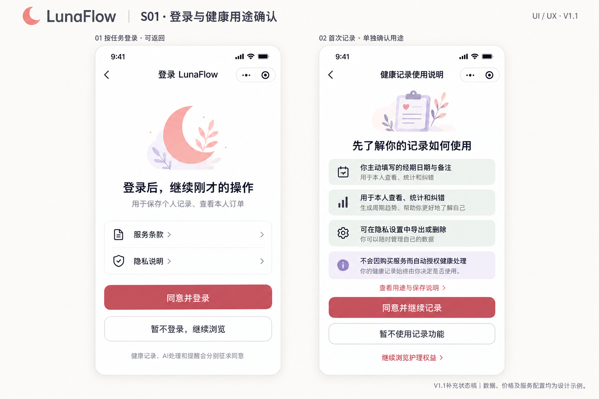

**场景与映射：**U04/U05首次保存私人记录时触发，登录成功仍回原任务；U02需要账户时可复用登录部分，但不能要求健康用途同意。

- **A：登录续接。**标题“登录后保存这条记录”，说明登录用于本人之后查看和修改。主“同意并登录”，次“暂不登录继续浏览”。该确认仅针对页面明确展示的必要账户条款及处理说明，不合并健康、AI、消息或代扣用途；不要求头像、手机号登录、伴侣或身份证。
- **B：健康用途确认。**明确将保存本人填写的日期与备注，用于查看、修改和回顾；AI另行询问。主“同意并保存”，次“先不保存”，处理说明可查看。只有当前确有待保存记录时才用“并保存”；纯设置入口用“同意并继续”。
- **拒绝或失败：**拒绝后说明“这条记录尚未保存”，保留可退出的原任务，不屏蔽公开介绍、购买和护理权益。登录失败可重试；登录完成但健康用途未同意，不能先把健康正文上传保存。
- **成功与返回：**按原操作标识保存一次，回原记录任务，不能重新弹购买页；登录过程中切换账号时重新核对草稿归属。
- **验收：**账户、健康、AI、消息、代扣分别确认。默认不勾选。仅需必要的短期会话草稿，不在未同意时云端长期保存健康内容。

### S02 首次AI用途确认与直接手动备注

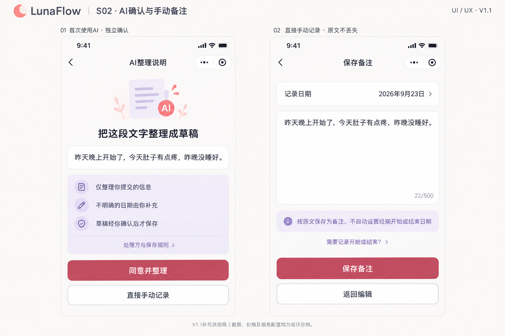

**场景与映射：**U06第一次选择AI整理或撤回后再次主动启用时使用；U19负责管理已存在的处理决定。

- **A：AI用途确认。**标题“用AI整理这段记录？”，说明“根据本次输入生成可修改的草稿，你确认后才保存”。主“同意并整理”，次“先手动记录”。实际服务商、处理范围与保留说明需可查，未核实不能假装已经具备真实个人AI能力。
- **B：手动备注保存。**显示具体记录日期及可编辑原话，说明“只保存你写下的内容，不经过AI整理”。主“确认保存备注”，次“返回修改”。开始/结束事件不是必填。
- **拒绝或失败：**拒绝AI不丢原文；AI不可用、额度不足都可走同一手动路径。手动备注经用户确认日期，不自动解析“昨天”为另一天的开始事件。
- **成功与返回：**普通备注写入`notes`，返回U04或来源时间线；只有选择AI并确认结构草稿才进入U07保存提取事件。保存失败保留文字，重试不重复新增。
- **验收：**手动保存不扣AI额度，不伪称AI成功；健康处理本身仍须具备有效用途同意。拒绝AI不能等同拒绝使用整个工具。

### S03 原记录详情与版本冲突

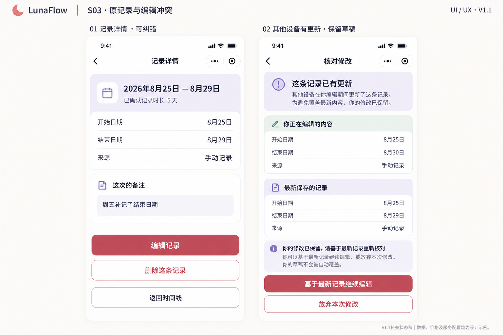

**场景与映射：**承接U08时间线和U09引用来源，使用U05已有纠错能力。版本冲突不是“结束日期早于开始”的表单错误。

- **A：原记录详情。**显示具体日期、本人确认字段与原话，提供“修改记录”“删除这条记录”；不混入新的AI推断。
- **B：版本冲突。**标题“这条记录已有更新”，说明“请先核对后再保存，你本次输入已保留”。对比当前已保存内容和本次修改的必要字段；主“查看最新内容”，次“返回继续编辑”。
- **错误恢复：**不得静默覆盖新版或自动恢复已删除记录；核对后用户重新确认，使用最新版本提交。日期重复、区间重叠仍按原U05独立校验。
- **成功与返回：**更新健康数据版本、重算统计并使相关报告失效；从U09来的用户返回原报告时看到“摘要待更新”，不是旧内容继续当最新。
- **验收：**来源点击准确定位到具体记录；删除确认说明影响范围；仅修改本人选中的记录。不得用“强制覆盖”作为默认一键处理。

### S04 未开通与到期未领取

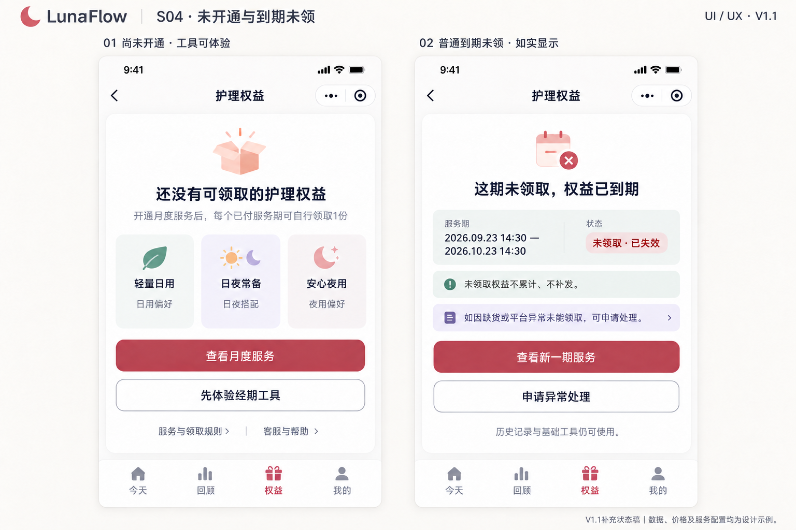

**场景与映射：**补U10尚未购买、正常到期未领的两种状态，区分工具免费能力与实物资格。

- **A：未开通。**说明当前没有可领取资格，展示真实服务介绍入口，主“了解关护月度服务”，次“先使用记录工具”。不显示“剩余1次”或伪造已到账权益。
- **B：已到期未领取。**展示对应历史服务期和准确截止时间，说明“该期未领取权益已到期，不自动累计”。主可查看服务或会员，次查看历史订单。旧期不可普通领取，新购仅获得新一期权利。
- **异常恢复：**只有正常可兑、无平台故障的到期资格才呈现B。缺货、支付延迟、已受理领取、退款冻结或补救延期分别显示实际状态，不借此页面统一失效。
- **验收：**到期不删除历史、手动记录、导出或售后入口；已领取正在运输的订单继续可追踪；是否失效以服务端截止与状态为准。

### S05 方案不可售与报价更新

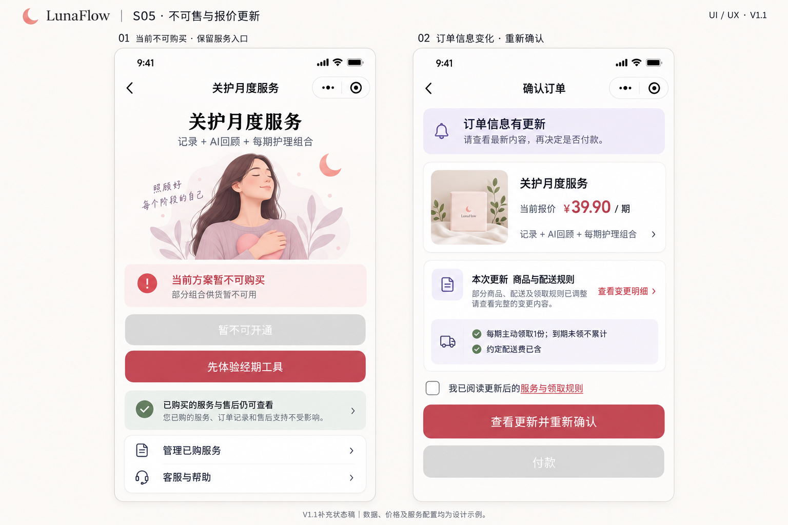

**场景与映射：**承接U01方案暂停、售前不可配送、库存义务不足等情况，以及U02报价过期/变更。

- **A：方案不可售。**标题“本方案暂时无法购买”，根据真实原因给可读说明。禁用付款，提供“查看其他可用方案”（确有方案时）或“先使用记录工具”、客服；不造一个空列表去处。
- **B：报价更新。**标题“订单信息有更新”，列示金额、商品、规则或地区中真实变化项；重新展示当前条款，复选框恢复未选，用户主动勾选后才可按新报价付款。主动付款按钮使用当前应付金额，次“返回服务介绍”。不能沿用旧报价的确认，也不能仅因滚动或打开更新说明自动勾选。
- **未知与恢复：**报价检查失败与确定下架分开，前者允许重试；渠道已在途付款不能因本地报价过期直接另建新付费单。先查询原交易事实，再决定新报价路径。
- **验收：**销售暂停不停止已售用户的领取、退款、订单及客服；新报价由后端签发；没有变化时不伪造“优惠即将消失”催付。

### S06 确定未付款与已付资格创建中

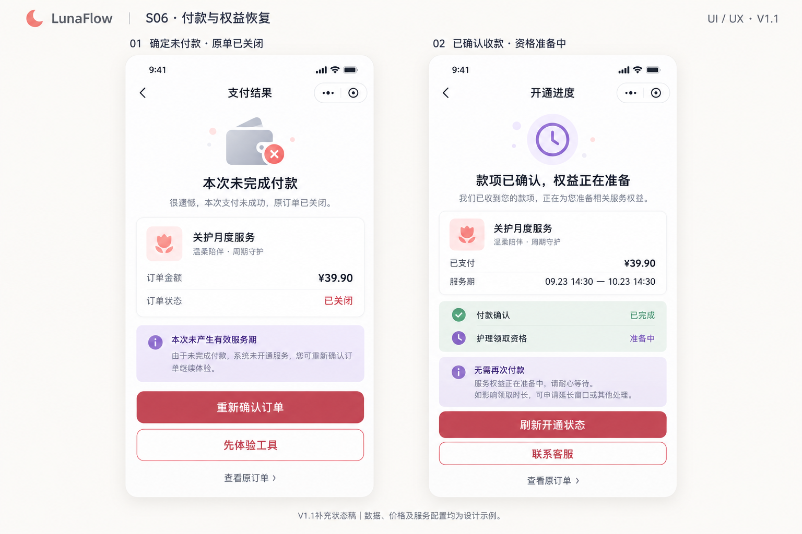

**场景与映射：**补U03的恢复分支，避免“结果未知”“未付款”“支付成功但服务尚在同步”混为一类。

- **A：已核实未付款。**明确“本次订单尚未付款”，解释是否仍可继续原订单。原订单合法可付时主“继续支付”；已经关闭时主“重新确认订单”回U02。用户主动关闭收银台不直接触发该终态，必须有服务端可信结果。
- **B：已付资格创建中。**明确“付款已确认，正在开通本期权益”，展示原单、实付和可确定的服务信息；主“刷新状态”，次查看订单/客服。不能再显示可扣第二次款的按钮。
- **失败与恢复：**恢复任务按原付款事实重试发期/资格；长时间无法完成转补救。平台延迟缩短实际领取窗口时按规则补偿，不计为用户忘领。
- **验收：**成功已收费状态不因资格失败倒退；资格尚未可用时不允许领取接口伪成功；网络未知始终先查单。

### S07 商品偏好与收货地址编辑

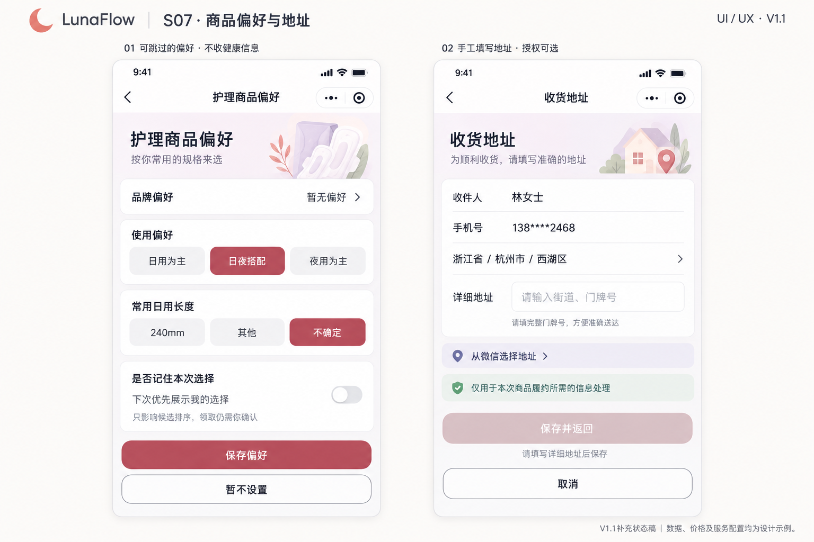

**场景与映射：**承接U10/U11“沿用上次、调整偏好”以及U12收货确认，入口也可从U14进入。

- **A：商品偏好。**仅选品牌、规格或组合偏好，可清除/跳过；“记住我的偏好”开关默认关闭，关闭时只作用本次选择，主动开启后才保存为下次偏好。主动作确认当前选择，次动作返回；是否持久化在按钮附近明确。保存不自动领取、不增加周期或症状问卷。
- **B：地址编辑。**只填写必要收件人、电话、地区、详细地址，主“保存地址”，次返回；有平台地址能力时可自愿使用，拒绝后继续手填。默认地址若提供，应由本人选择。图中的手机号是脱敏演示；实际新建/编辑提交必须提供完整有效的收货手机号，不能把`138****2468`等掩码当真实表单值提交。已存地址可以脱敏显示，编辑时按权限提供安全的修改路径。
- **校验与恢复：**就近提示缺字段、号码格式、配送范围和版本冲突；地区不支持先阻止本次提交，提供可行地址或购买承诺不符的售后处理，不能临时加运费。
- **成功与返回：**保存后回U12显示新地址，但仍需确认领取；改通讯录地址不改写已确认领取单的地址快照。已出库地址问题走售后，不伪称修改已生效。
- **验收：**偏好与履约资料不进入健康分析或广告标签；清除偏好后回统一候选，不减少用户选择权；没有有效地址时有新增入口而非空白确认页。

### S08 订单列表与退款申请表

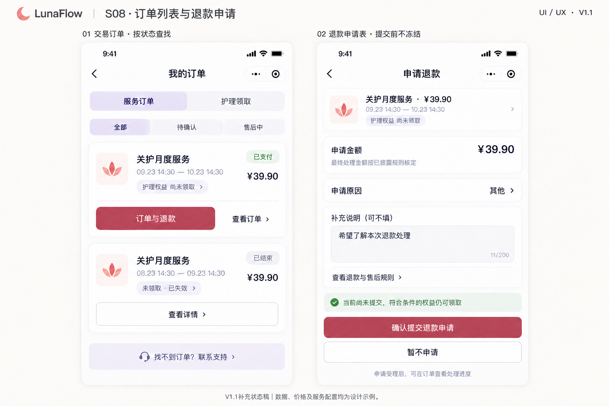

**场景与映射：**从U14/U15进入本人收费订单列表，选择后到U17；退款表是U17的提交前状态。

- **A：订单列表。**展示真实时间、金额、首付/主动续购/自动扣费类型及付款状态，按同一含义筛选；点击进入U17。收费订单与实物领取单区分，避免一份付款被当成两笔交易。
- **B：退款申请表。**显示对应实付、可申请范围、已领/履约状态及规则入口；理由可选或“其他”，不要求健康证明。主“提交退款申请”，次返回订单。
- **关键时点：**打开列表、表单或填写原因均不冻结权益；**服务端受理申请的事务才建立退款保护并阻止新的领取/供应提交**，随后进入U17受理态。
- **错误恢复：**表单失败保留内容；超时先查原申请，不能重复退款。金额由规则与服务端计算，申请额不是最终批准额或到账承诺。
- **验收：**全额/部分退款受累计金额预留约束；已发货进入真实售后；退款不自动等同取消独立代扣协议；空列表和加载失败分别处理。

### S09 导出任务与删除记录确认

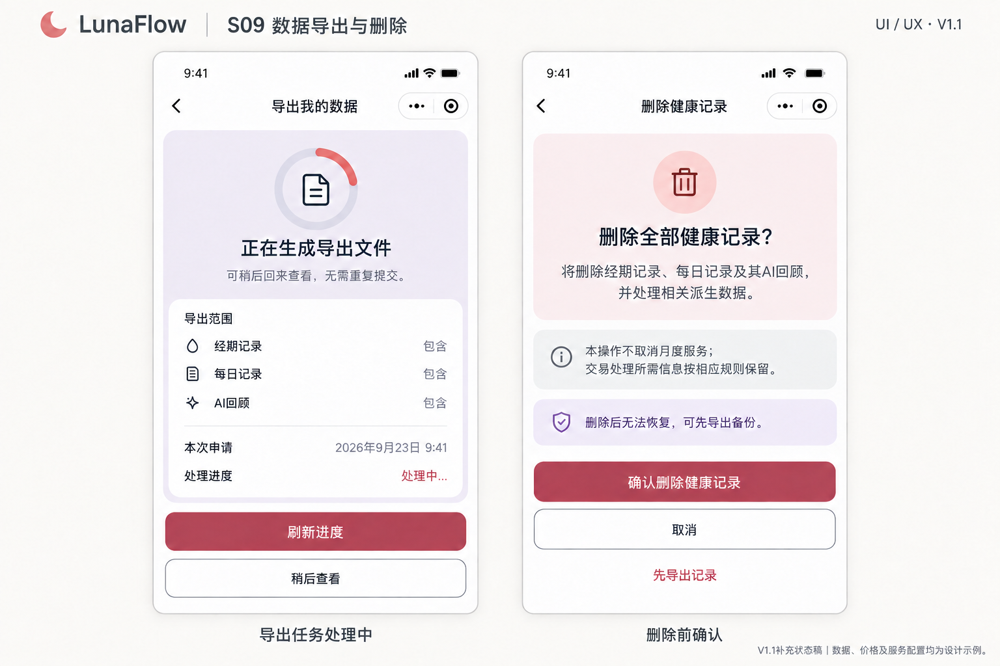

**场景与映射：**U19数据权利入口的实际任务终点，不要求会员、不改为必须人工客服办理。

- **A：导出处理中。**图中提交已受理，显示“正在准备你的记录”；可返回并再次查看。此图没有展示下载完成态；进度、完成可下载、链接过期及失败均由统一任务状态组件实现。完成后提供下载及服务器给出的有效期；过期显示重新生成入口，失败可重试。
- **B：删除确认。**明确删除范围（首版若仅全量则写“全部健康记录”），说明“相关摘要和缓存也将处理；必要交易资料按说明保留”。主“确认删除健康记录”，次返回。
- **处理中与恢复：**受理、执行、完成分开，不能仅客户端清空后宣称删除完成；撤回/删除触发进行中AI任务停止或结果丢弃。服务端未知先查任务，不自动再发第二次任务。
- **验收：**本人会话重新核验，不新增身份证门槛；导出短时私有下载、账户切换不可访问他人任务。健康删除不等于退款、取消会员或账号注销。

### S10 注销待处理事项与确认注销

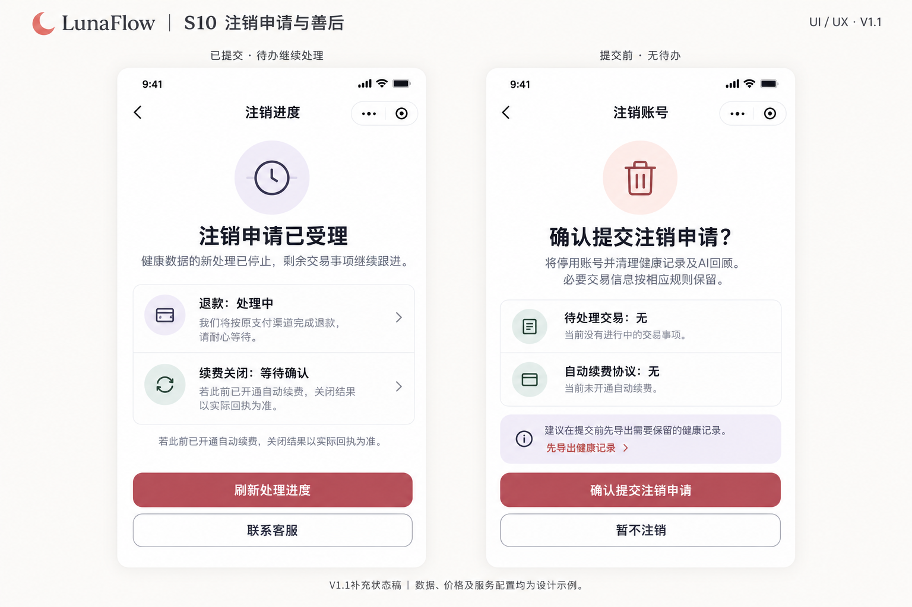

**场景与映射：**U19账号注销的两个状态；只显示完成注销确有必要处理的项目，不以不相关任务延长门槛。

- **A：注销已受理，尚待完成。**用户已经提交且服务端已受理注销；列出正在等待的交易处理或代扣解除回执，提供查看原单及注销处理进度。不是要求用户先清空所有订单才准许申请的前置阻挡，不重复显示“申请注销”按钮。
- **B：无相关待处理事项时确认注销。**这是另一个场景中的提交前确认，明确账号访问变化、健康资料处理及必要交易保留；主“确认申请注销”，次“返回”。A、B不是“先被阻挡，再获准申请”的先后流程。只有服务端完成后才显示“已注销”。
- **未知与恢复：**受理后按PRD停止新扣费、处理代扣协议及交易善后，健康访问按注销流程终止；外部解约未知、退款在途显示真实进度，不能用本地删除登录态冒充全部完成。
- **验收：**存在交易不意味着可无限阻止申请；明确入口、原因和后续结果。注销与仅删除健康记录、仅停止AI互不替代；处理进度访问范围由服务端限制，不恢复已终止的健康访问。

### S11 提醒预约与授权后的结果

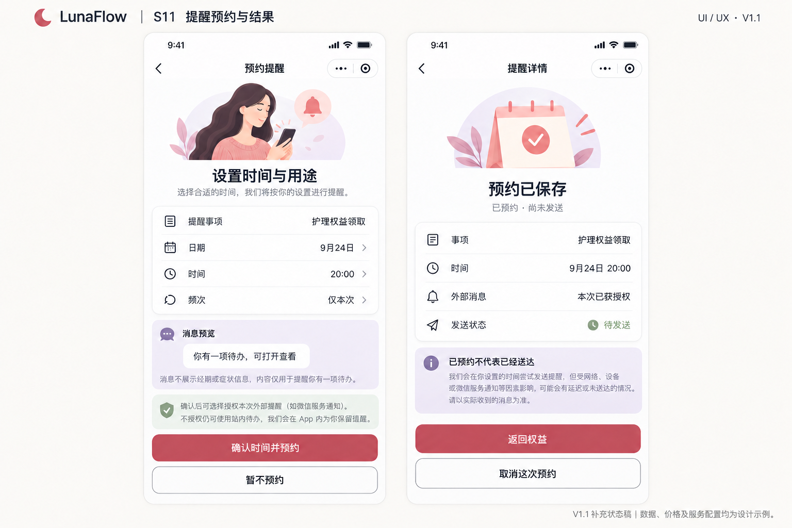

**场景与映射：**补U18点击“预约一次”后的任务表单及结果，拒绝外部授权仍复用U18已画的站内待办态。

- **A：预约表单。**选择这一次的任务类型、具体时间及适用消息方式，主“预约这次提醒”，次“只保留站内”。用户主动动作后才请求适用平台能力。
- **B：预约已保存、等待发送。**显示已保存任务、预约时间及真实授权状态；本图主“返回权益”进入U10，次“修改/取消预约”。从其他任务入口预约时按来源恢复。“预约成功”不是“消息已发送”，授权成功也不等于任务已经保存，不能提前显示送达。
- **错误恢复：**时间已过、模板不可用、授权拒绝、任务写入失败分别提示。授权成功但业务任务保存失败仍需重试保存原任务，不能宣称整体成功；不重复消费/请求权限来掩盖业务失败。
- **验收：**同一目的与业务对象去重；完成或取消后停止待发任务；无法收回已发送消息时如实说明；健康细节不出现在外部消息正文。 实现文案统一写“小程序内待办”；S11图中的“App内”简写不表示另需安装独立App。

### S12 工单列表与详情

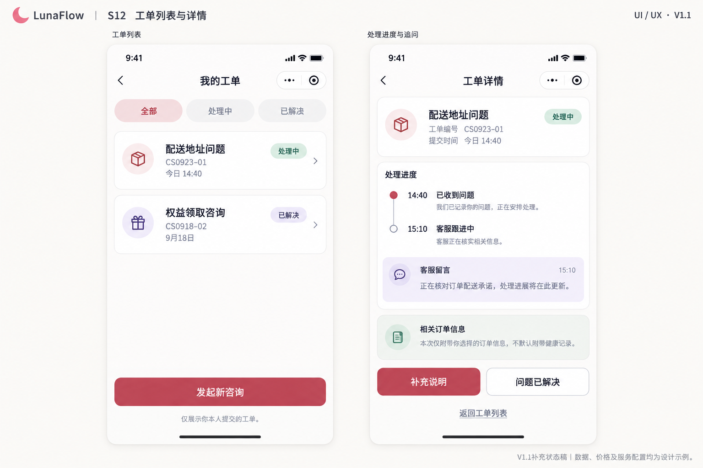

**场景与映射：**承接U20“查看我的工单”及提交成功后的详情；无需增加聊天社区或实时客服系统。

- **A：工单列表。**展示类别、脱敏关联单、提交时间和待处理/需要补充/已处理等真实状态；可进入详情。无工单说明“还没有提交过问题”，提供原有提交入口。
- **B：工单详情。**展示用户原问题、服务处理进展和必要回复；若需补充，列明缺少的信息；主动作随状态为“补充信息”或查看处理结果，不能永远显示再次提交。
- **错误恢复：**U20网络失败返回后可查是否已有工单；未知结果先查原提交标识。详情读取失败保留已知状态，允许刷新；不把“已受理”写成“已解决”。
- **验收：**健康证明与无关身份材料非处理订单问题的前提；附件可选、控制访问；客服时段由实际能力配置；工单关闭不自动标记退款到账或商品签收。

### S13 免费工具、额度不足与AI等待

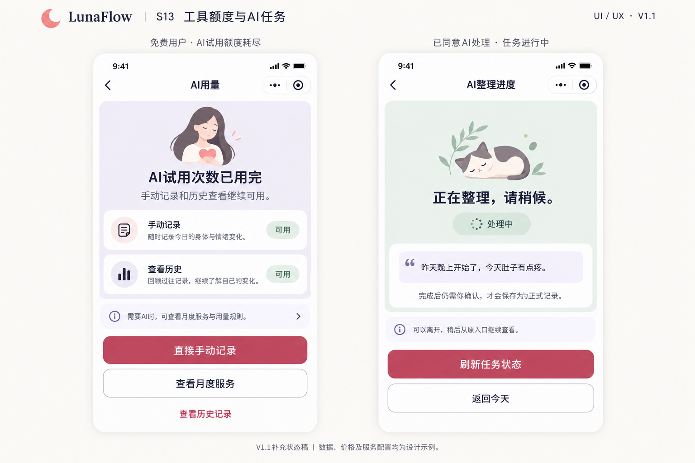

**场景与映射：**本图左侧为U04/U06免费用户的AI试用耗尽状态，右侧为U06/U08异步任务等待；会员到期后的基础工具可用规则沿用同一组件，但不是左图中另一个已发生的收费事实。

- **A：免费AI试用次数已用完，手动仍可用。**说明“手动记录和历史查看仍可使用”，针对具体任务显示当前免费额度；主“手动记录”，次“查看额度与服务”。不写成已付期到期，不以满屏购买弹窗遮住记录。
- **B：AI整理任务处理中。**显示“正在整理，可以稍后回来查看”，允许返回；原入口保留任务卡。任务完成后：提取去U07核对，回顾去U09查看。
- **错误恢复：**免费、到期和有预购期的额度规则分别由服务端返回；没有有效付费期不能承诺某日自动刷新付费额度。任务UNKNOWN先查状态，明确失败释放成功额度并可重试/手动处理。
- **验收：**再次打开相同数据版本缓存不再扣生成额度；“草稿已生成”不等于“记录已保存”。源数据删除或AI授权撤回后任务不能重新发布；换账号不显示前账号的待办。

### S14 断档重购与取消结果未知

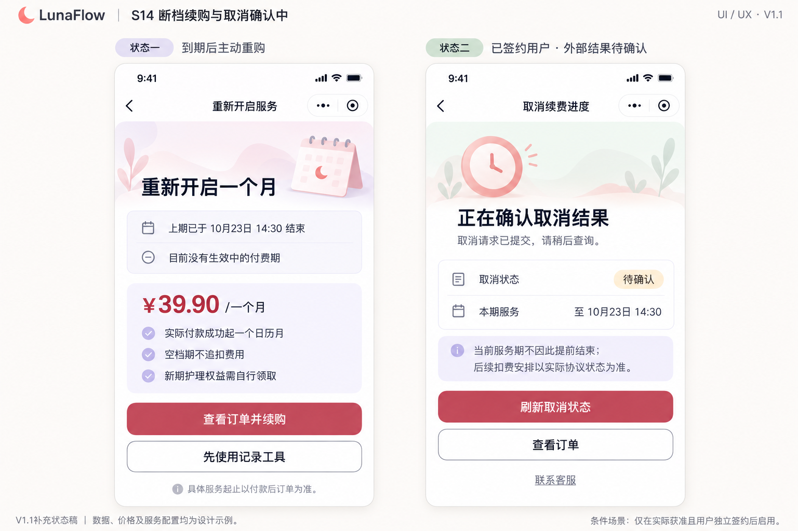

**场景与映射：**补U15断档后的主动付款以及U16外部取消尚未确认；与原U15提前购买、U16取消成功分别区分。

- **A：断档主动重购。**说明“本期已结束；重新购买后，从付款成功起提供完整一个日历月”，无追扣空档。主“查看订单并重新开通”进入U02核价，次继续使用免费工具。
- **B：取消结果未知。**说明“停止续费处理中，正在确认支付渠道状态”；主“刷新处理进度”，次查看订单或获取协助。不能显示“已关闭”成功勾号。
- **阻止重复收费：**A仅在无在途未知扣款时可进入新支付；有UNKNOWN/PROCESSING必须先查原收费义务。B本地已阻止新调度，不等于外部协议已解除，也不保证在途收费已取消。
- **成功与恢复：**断档新期以实际成功时间生效；如旧扣款晚成功，按PRD处理完整服务期、后续协议安排或退款补救。取消收到可信确认后切回U16成功态，本期已付服务保留。
- **验收：**不悄悄改签约日期、不用第二次付款解决未知；取消不等于退款，原单有收费仍可走U17。

### 9.3 统一请求与恢复交互

| 状态 | 用户应看到 | 允许操作与事实来源 |
| --- | --- | --- |
| 尚未提交 | 可编辑表单、清楚的确认动作 | 返回不产生保存、领取、退款或扣款 |
| 本地校验失败 | 错误在字段旁，保留全部已填内容 | 修改输入；不创建业务成功事件 |
| 已发请求/处理中 | 明确正在进行哪件事、可离开后的查找位置 | 限制重复提交；读取原业务对象 |
| 服务端或外部结果未知 | “正在确认结果”，不画成功 | 先查原单/原任务，必要时人工核对，不建立第二笔同类外部动作 |
| 确认成功 | 对应业务真实结果及下一步 | 页面跳转依据服务端状态；支付、资格、领取、发货、退款分开 |
| 确认失败且可恢复 | 真实原因、保留输入、可执行重试或替代 | 原幂等意图重试或按服务端指示新建，不能盲目重复扣款/发货 |
| 已失效/终止 | 明确原因及保留的其他能力 | 无效动作关闭；提供合法重新开始或补救入口 |

提交中禁用按钮仅防止前端连点，服务端仍必须幂等。成功Toast不能替代业务详情；用户关闭Toast后仍能从对应订单、记录、任务或工单列表找到结果。

### 9.4 导航与草稿恢复补充

1. 四Tab与U04/U08/U10/U14映射不变。记录、回顾、权益、我的子视图无上一页时分别回所属Tab；服务介绍返回使用明确的U01入口，不由随机历史栈决定。
2. 登录及用途确认完成后回原任务，不丢方案、组合、日期和输入。拒绝回到同一任务并允许退出，不循环索取。
3. 从U09查看引用后返回原报告位置；修改原记录后展示摘要待更新。原记录已删除时解释来源不可用，不能自动创建副本。
4. U03去U12必须已有合法选包上下文且资格可用，否则先U10/U11。默认候选不构成已领取。
5. 离开真实修改过的表单时才提示“这次修改还没保存”，提供“继续编辑”“放弃修改并离开”；未改内容不拦截返回。
6. 未保存草稿只按已披露的安全范围和期限保留；账号切换清理敏感草稿。此次补充不引入长期云端草稿箱。
7. 交易处理中可离开并从原单找回；离开页面不等于取消付款、退款、代扣或发货。
8. 原生返回、页面返回及Tab切换采用相同业务保护规则；不得用返回动作自动确认、自动领取或再次提交。

### 9.5 未单独绘制但必须实现的空态

| 场景 | 建议文案 | 行动 |
| --- | --- | --- |
| 回顾范围内零记录 | “这段时间还没有记录” | 记录一条／调整时间范围 |
| 账号尚无任何健康记录 | “从一条记录开始，之后可以在这里回看” | 开始记录；虚构示例必须明确标注 |
| 仅一条记录 | “已保存这条记录，还不足以比较不同周期” | 查看该条／补记，不出趋势 |
| 读取失败 | “暂时未能读取记录” | 重试；不把网络错误显示成数据为空 |
| 无历史订单/工单 | “还没有购买记录”／“还没有提交过问题” | 合适的服务介绍或提交入口 |
| 筛选无结果 | “没有符合当前条件的记录” | 清除筛选 |
| 已删除来源 | “这条来源记录已删除” | 返回时间线或基于有效记录更新摘要 |

加载不闪现0条，失败不清空既有数据，会员到期不让历史记录伪装为空。底部固定栏、键盘、大字体、长商品名、长地址和网络重试使用统一组件真机验收。

### 9.6 补充验收闭环

- 新用户可从广告直接购买而不授权健康/AI；也可从工具完成登录、健康用途确认和第一条手动记录。
- 拒绝AI、额度耗尽、AI服务失败、会员到期均有可用的手动记录路径，能在时间线找回。
- 引用来源可定位；版本冲突不覆盖较新事实；删除来源不继续暴露旧AI内容。
- 方案不可售不会误收款；报价变化需重新确认；已付未发资格可恢复，不让用户再付一次。
- 偏好保存不领取，地址保存不核销；服务端领取成功才创建履约主线。
- 退款表未提交不冻结；服务端受理后冻结正确；未知结果不重复退，解除冻结或补救可追踪。
- 预约成功不冒称已发送；工单受理不冒称已解决；导出/删除受理不冒称已完成；取消处理中不冒称已解约。
- 注销实际处理代扣与交易善后，健康数据访问按流程终止，必要留存说明与真实实现一致。
- 原U图与新增S图使用统一按钮、字体、图标和状态组件；图像细节差异不形成不同业务规则。

## 10. 退款、履约与工具剩余状态补充（S15—S22）

本节补8张静态状态板、16个视图，承接既有U页及S01—S14，**不是新路由或实装成果**。左右不一定先后发生；成功、失败或未知均以服务端事实为准。

价格、退款额及日期均为设计示例；主按钮继续使用`#B74752`白字。

### S15 退款执行失败与撤回恢复

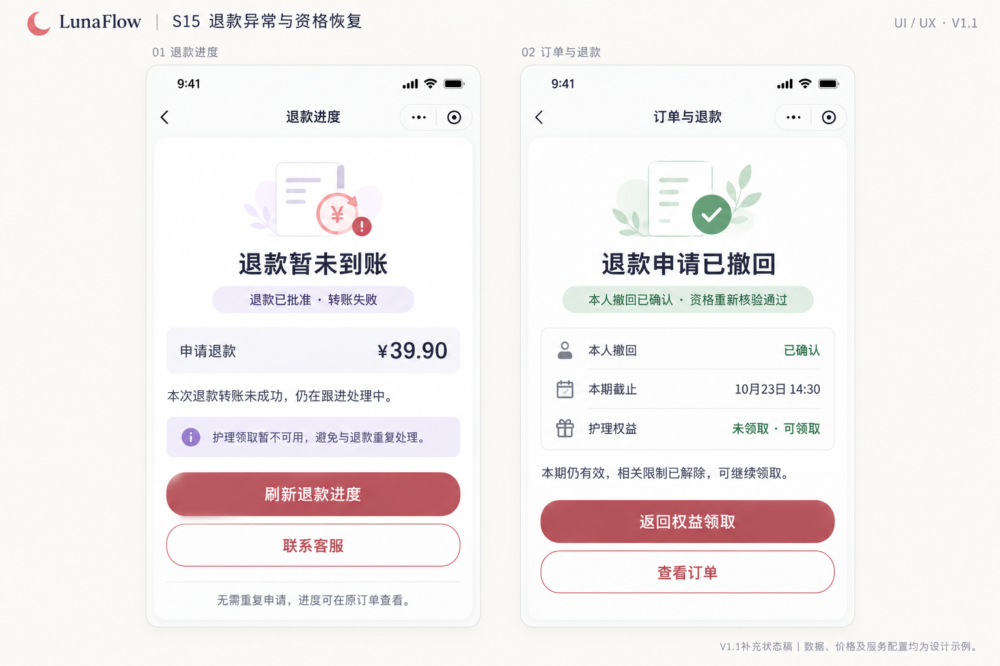

**入口：**U17已有退款申请的处理进度。

- **左：**退款已批准，渠道明确执行失败，退款义务仍存续。显示“退款暂未完成，正在处理”“护理领取仍暂停”；主“刷新退款进度”留在原申请，次“联系客服”去U20。不能显示可重新领取。
- **右：**本人撤回已获服务端确认，无其他冻结、未领取且仍在有效期，显示“退款申请已撤回，本期护理权益可继续领取”；主“返回权益领取”到U10，次“查看订单”到U17。
- **服务端条件：**渠道失败不等于撤回或批准取消，不自动解除业务hold；渠道执行预留与业务退款义务分别处理。只有确认撤回且满足全部资格条件才恢复；存在在途渠道退款时先查清，不能一边恢复一边到账。
- **验收：**撤回提交、撤回未知、撤回成功分开；有其他hold或已过期不套右图。恢复只解除限制，不重发资格、不重置次数和截止时间。

### S16 部分退款与解约前在途扣款

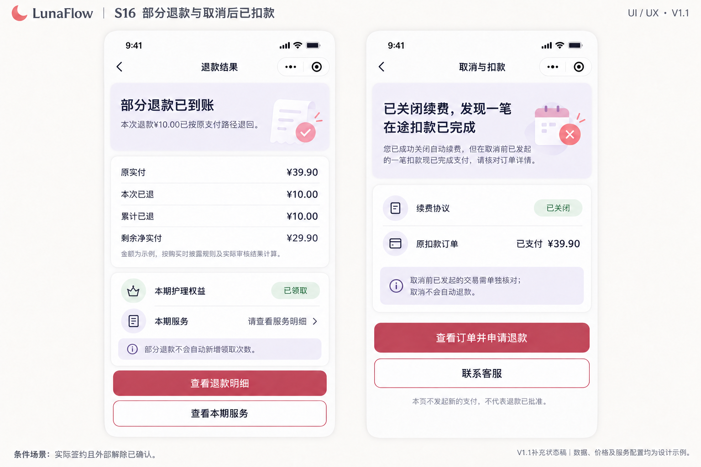

**入口：**U17退款结果；U16取消后查看关联收费订单。

- **左：**原实付¥39.90，已批准的部分退款¥10.00已确认到账，净支付¥29.90；显示已领取的真实历史。主“查看退款明细”到原退款详情，次“查看本期服务”到U15。已领取资格不会因部分退款恢复为可领。
- **右：**协议已确认关闭，但取消之前发起的在途扣款现已确认成功。显示关联订单和金额，点入原订单可见单号及交易时间；主“查看订单并申请退款”去原单U17，次“联系客服”到U20。不可写“仍在扣费”暗示关闭失效，也不可隐瞒这笔实收。
- **服务端条件：**左侧以渠道退款成功及账本冲正为准；右侧同时满足合同已终止、原支付意图在取消前已提交、付款事实已确认。未知交易不得套已付文案。
- **验收：**净额计算准确；部分退款后的服务范围按已披露决定展示，不自行发明扣减。右侧退款未受理前不显示已退款；后续不得再按该关闭协议新发扣款。

### S17 删除清理中与在线清理完成

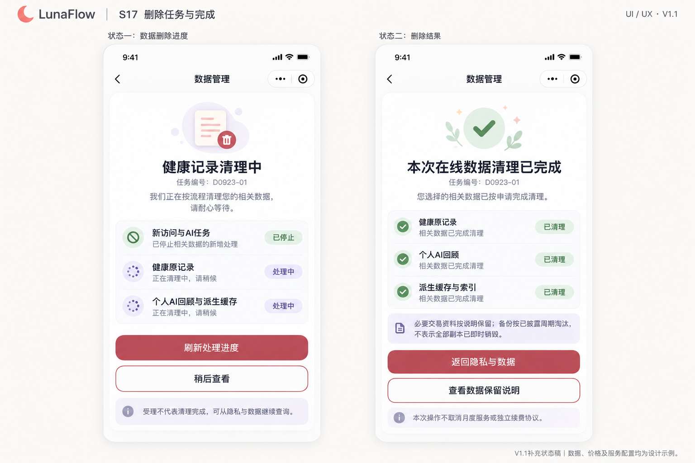

**入口：**U19经确认且服务端已受理的健康数据删除任务。

- **左：**“正在清理本次申请范围内的健康记录”，已停止受影响内容访问及相关任务。主“刷新处理进度”，次“稍后查看”回U19；不提前展示完成勾号。
- **右：**服务端确认在线原记录、个人回顾及相关派生数据清理完成，显示“在线健康记录已清理”；明确“备份按已披露周期淘汰”，必要交易保留另列。主“返回隐私与数据”到U19，次“查看数据保留说明”打开相关说明。
- **服务端条件：**清理范围、任务状态与完成项来自删除任务；派生未清完不能用右图。备份、外部处理方按真实配置说明，不承诺瞬间全部副本销毁。
- **验收：**旧AI任务不得把已删除版本重新写回；读取旧链接不能恢复正文。删除失败/未知可查原任务，不复活数据；健康删除不等于账号注销、退款或解约。

### S18 已付领取前缺货与预留过期

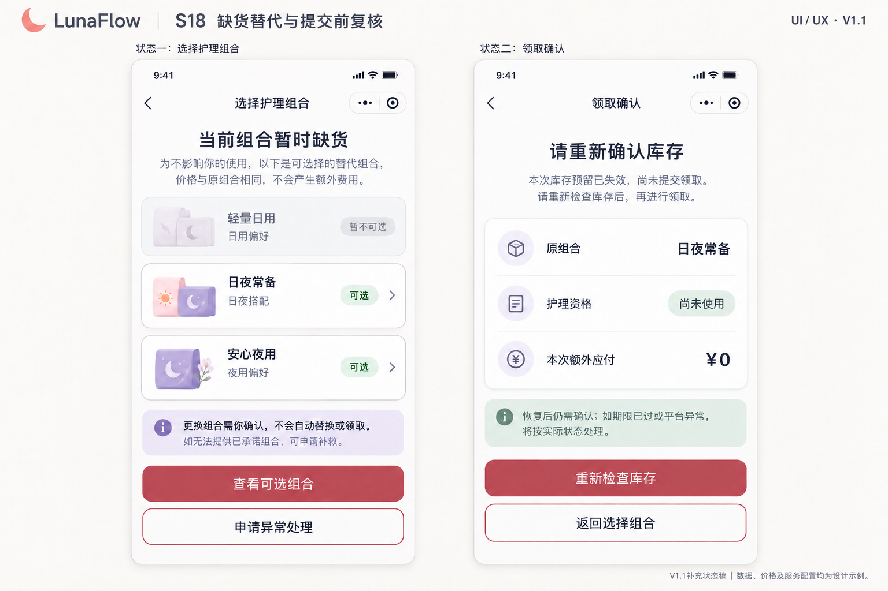

**入口：**U10/U11选包或U12确认领取时的服务端重新校验。

- **左：**已付款但尚未成功领取，所选组合缺货；显示“这份组合暂时缺货，你可以查看可选替代”，主“查看可选组合”到U11，次“申请异常处理”到U20。替换需本人确认，不自动换品牌。
- **右：**短时预留已过期，并且已确认没有成功提交的领取单，显示“商品预留已过期，请重新确认库存”；主“重新检查库存”重新校验，再回U11/U12确认，次“返回选择组合”到U11。
- **服务端条件：**资格仍有效且无退款hold；检查原请求、claim和供应调用状态。只有明确未领取才能套右图，UNKNOWN或已有claim必须查询原单，不建立第二份。
- **验收：**重新校验不自动核销、扣费或延长账期；不能临时加运费。平台缺货导致无法兑现进入补救，不能到期归为用户忘领；已领取后的供货异常使用U13。

### S19 模板不可用与原任务缺少授权

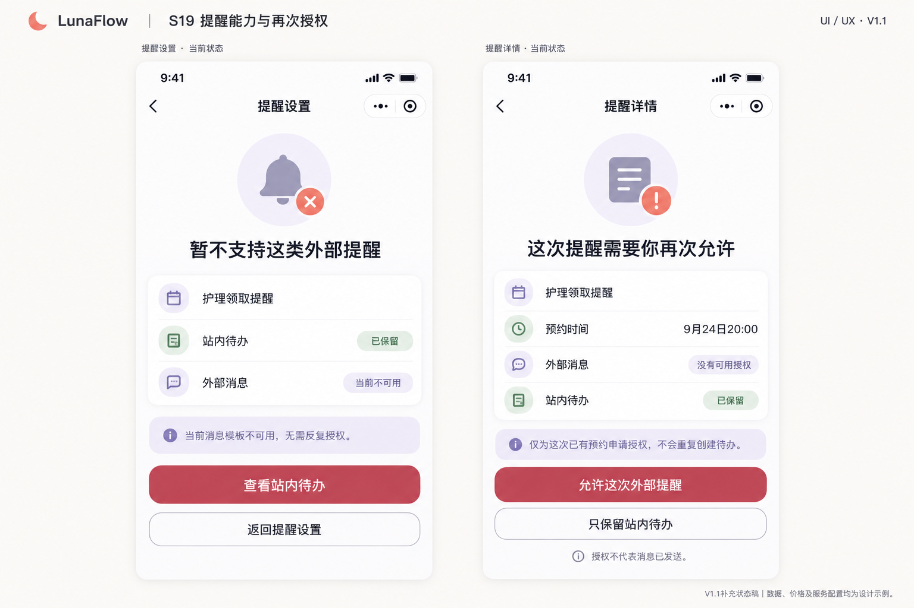

**入口：**U18既有预约的状态页；必要时从权益提醒返回U10。

- **左：**当前类目/模板无法用于外部消息，显示“暂不支持这类外部提醒，站内待办已保留”；主“查看站内待办”，次返回来源页。不要要求用户不断重新授权解决平台能力缺失。
- **右：**模板可用、任务仍有效且未来待执行，但当前没有可用授权，显示“这次提醒需要你再次允许”；主“允许这次外部提醒”由本人触发平台许可，次“只保留站内”。
- **服务端条件：**模板能力、任务、授权机会分别判断，不编造固定授权有效天数。再次授权仍关联原任务，不能新增重复预约。
- **验收：**拒绝后不反复弹窗；授权成功只说明许可取得，预约保存、发送受理和可观测送达各自展示。任务已过时、完成或取消不按右图直接重新发送。

### S20 未来日期与区间重叠

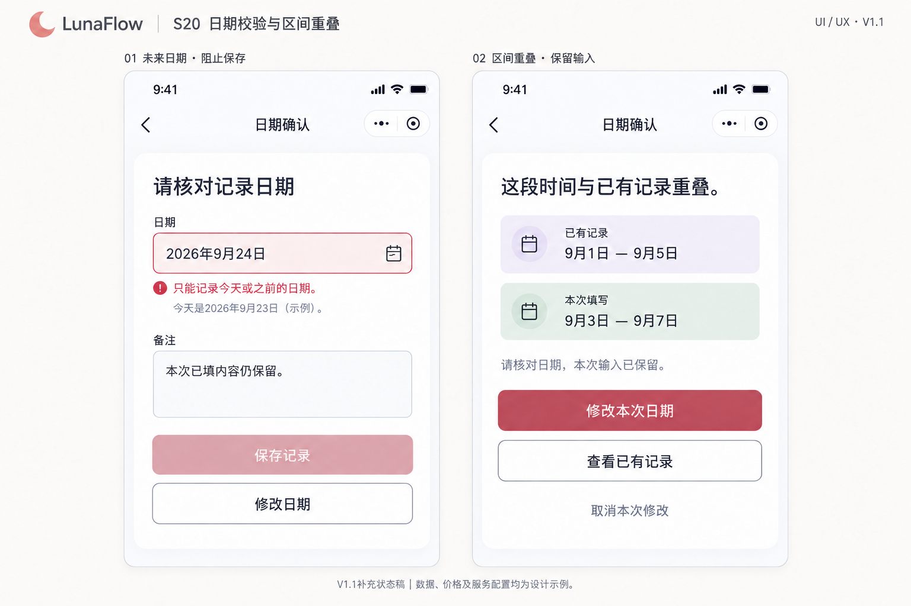

**入口：**U05开始、结束或补记表单；今天示例为2026-09-23。

- **左：**2026-09-24是未来日期，不能保存为已发生事实；日期组件正常应禁用未来选择，旧草稿/提交触发时显示“只能记录今天或之前的日期”。主“修改日期”，保存禁用；备注保留。
- **右：**已有2026-09-01至09-05的确认区间，新输入09-03至09-07与其重叠。显示“这段时间与已有记录重叠，请核对日期”；主“修改日期”，次“查看已有记录”进入原记录详情。
- **服务端条件：**客户端校验用于反馈，最终按可信当前日期、本人已确认区间与版本校验。区间冲突与S03并发版本冲突分别处理。
- **验收：**不自动合并、不静默改日期、不提供默认“仍然保存”。未来计划可从既有提醒入口另行设置，但不能变成已发生健康记录。

### S21 AI失败保留统计与有条件的额度刷新

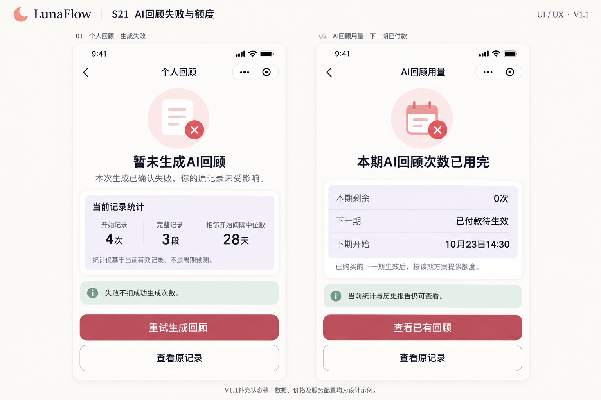

**入口：**U09新建/更新个人回顾，关联U08统计和U15服务期。

- **左：**AI任务已确认失败，但当前数据版本的确定性统计仍有效；显示“暂未生成AI回顾，仍可查看记录统计”，保留统计和来源。主“重试生成”，次“查看原记录”。只在服务端确认释放额度后说明本次未消耗成功次数。
- **右：**当期相应回顾额度耗尽，下一期已付款且待生效，才显示“下一期额度将于10月23日14:30生效”；主“查看已有回顾”到U08，次“查看原记录”到对应时间线。现在不能提前使用下期额度。
- **服务端条件：**统计有效性、任务终态、具体任务额度及预购期分别核验。未购买下一期不能承诺10月23日自动刷新；UNKNOWN不是明确失败，先查任务。
- **验收：**统计也不可用时显示错误，不伪造数字；整理额度与回顾额度不混用；无变化查看缓存不扣生成次数；已删除来源不继续展示旧统计或正文。

### S22 已付服务与签约未知/失败

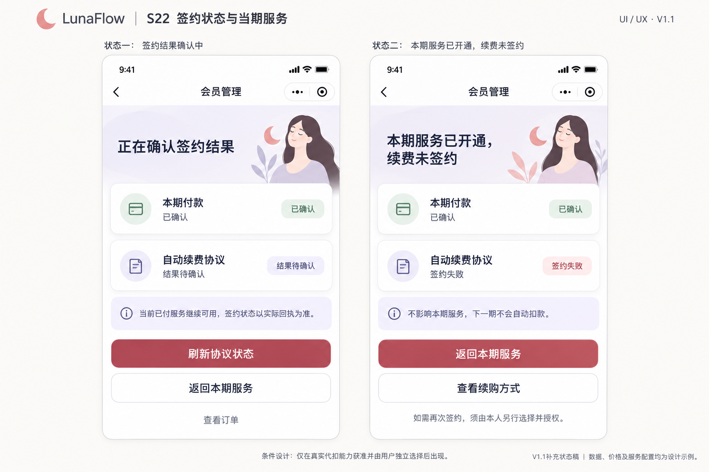

**条件与入口：**仅代扣产品已获准且用户主动发起签约时，从U03/U15查看。普通单期购买不必经过此板。

- **左：**首付已确认，签约结果未知；显示“本期服务已开通，自动续费授权正在确认”。主“刷新协议状态”查询原签约意图，次“返回本期服务”去U10/U04。不要求重新付首期或盲目重复签约。
- **右：**首付已确认、签约明确失败；显示“本期单期服务保留，未开通自动续费”。主“返回本期服务”到U10，次“查看续购方式”到U15；未来可主动续购，不强制再次签约。
- **服务端条件：**支付和协议对象分别取可信状态。仅合同确认ACTIVE才可按已披露规则调度未来扣款；SIGN_FAILED才能宣告签约失败，未知不得假称关闭或成功。
- **验收：**付款成功不自动等于签约成功；签约失败不撤销已付服务、不删除资格；未知后收到合法结果应更新原对象，不生成第二笔首付或第二份当期权益。

### 10.1 统一验收

视图只在所列服务端条件成立时显示；失败、未知、撤回不能共用一条恢复分支。原单未查清不重复发起外部动作。未绘制状态使用统一组件，可从原订单、隐私任务或提醒入口找回。本节细化需同步进入实现和测试，特别禁止退款渠道失败无条件解冻、未购下一期无条件承诺额度刷新。
