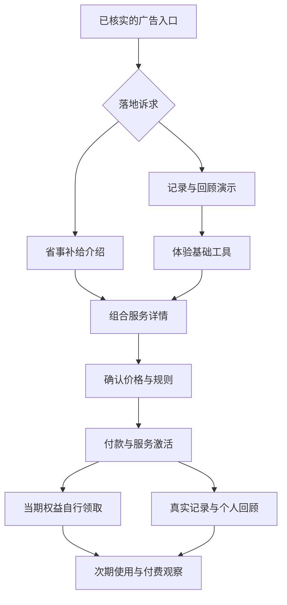
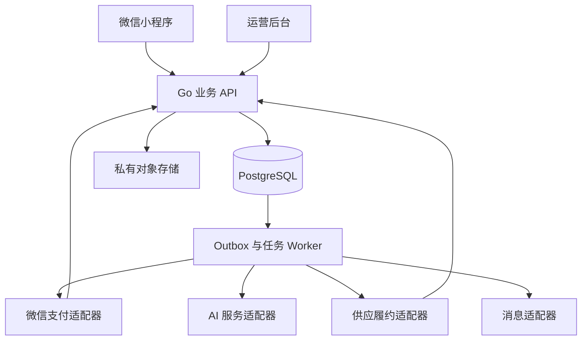

# LunaFlow 小程序技术 PRD V1.0

**主题：以投放验证为起点的极简经期工具、AI 回顾与月度护理权益服务**  
编制日期：2026-09-23｜适用市场：中国大陆成年用户｜业务展示时区：Asia/Shanghai  
文档用途：产品评审、交互原型、接口与数据库设计、开发任务拆解、测试与小规模投放验收。

> 本文定义拟实现的产品，不表示已经上线或验证盈利。当前没有实际投放、采购成交、续费或完整商户准入数据。P1／P2／P3 为待验证需求画像。本文给出可开发的基线，并将需要真实商户配置、供应报价和平台审核才能启用的功能明确列出。

## 1. 现状、依据与本次决策

### 1.1 仓库现状

已检查本地 `spocetmm/lunaflow` 工作副本，提交 `cc09cf1961ed1aa81ac6ddb8a270757e273aa01c`，检查时工作区无修改。仓库保存 README、PPT 网页、产品方案和研究材料，尚未发现小程序应用、业务后端或数据库迁移代码。因此下面的技术栈、接口和数据表是**新建实现方案**，不是既有能力描述，也不是对远程仓库最新状态的保证。

仓库 README 的 V1.2 仍侧重用品单次成交与主动复购。本技术 PRD 以本轮用户最新目标为准：**好用的经期工具＋AI 个人回顾＋多品牌护理权益组成月度服务，支持用户主动续购，并完整设计经授权的自动续费能力。**不直接继承历史文档的价格、预算、毛利或已验证结论。

### 1.2 功能决策

| 决策 | 本版实现基线 | 原因 |
|---|---|---|
| 产品形态 | 微信小程序＋内部运营后台＋业务 API／异步任务 | 首轮在可核实的微信流量入口内减少跳转 |
| 首发需求 | P1 省事补给型；P2 记录回顾型作素材对照；P3 商品划算型后置 | 同时验证数字服务与实物价值 |
| 导航 | 今天／回顾／权益／我的，4 个 Tab | 工具、历史与权益各有稳定入口 |
| 首发商品结构 | 一个组合会员方案，最多展示 3 个当期护理组合 | 压低选购及运营复杂度 |
| 支付方式 | 单期主动付款；获得对应商户能力后可选自动续费 | 签约与付款分别建模，不用普通支付冒充代扣 |
| 权益周期 | 按服务账期，每期 1 次，用户自行领取 | 不以生理周期或自然月截断已付服务 |
| 未领取规则 | 正常可领取而到期未领的权益不自动结转；商家故障另行补救 | 实现既定模式，同时区分未使用与未能履约 |
| 工具独立使用 | 基础手动记录、查看、纠错、导出和删除不要求会员 | 使工具价值与会员价值可以分别验证 |
| 商业分析 | 分别统计首付、自动续费、主动续购、主动领取及成本后贡献 | 避免把不同动作当成同一种复购 |
| 实现方式 | 微信原生 TypeScript；Go 模块化单体；PostgreSQL；独立 worker | 无既有代码约束，便于小团队调试与交易一致性 |

技术选型是本次建议。依赖版本在实施时选受支持版本并锁定；不在文档中猜测“最新版本”。

### 1.3 首轮不纳入

不建设社区、内容信息流、多商户入驻结算、积分商城、票务会员、诊断／治疗、排卵避孕建议、无限 AI、全渠道投放自动化。伴侣关怀、赠送及双端分享归 P2 后续版本：保留可扩展边界，首版不实现关系权限系统，也不将他人付款与健康查看权绑定。

## 2. 用户任务、目标与验收原则

| 需求画像 | 核心任务 | 对应功能 | 要验证的结果 |
|---|---|---|---|
| P1 省事补给 | 快速记录；少选商品；找得到常用组合 | 一键开始／结束、补记、默认组合、沿用偏好 | 用户完成任务、真实付费、后续仍使用服务 |
| P2 记录回顾 | 找到历史、看懂自己记录过的变化 | 时间线、确定性统计、可溯源 AI 回顾、纠错 | 在回顾可用的人中发生实际查看和再次使用 |
| P3 商品划算 | 确认品牌、规格、总到手成本 | SKU 明细、三组合对比、运费与库存说明 | 是否只对首期优惠成交、是否有持续需求 |

22—35 岁仅为首轮广告年龄测试带，不是注册的年龄上限，不要求用户提交身份证或出生日期来证明画像。成年范围采用适当的自我确认与平台要求处理；收货手机号仅在履约时需要，不作浏览和记录的强制前置。

首轮成功标准分两层：

1. **工程可用：**记录能正确保存；支付不会重复扣或凭客户端发权益；用户能自行领取、取消和申请售后；订单可对账；数据可追溯。
2. **经营可验证：**取得可归因的真实首付、使用、领取及成熟账期续费数据。CAC、领取率、留存率和利润阈值须结合供应成本与可承受试错损失设定，不把本文中的工程指标当成经营效果承诺。

## 3. 投放与产品闭环

### 3.1 两条入口，共用一套服务



购买路径不要求先填健康问卷、产生经期记录、绑定伴侣或开启营销通知。工具路径可先看演示；需要保存个人健康信息时，按用途完成必要说明与授权。首页内容由落地版本配置决定，不改变取消、退款和隐私入口的可达性。

### 3.2 第一轮实验边界

- 在同一服务价格、权益、配送范围及订阅规则下，比较“省事记录＋常用补给”与“清楚回顾＋实用护理”两种诉求。
- 第一轮主要改变素材切入点；如同时改变落地页面，要作为独立实验变量记录，不能把差异全部解释成人群差异。
- 后续固定有效诉求，再比较后台真实支持的定向范围。年龄、地区使用平台实际报表粒度，不伪造用户级标签。
- 微信外的平台入口先验证其允许的跳转、类目与归因能力。不得假定所有广告都能一键跳微信小程序；未经验证的渠道不列入首发承诺。
- 广告文案中的具体品牌、价格、权益数量与当前 `offer_version` 对齐。实际不含的商品、不成立的到手价、虚构成交滚动条均不得由运营配置发布。

## 4. 版本范围与功能清单

P0 = 可付费试运营必须实现；P0-C = 同属核心方案但依赖外部能力，具备条件后启用；P1 = 首轮证据明确后增强；P2 = 本版后置。P0-C 未开通时不伪装成功，不影响能独立运行的 P0 路径。

| ID | 功能 | 级别 | 具体实现 | 验收要点 |
|---|---|---|---|---|
| G01 | 广告落地与版本 | P0 | 已发布配置、来源标识、素材与套餐关联 | 非法配置回退；价格以后端为准 |
| G02 | 访问与转化归因 | P0 | 去重访问、订单来源快照、未知来源 | 无参数不猜测；无健康数据外传 |
| G03 | 受控实验 | P0 | 实验版本、固定分组、污染标记 | 同用户不在刷新时换组 |
| A01 | 微信登录与会话 | P0 | code 换登录态、会话失效与恢复 | 不信任客户端 openid；密钥只在后端 |
| A02 | 分用途授权 | P0 | 服务条款、健康处理、AI、提醒分开记录 | 拒绝 AI 不影响手动记录 |
| R01 | 开始／结束／补记 | P0 | 日期确认、重复及重叠校验、撤销 | 未结束不被解释为持续出血 |
| R02 | 日历与时间线 | P0 | 已确认事实、未知状态、详情修改 | 修改后统计与回顾失效更新 |
| R03 | 一句话备注 | P0 | 普通文字保存；可选 AI 提取草稿 | 原话保留；模型不能直接落库 |
| R04 | 参考时间与提醒 | P0 | 历史区间参考、用户自定日期提醒 | 证据不足不展示精确倒计时 |
| R05 | 冲突与数据版本 | P0 | 乐观锁、历史修改、撤销重算 | 旧页面不覆盖较新记录 |
| AI01 | AI 整理确认 | P0 | 有来源片段的结构化草稿 | 未提供字段为 null；保存由本人确认 |
| AI02 | 个人回顾 | P0 | 确定性统计＋有来源的语言整理 | 不编造个人历史或因果诊断 |
| AI03 | 额度、缓存与失败恢复 | P0 | 服务额度快照、任务去重、错误退额度 | 超时可手动继续，失败不扣成功次数 |
| M01 | 服务与套餐详情 | P0 | 数字服务、实物、账期、领取、价格 | 明示组合服务和需自行领取 |
| M02 | 单期付款与主动续购 | P0 | 普通支付、订单查询、主动新订单 | 前端 success 不直接授予权益 |
| M03 | 自动续费签约与扣费 | P0-C | 独立合同、扣前提醒、查询、解约 | 对应产品获批并联调通过后开启 |
| M04 | 会员管理 | P0 | 当期服务、下期状态、付款方式、订单 | 取消续费不删除当期服务或记录 |
| E01 | 三选一护理组合 | P0 | 商品偏好、推荐与替代、沿用上次 | 默认选包不等于自动领取 |
| E02 | 当期权益领取 | P0 | 每期一次、地址确认、库存及幂等 | 并发多次点击只生成一个有效领取单 |
| E03 | 履约与物流 | P0 | 供应商下单／人工导入、物流、异常 | 已领取未发货不能记为完成履约 |
| E04 | 到期与补救 | P0 | 正常失效；故障冻结／延期／退款 | 供货或系统故障不计作用户忘领 |
| S01 | 取消、退款、客服 | P0 | 自助解约；订单内售后；处理状态 | 不要求额外身份证或联系客服才可解约 |
| N01 | 用户预约提醒 | P0-C | 经准入模板发送、取消及授权状态 | 拒绝、未知、失败分别展示 |
| N02 | 站内消息 | P0 | 权益、交易、售后状态 | 站内生成不宣称外部已送达 |
| P01 | 隐私与数据控制 | P0 | 查阅、导出、纠错、撤回、注销 | 免费可用；订单必要留存与健康删除分开 |
| O01 | 运营后台 | P0 | 配置、库存、订单、补救、对账、审计 | 客服默认无健康原文权限 |
| O03 | 平台交易与发货管理 | P0-C | 依适用交易规范同步商品及真实履约状态 | 所需能力未接入不得宣称可正式支付；不伪造未领订单发货 |
| O02 | 投放与经营看板 | P0 | 成本导入、漏斗、成熟批次、贡献估计 | 自动续费／主动复购／领取分开 |
| X01 | 语音录入与历史导入 | P1 | 在权限和准确性验证后接入 | 不用语音权限阻塞基础记录 |
| X02 | 就诊准备文档 | P1 | 用户挑选记录后生成可核对摘要 | 分享前确认；不作为诊断报告 |
| X03 | 伴侣关怀及赠送 | P2 | 独立关系与可撤回分享授权 | 支付方不自动获得查看权 |
| X04 | 更多供应商与选品 | P1 | 供应适配、替代品版本、价格实验 | 先解决跨商家运费和售后责任 |

## 5. 服务权限与定价配置

| 能力 | 游客 | 已登录免费用户 | 当期付费用户 | 会员到期后 |
|---|---|---|---|---|
| 商品、服务规则、示例回顾 | 可浏览 | 可浏览 | 可浏览 | 可浏览 |
| 个人手动记录／查看／纠错 | 需登录及相关说明 | 可用 | 可用 | 继续可用 |
| 个人数据导出／删除 | 无个人数据时不适用 | 可用 | 可用 | 可用 |
| AI 整理／个人回顾生成 | 仅虚构示例 | 按试用额度 | 按购买时额度快照 | 保留已生成记录；新增按免费额度 |
| 当期护理权益 | 不可领取 | 无付费期不可领取 | 当期一次，自行领取 | 已失效期不能普通领取；补救单另行处理 |
| 订单与售后 | 登录后查本人订单 | 可用 | 可用 | 可用 |

发布 `offer_version` 必填：价格（分）、币种、数字服务范围、AI 额度、护理组合目录版本、配送范围及运费、领取有效期规则、续费方式、取消／退款规则、供应商、客服说明。缺字段不能上架或建立真实支付订单。

研发测试可采用“每账号试用 3 次 AI 提取、1 次个人回顾；付费每期 60 次提取、4 次回顾”的**测试配置**，不代表已确定商业权益。生产发布时必须明确展示实际额度；已购买的权益快照不能被后台调低。相同数据版本的缓存回顾不重复扣生成额度；服务失败不消耗成功额度。

## 6. UI/UX 页面与交互规格

### 6.1 信息架构与进入方式

| Tab | 默认展示 | 固定任务入口 | 不主动索取 |
| --- | --- | --- | --- |
| 今天 | 今天日期、开始/结束/补记、最近记录；下方一张当期服务摘要卡 | 一句话记录、会员权益入口 | 定位、通讯录、身份证、首次打开的通知授权 |
| 回顾 | 真实记录时间线、可用统计；有条件才提供 AI 回顾 | 时间范围、查看来源、修正记录 | 无依据的疾病、怀孕或“正常/异常”判断 |
| 权益 | 当期资格与截止时间、3 选 1 组合、历史履约 | 领取、服务说明、订单 | 经期日期、症状、周期预测 |
| 我的 | 会员状态、续费方式、订单、提醒、隐私与客服 | 管理订阅、取消续费、退款申请、导出删除 | 伴侣绑定、头像昵称、强制手机号 |

#### 6.1.1 入口规则

- **权益诉求入口：**广告 → 服务介绍页 → 明确订阅规则和价格 → 付款/可用时单独签约 → 会员生效 → 领取组合。首付前不要求健康录入；地址在用户决定领取实物时收集。
- **工具诉求入口：**广告 → 功能介绍或今天页 → 用户选择记录 → 按需完成登录、健康信息与 AI 处理授权 → 产生首个结果 → 自愿查看月度服务。
- 两个入口销售同一服务，同一方案版本、同一账期规则；介绍页信息顺序可以按已备案实验版本调整。今天页固定保留权益入口，权益页固定保留工具入口，不将对照组人为隐藏权益来制造差异。
- H5 是可选营销外壳，不能假设任一广告渠道都能直接唤起小程序或支付。每个渠道独立核验允许的落地与跳转能力，失败显示可执行的渠道内替代路径；不可承诺“全渠道一键直达”。入口只携带签名后的投放来源和方案版本，不携带健康记录。
- 冷启动直接打开某个子页时，返回按钮回到本产品对应 Tab；退出购买后保留当前查看状态，不自动弹第二次购买窗。

#### 6.1.2 全局账户及权限规则

游客可浏览功能介绍、有效商品信息、公开条款和服务价格；保存云端私人记录、订单、领取与导出前需要账户会话。仅在实际任务发生时请求必要权限。拒绝健康信息处理可继续购买和管理权益；拒绝地址授权可手工填写；拒绝通知授权可继续全部站内任务。

记录、AI 处理、支付、自动续费、订阅消息、可选营销分别记录同意的版本与时点。页面默认不开启自动续费、默认不勾选分享与营销。具体支付可用方式由服务端返回，前端不得显示尚未获准的能力。

### 6.2 关键页面规格

以下 P0 为产品能力要求；自动续费相关 UI 和接口为条件启用模块，未具备能力时不渲染入口。页面事件统一映射第 10 章字典；H 为受限健康域，C 为内部商业／普通导航域，O 为运营审计域。所有事件默认仅内部使用，不附带健康原文、症状或周期日期。

| 页面 ID / 路由 | 目的与组件顺序 | 默认态；主/次动作 | 空态、错误、权限拒绝 | 埋点建议 | 页面验收 |
| --- | --- | --- | --- | --- | --- |
| U01 服务介绍 `/pages/offer/index` | ①具体服务结果 ②工具/AI/护理三项 ③真实组合预览 ④价格、周期、领取次数及截止规则 ⑤续费方式 ⑥FAQ与客服 ⑦固定购买栏 | 默认单期主动付款方式；主“查看订单并开通”，次“先体验工具”；自动续费需可用且用户明确选择 | 方案下架禁用购买并显示原因；弱网可展示缓存介绍但价格需刷新；退出登录不影响浏览 | `offer_viewed` | 首屏或购买栏可见收费周期；付款前能够看清每期一次、主动领取、到期未领不累计、运费、取消与退款入口；未落实品牌不得上屏销售 |
| U02 订单确认 `/pages/checkout/index` | ①方案与数字服务额度 ②本期起止/计算规则 ③实物领取规则 ④包含约定运费的全部实付明细 ⑤续费方式与相关协议 ⑥付款按钮 | 主“支付 ¥X 开通”；次“返回修改”；自动续费模式同时明确后续金额、周期及取消方法 | 价格变更要求重新确认；重复点击复用订单；登录失效返回后恢复待确认内容；不可用支付方式隐藏 | `billing_terms_presented`、`billing_terms_confirmed`、`checkout_created` | 创建订单不等于付款；不要求完整地址、经期录入或 AI 授权；售前仅手选配送地区；未同意必要交易条款不能付款且明确原因 |
| U03 支付结果 `/pages/payment/result` | ①服务端订单状态 ②已生效服务期 ③领取入口 ④工具入口 ⑤交易订单入口 | 已支付主“领取本期护理包”，次“开始记录”；处理中主“刷新状态”；关闭支付主“返回订单” | 客户端返回成功但回调未到显示“正在确认”；提供查看原订单，禁止引导重复支付；失败保留原单 | `payment_status_viewed` | 回调重复只生效一次；支付成功而资格生成延迟显示处理中及客服，不重扣费；权益生成最终可恢复 |
| U04 今天 `/pages/today/index` | ①日期 ②状态卡 ③开始/结束/补记 ④一句话输入 ⑤最近记录 ⑥简洁会员/权益卡 | 无未结束记录显示“记录开始”；存在开始事件显示“记录结束”，同时允许补记与纠错；主为当前记录动作；次查看回顾 | 无数据显示“从今天的一条记录开始”；不能据空白推断周期；未登录在保存前引导登录；拒绝健康同意保留功能示例 | `record_saved_internal` | 已付费不遮盖记录；未付费不强制购买；权益卡可见但不覆盖操作；不得把未填结束日期展示成持续出血 |
| U05 日期确认与补记 `/pages/record/edit` | ①记录类型 ②明确日期/区间 ③可选备注 ④冲突提示 ⑤保存 | 开始/结束默认今天，日期显式可编辑；主“保存记录”，次“取消”；结束显示对应开始日期 | 结束早于开始、重复开始、与其他区间重叠时提示并提供修改，不静默合并；未来日期不能作已发生事实；离线保存不报成功 | `record_saved_internal` | 开始/结束简洁路径≤2次确认操作为设计目标；提交去重；保存后提供撤销/编辑；修改显示版本冲突而非覆盖另一设备修改 |
| U06 一句话整理 `/pages/record/compose` | ①输入区 ②说明“整理为草稿，保存前可修改” ③AI处理授权入口 ④生成/手动保存动作 | 文字为 P0；主“整理记录”，次“直接手动记录”；不默认调用 AI | 输入空白不提交；字数与模型额度明示；拒绝 AI 处理可手工保存；超时保留输入并可重试；草稿仅在确定安全方式下暂存 | `ai_extraction_requested_internal` | 请求只携带任务必要文本及日期上下文；不把输入传到营销SDK；切后台返回不丢当前输入；语音留至 P1 |
| U07 AI确认 `/pages/record/confirm` | ①“AI整理”标识 ②原话 ③日期、事件、备注等草稿字段 ④不确定项 ⑤确认保存 | 未提供字段为空；主“确认保存”，次“修改/放弃”；相对日期转换成明确日期可编辑 | 结构不合法不进入确认；多种日期解释要求用户选；冲突阻止直接覆盖；放弃不会生成正式记录 | `record_saved_internal` | “有点疼”不生成疼痛评分；草稿不自动保存或修改既有记录；重复确认不重复新增；每个提取项可追溯原句 |
| U08 回顾首页 `/pages/review/index` | ①范围选择 ②真实数据覆盖提示 ③确定性统计 ④时间线 ⑤个人AI回顾入口 | 默认最近90天，可切30天/自选；有一条记录即可看时间线；主“生成/查看回顾”，次“补记” | 无数据给记录入口；数据不足逐项说明，隐藏无依据指标；无会员仍能查看基础记录及已有个人数据 | `review_opened_internal` | 0条无个性化结论；仅1个开始事件不计算开始间隔；仅1个完整区间只能显示该次已记录时长；缺失不填0 |
| U09 AI回顾详情 `/pages/review/detail` | ①AI标识和生成时间 ②数据范围及完整性 ③代码统计 ④带来源的摘要 ⑤逐条原记录入口 ⑥修正/重新生成 | 主“查看引用记录”，次“反馈/重新生成”；无变化优先复用当前版本，避免重复扣额度 | 数据修订后标记“记录有更新，当前摘要待更新”；AI失败展示规则统计；额度不足保留历史摘要；仅有已确认下一期或其他有效配额权利时展示刷新时间，未购下一期不承诺自动刷新 | `review_opened_internal`、`review_source_opened_internal` | 不诊断、不推荐药物或凭空解释病因；来源记录删除后同步失效或重建摘要；推导数字与服务端统计一致 |
| U10 权益首页 `/pages/benefits/index` | ①本期服务时间与资格状态 ②截止时间 ③建议组合+2替代 ④选择偏好 ⑤往期领取/履约 ⑥服务规则及客服 | 已付未领主“选择并领取”；已领主“查看物流”；未付主“查看月度服务”；偏好存在时优先预选此前有效组合但仍需确认 | 无有效期显示到期/未开通；已过期显示当期未领已失效，不伪装为已领；缺货显示可选替代与补救；取消续费不影响本期入口 | `benefit_catalog_viewed` | 资格与月历分开；一次资格只能成功领取一个组合；从任一入口能到达；未领到期状态准确；平台故障不能一律按用户未领处理 |
| U11 组合详情/对比 `/pages/benefits/pack` | ①品牌原包装图 ②每项名称/规格/数量 ③适合的商品偏好说明 ④运费与配送范围 ⑤三组合对照 ⑥替代及售后规则 | 主“选这个组合”，次“返回比较”；首版默认方案由商品偏好或统一配置确定 | 图文版本过期重取；缺货不可承诺；无偏好展示统一组合；不允许偷偷替换品牌；切换不立刻提交领取 | `bundle_selected` | 多品牌是可选供给池，不代表每份一定混装；每份实际品牌明示；价值对比须注明同规格、同数量、同运费及可核查日期，不虚构划线价 |
| U12 领取确认 `/pages/benefits/claim` | ①资格归属期 ②组合明细 ③收货信息 ④本次额外应付 ¥0 ⑤履约时效 ⑥确认领取 | 主“确认领取本期护理包”；次“更换组合/地址”；首版额外应付为0，不称为一次新购买 | 地址授权拒绝可手填；首版不在领取时临时收费；地址不可达先阻止提交并提供可行地址或补救；库存占用超时重新校验 | `benefit_claim_started`、`benefit_claim_succeeded` | 地址只向履约方提供必要字段；提交带幂等键；库存与资格同事务或可靠补偿；网络超时先查询原领取单，不重复消耗资格 |
| U13 领取/物流详情 `/pages/fulfillment/detail` | ①领取状态 ②服务期与组合快照 ③地址脱敏 ④预计时效/物流 ⑤异常处理及客服 | 处理中主“查看状态”；已发货主“查看物流”；待处理异常主“申请处理” | 物流暂无信息说明更新时间；供应商失败转异常工单并保留资格/补救权，不显示用户已完成；跨期发货不重复消耗新期资格 | `fulfillment_viewed` | 领取成功、出库、发货、签收独立状态；记录费用与实际SKU；同一单无并行退款与重复补发 |
| U14 我的 `/pages/me/index` | ①匿名化账户标识 ②会员状态和当前期 ③订阅管理 ④订单/领取单 ⑤偏好与提醒 ⑥隐私与数据 ⑦客服 | 主“管理会员”，次按各功能；游客显示登录和公共帮助 | 账户失效不缓存展示其他账户资料；服务到期仍能看历史订单、本人基础记录和数据权利入口 | `navigation_viewed` | 取消续费不藏在客服；退款入口与取消并列可发现；注销入口不要求先购买 |
| U15 会员管理 `/pages/subscription/manage` | ①有效期 ②当前模式 ③本期权益使用 ④下期金额/扣款日或主动续购提示 ⑤取消续费 ⑥续购及订单退款 | 主动模式显示“续购下一期”；自动模式显示“管理/取消自动续费”；下一期不可重复购买 | 签约状态未知显示核实中；扣款失败展示实际状态及可用补缴；产品未获代扣能力时完全不显示自动续费 | `subscription_viewed` | 付款状态、协议状态、服务期、领取状态分列；主动续购与自动扣费互斥防重复；取消后的当期结束时间准确 |
| U16 取消自动续费 `/pages/subscription/cancel` | ①将取消的协议及生效范围 ②已付服务保留到何时 ③已发起扣款如何处理 ④确认动作 ⑤结果 | 主“确认取消自动续费”，次“返回”；最多一次必要确认 | 请求超时显示处理中并查询；协议已取消按幂等成功返回；若扣款已发生，说明对应订单并给退款入口 | `subscription_cancel_requested`、`autopay_contract_terminated` | 不索取身份证、房产证或健康资料；不强制说明原因/加客服；无循环挽留；不能宣称取消即自动退款 |
| U17 订单与退款 `/pages/orders/detail` | ①订单和金额 ②服务期 ③权益履约状态 ④退款条件/可申请范围 ⑤申请和客服 ⑥处理进度 | 主“申请退款”或“查看退款进度”；次查看条款/客服；理由分类可“其他”，不强制健康证明 | 资格/履约不同对应明确处理路径；金额由后端按已披露规则计算，异议可人工处理；退款失败状态可追踪 | `refund_requested` | 退款和取消独立；支持售前公开的规则及必要例外，不能把未领取到期解释为任意退款拒绝；状态可对账 |
| U18 提醒设置 `/pages/reminders/index` | ①站内待办 ②记录/回顾/领取等各自预约 ③授权状态 ④取消任务 | 默认外部提醒关闭；在用户点击具体预约后请求对应能力；主“预约一次”，次“只保留站内” | 模板不可用给站内提示；拒绝后不反复弹；授权过期/次数不足显示实际能力，不能显示无限提醒 | `reminder_updated_internal` | 开通会员不自动授权消息；取消、完成、资格变化后清理相应待发任务；外部消息不含症状和健康日期 |
| U19 隐私与数据 `/pages/privacy/index` | ①数据用途及处理授权 ②AI处理设置 ③导出 ④删除记录 ⑤注销 ⑥供应商与留存说明入口 | 主依任务；导出/删除前重新验证当前会话；默认无共享 | 拒绝或撤回AI仅停用该处理；导出生成中可追踪；注销存在未决退款/订单时说明处理，不无限阻挡 | `privacy_request_created_internal` | 付费与否均可行使数据权利；导出短时下载不公开；删除原记录同步处理摘要/索引；交易必要留存与健康删除分开说明 |
| U20 客服与帮助 `/pages/support/index` | ①产品/订单/权益/隐私分类 ②常见问题 ③关联订单或工单 ④联系方式及真实服务时间 | 主“提交问题”，次查看帮助；订单号可预填脱敏 | 网络失败保留用户输入；渠道不可用提供真实替代；未登录可查看公共帮助 | `support_case_created` | 不假装24小时医生服务；客服默认无健康正文权限；用户上传附件需明确用途且可不提供 |

### 6.3 视觉与全局交互

- 视觉采用清晰留白的工具风格；可用低饱和暖色作强调，状态不能只靠颜色区分。截图可用商品卡，核心记录区不做商城瀑布流。
- 首屏每页保留一个主要动作；底部固定按钮避开设备安全区，滚动末尾不被遮挡。全局返回、加载、保存成功、失败、重试、处理中保持一致。
- 正文建议16px等效起步，辅助文字不为藏收费而缩小；触控热区建议不低于44×44 CSS像素等效，最终按小程序单位和机型验收。
- 金额、扣款方式、服务期限与领取期限使用可读正文，与购买按钮保持近距离；不使用虚假倒计时、虚构成交滚动、默认勾选或连续挽留。
- 网络请求失败保留正在填写的内容；敏感草稿缓存使用明确的端侧清理策略，不长期保留在普通分析缓存。
- 加载超过预定阈值显示等待状态及退出/重试路径；页面显示“成功”只依据服务端已确认事实。客户端点击不记作领取成功、付费成功或取消成功。
- 方案配置与条款都有版本，购买、领取、取消前展示当前有效快照；运营调整只作用未来销售，不能直接改变已售期权利。
- 分享页与分享封面默认只包含中性产品信息；首版健康页不主动提供公共分享按钮。未来伴侣功能需独立关系授权与服务端范围校验。

交互目标：已有会话和相关授权时，从“今天”完成简单开始／结束记录只需要选动作和确认日期；从“权益”领取已选组合只需要确认组合、地址及提交。首次授权、地址填写与冲突处理另算，不能为追求点击数省略必要确认。付费后的一键主动作进入领取，次动作进入工具；后续再次访问优先显示用户任务，不循环弹购买窗。


### 6.4 配套 UI/UX 设计资料（V1.1）

- [42张设计图索引](../UI/README.md)：保留U01—U20的20张主图，补充S01—S22的22张状态板，共84个视图；S编号不增加主路由。
- [UI/UX详细说明V1.1](../UI/UI_UX_SPEC.md)：逐页操作、跳转、首次授权、交易恢复、异步任务、数据处理及统一组件。
- [缺口审查与补齐清单](../UI/UI_UX_REVIEW_V1.1.md)：20页逐页覆盖、补图映射、待配置项及开发验收范围。

图片为静态视觉评审稿，不表示功能已开发或支付能力已开通。示例价格、商品、额度、日期与时效不能直接作为生产配置。原图与补图共用一套实现组件；主要按钮按UI/UX V1.1采用深珊瑚色`#B74752`白字，原浅珊瑚色仅作装饰。业务状态、权限、金额、期限、补救与接口规则仍以本PRD为准。

## 7. 经期记录、统计与 AI 实现

### 7.1 记录事实模型

`cycle_episode` 表示用户确认的一段记录：开始日期、可空的结束日期、来源、版本和确认状态；`daily_note` 表示指定日期的可选感受及原话。开始／结束和备注可独立保存，不强迫填写症状评分。

- 日期以用户确认的本地 `DATE` 保存；创建、更新和审计用 UTC 时间戳。历史日期不因设备时区切换而漂移。
- 重复开始日期提示合并或修改；新增开始与已有未结束记录冲突时，允许补结束或明确保留“上一段结束未知”，不能自动补造结束日。
- 结束早于开始拒绝保存；未来日期不能保存为已发生事实，可以另设提醒。缺记录、明确无症状和未回答是不同状态。
- 一次确认保存拥有 `client_operation_id`；重试不重复创建。编辑使用 `version`，冲突返回当前版本，由用户选择。
- 用户修改／删除记录后增加 `health_data_version`；统计、参考时间和旧 AI 回顾标记需更新。删除不以继续付费为条件。

### 7.2 描述性统计与参考时间

周期间隔为相邻、已确认且适合比较的开始日期之差；记录时长仅对开始与结束都确认的记录计算（含首尾日期）。缺失、冲突和用户标记漏记的区间单独列示，不自动当成正常周期。

首版参考规则：至少有 **3 个可比较间隔，即通常至少 4 个有效开始日期**，才提供基于最近最多 6 个间隔的中位数参考日期及历史最短／最长间隔对应的参考范围。此数量是工程设计阈值，不是临床有效性结论；区间不是置信区间，不承诺预测准确率。用户认为仍有漏记时可关闭参考，保留手动提醒。

展示“根据你已确认的 X 次间隔整理，仅供安排记录参考”；不足时展示历史事实与补记入口，不用统一 28 天或强倒计时替代个人数据。不输出易孕期、安全期、疾病判断；也不因预测日期到来自动写入经期开始或触发商品营销。

### 7.3 AI 提取与回顾流水线

1. 校验登录态、本人数据权限、健康及 AI 用途授权、额度与频率。
2. 后端组织有限范围的输入。去除姓名、电话、地址、广告标识；模型无法调用支付、履约、分享接口。
3. 提取任务返回严格 JSON 草稿；相对日期用本次参考日期解析并在 UI 展示原文依据，含糊日期留空请求确认。
4. 统计由业务代码计算；模型只把已给的事实整理成易读语言。回顾段落必须带来源 ID 或确定性统计键。
5. 进行 schema、日期、来源存在性及输出内容校验。校验失败不生成伪成功回顾，保留普通记录与重试入口。
6. 用户确认提取草稿后才写个人记录。个人回顾保存为独立文档，不能覆盖原始记录。

建议提取结构：

```json
{
  "schema_version": "1",
  "reference_date": "2026-09-23",
  "draft_events": [
    {"kind": "period_start", "date": "2026-09-22", "evidence_text": "昨天开始了"}
  ],
  "notes": [],
  "missing_fields": ["end_date"],
  "needs_confirmation": true
}
```

示例仅说明协议，不是用户健康记录。用户原话作为数据输入，不能覆盖系统权限或模型操作边界。自由文本中声称“忽略限制、调用其他人记录”的内容不改变后端授权。

个人回顾至少包含：数据范围及覆盖情况、已确认事实、可核对的统计、记录中的重复描述、缺失／冲突说明、来源入口与纠错。短期只有一条记录时只能整理这一条，不生成跨月趋势、改善结论或因果解释。示例回顾全程标注“虚构示例”，不能混入用户正式记录。

### 7.4 任务与成本

`ai_job` 幂等键由用户、任务类型、数据版本、时间范围及模型／提示词版本组合生成。先预留额度；成功发布时结算；明确失败释放；超时未知任务先查询，不盲目并发生成。记录供应商、耗时、token 用量和金额估计版本，不在普通日志中记录健康原文。

输入发生删除或撤回授权时，进行中的任务停止或丢弃返回结果；已删除版本不得重新发布。模型供应商数据用途、保留和处理位置未核清前，真实个人 AI 功能保持关闭，可以提供规则统计和虚构演示。

## 8. 账期、支付、权益与售后规则

### 8.1 外部能力边界与适配策略

普通小程序支付通过服务端下单及客户端收银台完成；付款事实由后端通知或查单确认。交易类小程序还需按适用要求接入订单发货管理，不能仅做一个本地物流页就认定接入完成。[S1]

自动续费需要对应代扣权限与获批模板；微信接入文档中“预约扣费”另属能力，当前文档标为暂未开放申请，不能见到公开接口就假设能用。[S2] 周期扣费的通知模式、受理与实际扣款存在时间差，处理中禁止重复发起；具体适配采用商户实际获批模式，不硬编码一套通用定时扣款。[S3]

自动续费需明确选择与原生授权，同时保留清晰的单次主动支付选项。扣前通知、收费内容与便捷取消须与获批规则一致。[S4] 2025 年修正《网络交易监督管理办法》第 18 条要求服务前及续费日期前显著提醒并提供便捷取消；本 PRD 不沿用旧版固定“提前五日”的表述。合同中未领到期条款的效力不能仅由“已提示”推定。[S5]

生产自动续费开关默认关闭；业务付款、发期、领取与退款均先完成可独立运行的实现。对数字服务与实物混合销售的类目、iOS 场景、订单发货管理和代扣业务范围，应以真实审核结果适配，不借实物名义绕过其他服务的要求。若某类服务不可提供，须先更改并重新发布销售承诺，不能收款后长期降级。

### 8.2 账期定义

采用会员账期，非自然月，也不跟随预测经期变动；每个已付费账期 1 份自主领取权益。时间使用 Asia/Shanghai 展示，数据库 UTC 存储，边界采用 `[start_at, end_at)`。

- 首期：支付渠道确认的实际成功时间为账期锚点，完整一个日历月；回调到达时间不作为锚点。
- 正常续期：每期边界从原始锚点计算，不能从上个月被截断后的日期继续加月。例：2026-01-31 10:00 → 02-28 10:00 → 03-31 10:00；锚点日仍是31。闰年2月采用29日。
- 提前成功购买下一期：付款已确认可以建立 `PAID_SCHEDULED` 账期，数字服务与下一期领取资格到该账期开始才激活；不能立刻发第二份当前权益。
- 到期未成功付款：旧期结束；没有新一期数字付费权限和权益，不追扣空档期。
- 无任何在途未知扣款时，断档后的实际成功付款启动完整新月并重设新序列锚点；付款页明确新有效期。
- 存在 UNKNOWN / PROCESSING 旧扣款时：先查单并确认，暂不生成新手动支付单或第二笔代扣。用户可看处理进度，不以“再付一次”作为默认恢复手段。
- 已成功但通知延迟：按渠道 `success_time` 归入原对应账期，补齐漏发权益；平台故障造成领取窗口缩短时延长窗口或其他补救，不记作忘领。
- 如果获批微信模板不允许断档重设锚点或其扣费日期无法与产品策略相容，关闭自动续费适配，重新明确并披露策略后才联调；不能静默改动用户已签约日期。

- 已有自动扣款意图的实际 `success_time` 晚于原应续费边界：不能误判为“只是通知晚”。先按该意图绑定的 `billing_obligation_id` 结清一次收费，再从实际成功时刻提供完整新月（已提前披露的迟扣处理方案），保留原首付 cohort 和原应付时间。默认阻止下一笔自动扣费，只有新的锚点安排符合获批模板并已获得所需明示确认时恢复；不能由后台悄悄改用户签约日期。若实际模板不支持这一方案，应在开启前禁用该适配；若异常已收款，提供上述完整服务期或依适用规则退款补救，不能只关闭开关后不处理已收款。
- 外部付款调用前必须持久化 `billing_obligation_id、target_sequence、anchor_version、terms_version、renew_mode`；同一收费义务最多一个在途支付意图。晚成功不会另造第二笔应收费义务，断档后的新锚点也不重置全局 sequence。
- 不直接 `AddDate(0,1,0)` 并接受语言运行时溢出结果。实现 `anniversary(anchor_year_month, original_day, time)`，将目标日裁剪到目标月最后一日；所有轮次从原锚点求值。

### 8.3 四类对象独立状态

#### 8.3.1 支付订单 PaymentOrder

`CREATED → AWAITING_USER / PROCESSING → SUCCEEDED | FAILED | CLOSED`；网络超时或响应不明单独标 `UNKNOWN`，只通过可信查单/通知转向终态。

- 唯一约束 `(provider, mch_id, out_trade_no)`、渠道交易号；金额以分存整数，currency=CNY。
- 验签/解密后校验 appid、mchid、订单号、金额、币种、渠道交易状态。
- 不因前端取消把已提交外部扣款直接标失败；异步到账仍以外部事实为准。
- 对账与回调走同一业务处理器。即便收到重复、乱序消息，也仅产生一次 `PaymentConfirmed`。
- 建立独立 Refund 对象，不用把 SUCCEEDED 倒退到未支付；退款成功才写资金冲正及撤销未消费权限。

#### 8.3.2 代扣协议 PaymentContract

`NOT_SIGNED → SIGNING → ACTIVE → TERMINATING → TERMINATED`，另有 `SIGN_FAILED / STATUS_UNKNOWN`。

- 签约成功不等于首付成功；首付成功不等于签约成功，UI 分别展示。
- 首付成功、签约失败：保留本期单月服务，不自动扣下一期，可用户后续主动签约。
- 签约成功、首付失败：不发本期；停止任何未经约定的自动补扣，展示重新支付/取消协议。是否保留协议按最终签约产品方案处理。
- 用户取消时本地先写 `renewal_blocked_at`，阻止新代扣任务；外部成功后才显示“微信自动续费已关闭”。外部状态未知显示“停止续费处理中”，可查进度、人工处理及微信原生管理入口。
- 收到微信侧用户解约通知后及时同步，无论用户是否在小程序点过取消。
- 本地取消仅改变未来续费，不收回本期已支付服务、不强制用户先删除账户。

#### 8.3.3 会员账期 BillingPeriod

`PENDING_PAYMENT → PAID_SCHEDULED → ACTIVE → ENDED`；退款后 `REVOKED / PARTIALLY_REFUNDED` 通过明细表达。

- 唯一 `(subscription_id, sequence)`，同一业务账期至多一笔可保留的成功收费。
- `payment_confirmed_at`、`service_start_at`、`service_end_at`、`anchor_version`、`terms_version`、`price_snapshot`、`benefit_snapshot` 全部保存。
- 账期到期与是否自动续费无关；取消协议后的当期照常有效。

#### 8.3.4 领取权益 Entitlement 与履约 FulfillmentOrder

Entitlement：`SCHEDULED → AVAILABLE → CLAIMED`，未领且真实可兑期结束则 `EXPIRED`；商家故障 `REMEDIATION_PENDING`，退款撤销未使用权益 `REVOKED`。

FulfillmentOrder：`CREATED → SUPPLIER_PENDING → ACCEPTED → SHIPPED → DELIVERED`，异常 `EXCEPTION`；取消 `CANCEL_PENDING → CANCELLED`。售后单独 `AfterSale`，不要复用会员取消状态。

- 正常权益唯一 `(billing_period_id, benefit_type)`；商家故障补救建关联原权益的 Adjustment，不伪造新一期。
- 用户先选组合、填地址、看完整明细和邮费，再点击确认领取。只有服务端事务成功提交才视为已领取。
- 领取落库与权益扣减同事务；外部供应商下单走 Outbox，避免供应商超时造成权益已扣但系统无单。
- 多品牌池中1个推荐包、最多2个替代包；保留品牌/规格偏好只用于推荐，不自动执行当月领取。不默认同意替换品牌、规格或付费升级。
- 未领取到期不结转是拟定的业务规则。首付和断档新购的支付前展示“付款成功起完整一个日历月”的计算规则与标明预计的时间范围；提前续购展示已确定的下一期。支付成功后，会员中心及权益卡展示服务端最终生效时间和具体领取截止时间。不得以“已显著告知”为由推断任何到期条款必然有效。
- 用户已成功提交领取但尚未发货，不得因会员到期取消订单；继续履约。
- 缺货、不可配送、支付开通延迟、领取 API 故障不归入用户忘领。提供延长期、用户同意替代或退款/补偿通道，记录原因与处置。

### 8.4 并发、幂等与竞争

| 竞争场景 | 必须实现的结果 |
|---|---|
| 回调重复/查单与回调并发 | 数据库条件更新 + 唯一约束；支付确认、账期开通、正常权益创建各一次 |
| 双端同时点领取 | 锁定同一 entitlement 行，或带 version 的条件更新；只有一笔成功，重试返回原领取单 |
| 到期任务与领取并发 | 在事务内依据数据库时钟和权益行状态判断；`now < expires_at` 才可提交。已提交领取不被到期任务反转；精确等于截止时视为到期 |
| 客户端点击早但请求到达晚 | 以服务端接受时间为准；平台已记录受理成功或已知故障需走补救，不能用用户设备时钟认定 |
| 调外部供应商超时 | 使用稳定商户领取单号查供应商结果；未知时不再次创建实物单，不把权益放回可领 |
| 退款与发货并发 | 退款申请事务锁定订单及原权益，设置 refund_hold，阻止新领取和新的供应商提交；再建立履约暂停/拦截栅栏；查询仓库实际状态，已发货进入售后，不得一边全退一边继续无条件发货 |
| 解约与扣费任务并发 | 发起外部调用前最后校验 renewal_blocked_at 和合同版本；已在途则查询事实，不能保证一句“本地取消”就撤销外部已受理交易；发生取消后续费的异常进入退款补救流程 |
| 主动续费与代扣并发 | 以 subscription + billing obligation 锁禁止两条收费路径同时创建在途扣款；UNKNOWN 未清理前不可新支付 |
| 旧任务重跑 | 任务携带 billing_period_id + contract_version + terms_version；过期合同版本拒绝执行，不按最新数据套旧任务 |

数据实体及统一名称见第 12 章。

外部调用不放长数据库事务中；本地事务提交业务意图与 Outbox，worker 幂等调用。所有敏感外部写入都先有稳定幂等号，未知结果先回查，不依靠本地定时任务无条件重扣。

### 8.5 退款与异常

- 取消未来续费不等于退款；页面分别提供两项操作，文案说明当前截止日期。
- 退款申请提供已付款金额、已领状态、实物履约状态、申请原因和预计处理时间。不得写“领取过一次一律不退”，实际售后规则需依据商品状态、合同和适用规定审定。
- 未领取/未履约退款可由规则引擎或客服审核；已付款但商家不能提供承诺服务，不能用权益到期条款免除补救责任。
- 已领实物的退款与数字服务分摊只能基于支付前披露并审核的真实分摊规则，不能临时按虚构“原价”扣减。发货商品涉及退货时走售后；财务与库存按退款实际成功结果更新。
- 接受退款申请时对拟退款金额作预留，要求“已成功退款＋未终结退款业务的预留＋本次预留”不超过原实付；并发部分退款在原订单行锁下判定。退款业务状态与渠道执行尝试状态独立记录：只有业务申请已明确拒绝、本人撤回已获服务端确认，或该退款业务已按处理决定终结时，才结算或释放该业务对应的金额预留与 hold；还须检查原订单上是否存在其他未终结退款或履约保护，不能清除其他业务的冻结。
- 已批准退款的渠道执行失败、超时或结果未知，不等于退款业务终结；保留该业务的金额预留及 refund_hold，页面显示渠道异常或结果核实中，不自动恢复领取。按原退款业务 ID 查询和恢复处理；未知结果先查原渠道退款尝试，只有确认旧尝试终态后，才依渠道支持方式重试或创建带独立渠道尝试号的安全尝试。同一退款业务重试不重复占用业务金额预留，也不并发执行两笔可能成功的退款。
- 业务申请因拒绝、有效撤回等在未发生退款的情况下终结并解除保护后，资格状态由服务端重新判定：已领取的权益不恢复第二次资格；未领取且普通账期或已审批补救授权仍有效、并无其他 hold 时才恢复可领。若处理跨过领取截止，展示实际补救决定。部分退款成功只按已披露规则及实际处理决定更新对应金额和权益，不因“部分到账”自动恢复或撤销全部权益。
- 退款处理中已生成的补救或领取任务也检查 refund_hold；已出库的单据保留真实状态并进入售后，不因本地 hold 假装仓库已拦截。
- 全额退款成功后撤销尚未使用权益；已履约权益保留不可改写的历史并关联售后结果。
- 缺货补救、履约退款、用户未领到期、技术漏发分别计数；不能统一归入 breakage 或利润。

### 8.6 首版供给约束与资金保护

首发采用相同价格、相同运费规则的三种原包装组合；报价和支付包含已约定的全部应付费用，领取时额外应付为0，不另收领取附加费，不做补差价升级；只在事先公布且可履约的配送范围内销售。付款前用户手选省市区核验配送资格，无需定位或完整地址，完整收货地址在领取时填写。因平台配置或承诺错误造成付款后无法配送，进入补救／退款，不能当作用户正常未领。

销售时核验的不只是此刻库存，还需核对当期可领取义务与供应商备货承诺。不得因预计部分人不领取而超卖无法承担的数量；按未履约义务保留库存或可执行的采购配额与资金。暂停新销售可独立于已付服务运行。

月底与精确时间的示例：2026-01-31 10:00 起的一期，到 2026-02-28 10:00 前领取；按时续期的下一期到 2026-03-31 10:00。页面时间精度与后端边界一致，详情可展开到秒，不用分钟显示掩盖实际更早的截止点。采用半开区间，精确等于截止时刻不可新领；已受理领取继续履约。


## 9. 提醒、会员管理与隐私控制

用户预约的记录提醒、权益领取提醒、扣费前通知、履约通知属于不同用途，分别定义模板、触发与授权。用户选择提醒不等于授权自动续费；签约自动续费也不等于授权查看健康数据。

- 产品默认在站内显示当期权益和截止时间。可邀请用户自主订阅权益提醒；外部消息模板、额度和发送条件依实际平台能力核验。[S7]
- 一次性消息授权不能被包装成无限月度通知；拒绝授权后仍可使用工具和领取权益。不得改用未同意的其他渠道催促。
- 自动续费上线前，扣前提醒须有符合获批产品要求的可验证流程；只有站内生成提醒记录不能证明完成对消费者的提醒。
- 消息状态分为 `scheduled / sending / accepted / failed / unknown / canceled`；平台接收通常不能等同用户已读。超时未知先查明，避免重复发送。
- 健康相关外部提醒使用中性文案，如“你预约的记录提醒到了”，锁屏和分享封面不展示经期日期、症状或个人备注。
- UI 隐私中心分开提供：AI 处理设置、消息设置、健康记录导出／删除、账号注销、订单及必要留存说明。撤回 AI 授权后不再发送新任务，基础记录可继续使用。

平台隐私声明和实际调用的信息接口保持一致，业务层健康与 AI 用途授权另外管理。[S6] 健康数据、支付数据、收货资料分别授权、最小化处理。退出登录清理本地健康缓存；不向通用日志、错误上报或第三方分析 SDK 发送原文、日期或地址。内部使用去标识化 ID，明确其仍有可关联性，不宣称完全匿名或默认端到端加密。

导出生成限时下载文件并校验本人权限；失效后不可通过旧链接访问。删除先停止访问与任务，再清理派生缓存和个人回顾；依法或履约必要的交易留存单独说明，不用交易留存理由保留全部健康原文。具体保存期限、备份淘汰周期和删除完成目标写入上线前的数据保留配置与用户说明，不能给出系统无法兑现的即时全副本删除承诺。

## 10. 投放事件、归因、指标与运营后台

### 10.1 来源与归因

#### 10.1.1 可信归因的基本设计

所有来源记录具有 `evidence_level`，避免把客户端 URL 参数当作成交真相：

| 等级 | 证据 | 可报告的内容 |
|---|---|---|
| `platform_verified` | 经核实可用的平台回传、签名或服务端核验结果 | 平台确认的来源信息；具体能力按渠道适配器实现 |
| `owned_link` | 本系统签发并校验通过的投放链接令牌/二维码上下文 | 来自某已登记链接；不自动等于平台确认的付费点击 |
| `unverified_hint` | 客户端携带的 campaign、creative、场景等未经验证参数 | 原始线索，单独存储，不能混入可信归因 |
| `unknown` | 无有效来源、令牌过期/无效、跨端无法关联 | 无法归因，正常服务与成交 |

本系统签名只能证明「令牌由本系统签发且未被篡改」，不能证明「平台确实投放并扣费」；一个已签发链接可能被分享。后台应同时展示证据级别和自然分享的已知线索。

`campaign_id`、`creative_id`、`landing_version`、`offer_version`、`experiment_id` 和 `variant_id` 均引用已登记对象，不接受客户端直接写入任意统计标签或订单金额。实际广告点击 ID 仅在已验证接口、明确用途和允许留存范围内处理。

#### 10.1.2 归因流程

1. 运营先登记渠道、计划、素材及版本，系统生成签名 `entry_token` 或绑定合法入口配置；令牌不含经期/症状、手机、openid、收货地址等个人数据。
2. 进入小程序时提交平台提供的允许参数、入口令牌和客户端幂等请求 ID。
3. 服务端校验令牌、启停状态及版本，生成 `entry_context_id`；保留不可变原始触点和验证结果。登录前仅使用产品批准的短期访客标识，不作跨应用指纹识别。
4. 登录后通过服务端会话关联内部 `user_id`。未经可靠身份确认的访客之间不自动合并；跨设备无法确认则保持分离。
5. 创建订单时服务端根据用户、有效触点和配置规则计算归因快照，绑定 `entry_context_id`、落地版本、offer 版本及实验曝光，不让前端指定订单的最终归因。
6. 支付事实来自已验签回调或服务端主动查单；支付完成事件从订单事务 outbox 产生。
7. 后续退款、领取、履约、续费沿原首付 cohort 和对应账期关联。新一期可记录近期触点，但不得覆盖历史首付来源。
8. 平台报表与自有订单定期对账；口径、归因窗口不同导致的差异单独解释，不强行改到一致。

必须保留 `first_touch` 与 `last_eligible_touch`，主报表使用一种预先确定、带版本的归因规则。归因窗口、可覆盖的触点类型及生效日期由业务配置并在试验前锁定，不能事后选能提升 ROI 的窗口。无法对外平台流量做确定性归因时，可看整段投放期间的聚合变化，但明确不是个人级精确归因。

### 10.2 实验系统

#### 10.2.1 实验登记

每个实验至少包含：业务问题、假设、目标人群范围、纳入/排除条件、分配单位、分配机制、实验变量、控制变量、主指标、辅助指标、观察窗口、计划样本依据、预算上限、停止条件、开始结束时间、负责人和变更记录。

- 受平台实际可用能力限制的广告实验：优先采用平台正式实验工具。若只能并行广告组，记录算法自动分配、竞价竞争和受众重叠，结果标记为探索性，不包装为随机对照。
- 小程序内部实验：使用服务端随机分配并持久化，首次符合条件时分组。同一用户保持同一组；匿名访客登录后按预设合并规则处理并记录污染标识。
- 不随机改变已支付用户的领取/到期/续费条款。涉及价格或权益版本的后续实验，订购前清楚展示并保存快照。
- 命中多个可能冲突的实验时只进入一个互斥层；跨组访问、重复曝光和人工客服发放要可审计。
- 广告定向里的年龄段或兴趣并不等于研究画像；数据报表保留实际定向条件，不将未获得的信息推断成婚育、职业、疾病或收入标签。

#### 10.2.2 A/A 与数据核对

正式分析前，以测试账户、受控订单和必要的 A/A 流量核对：分组稳定、曝光有定义、支付事件仅一次、退款冲回一致、领取失败未当成功、跨天时区一致、金额合计能与支付账对上、来源缺失有独立桶。

是否需额外线上 A/A 及样本量由剩余数据风险决定；低预算初测可先完成工程回归和受控订单对账，不把大量 A/A 支出作为硬性前置。

#### 10.2.3 样本与停止规则

- 样本依据主指标基线、希望检测的最小业务差异、波动、容忍的不确定性和预算确定；没有基线时首轮为探索性样本，不预设通用「满 30/100 单即可放量」。
- 总样本、有效样本、每组人数、实际分配比例、退款观察进度、账期成熟度必须同屏展示。
- 持续偷看后挑最有利日期停测会产生偏差；固定窗口分析或采用事先约定的序贯方法。
- 预算到顶、重大承诺不符、支付/履约故障、异常投诉或既定亏损上限触发暂停；阈值由可承担损失及供应能力明确填写，不在 PRD 编造行业标准。
- 若一组缺货、运费变化或链路故障，受影响时间分层标注；不能把供应问题解释为人群偏好。
- 放量前需同时满足产品可交付、追踪可信、成本可估和风险阈值；仅 CTR 高或首单便宜不能直接认定人群可持续。

### 10.3 数据分区、隐私与对外回传

#### 10.3.1 数据边界

1. 健康服务域：经期日期、症状、周期预测、健康备注、AI 输入输出、个人回顾及其使用细节。
2. 商业服务域：套餐、订单、收费授权、账期、领取、SKU、运单、取消退款、客服与成本。
3. 内部分析域：经权限控制的假名化标识及最少必要指标。内部假名化仍可能通过授权映射关联个人，不称「真正匿名」。
4. 广告出站域：默认关闭。经核实渠道准入、事件类别、授权和数据用途后才可开启的商业事件 allowlist。

禁止向广告平台、通用第三方埋点 SDK、日志 SaaS 或营销受众导出传送：健康原始记录、周期预测、经期/症状标签、AI 内容、`record_*`/`review_*` 事件及其派生个人标签。工具使用统计只在受控内部域计算聚合结果。

即使是支付事件，也可能因健康类产品上下文产生敏感含义；不得因为字段名为 purchase 就假定平台允许。通过准入与授权核实前，默认不开通任何广告转化回传。

允许启用出站适配器时，仅使用该平台确认接受的最少普通商业事件和字段，例如核实可用的订单成交/退款回传；具体名称、标识形式、金额、去重键和保留期按正式能力映射，不能事先假定。手机号/openid 的哈希不自动等于匿名或许可。

#### 10.3.2 技术要求

- SDK 清单、域名 allowlist、事件 schema、出站 payload schema 均纳入代码审查。
- 出站网关按事件与字段双 allowlist 校验；schema 不认识的字段直接拒绝，而非默认透传。
- 页面标题、URL、错误日志、截图与埋点属性不得夹带用户输入或健康内容。
- 出站开关有全局、渠道和事件三级熔断，记录批准人、配置版本及启停时间。
- 运营、投放人员仅可看允许的商业聚合与商品偏好，不能搜索某广告用户的经期记录。
- 数据导出实行权限、目的、字段、时间范围和下载记录审计；保存期限及删除策略由实际业务及适用要求确定，生产上线前配置，不无限期默认保存。

### 10.4 事件字典（MVP）

共同 envelope：`event_id`、`event_name`、`schema_version`、`occurred_at`、`received_at`、`producer`、内部访客/用户引用（按合法可用状态）、`request_id`、`session_id`（适用时）、`entry_context_id`、`consent_policy_version`。金额均为整数分；时间以 UTC 保存、按 offer 的 IANA 时区展示。客户端时间只作辅助；服务端负责核心业务时间。

域：`C`=内部商业分析；`H`=内部受限健康分析；`O`=运营审计。以下事件全部默认仅内部使用；任何外传必须另经过上述出站门禁，不能直接复用整条内部事件。

| 事件 | 触发端/时机 | 去重依据 | 最少业务属性 | 域与用途 |
|---|---|---|---|---|
| `entry_context_resolved` | 服务端完成入口解析 | context_id | 渠道引用、证据级别、失败原因 | C，来源质量 |
| `landing_viewed` | 客户端页面实际展示 | event_id；分析按 session/page 合并 | landing_version、page_id | C，实际到达 |
| `experiment_assigned` | 服务端首次持久分组 | experiment_id＋assignment_unit | variant_id、分配版本 | C，分流审计 |
| `experiment_exposed` | 变体关键内容实际展示 | assignment_id＋曝光定义版本 | variant_id、surface | C，有效曝光 |
| `demo_started` | 客户端演示开始 | event_id | demo_version | C，体验兴趣，无个人健康输入 |
| `demo_completed` | 客户端完成演示 | event_id | demo_version、完成步骤数 | C，演示理解 |
| `offer_viewed` | 客户端套餐内容展示 | event_id | offer_version、surface | C，商业漏斗 |
| `benefit_catalog_viewed` | 客户端组合池展示 | event_id | catalog_version、可售组合数量 | C，商品理解 |
| `billing_terms_presented` | 客户端收费规则完整组件展示 | event_id | terms_version、surface | C，展示记录；不能等同用户同意 |
| `billing_terms_confirmed` | 服务端接收明示确认并存证 | confirmation_id | terms_version、offer_version | C，订购确认事实 |
| `checkout_created` | 服务端创建待支付订单 | order_id | offer_version、金额分、币种 | C，结算开始 |
| `payment_initiated` | 服务端获取支付尝试结果 | payment_attempt_id | order_id、provider | C，支付链路 |
| `payment_succeeded` | 验签回调/查单经事务确认 | provider＋transaction_id | order_id、账期、实收金额 | C，唯一成交事实 |
| `payment_failed` | 服务端确认本次尝试失败 | payment_attempt_id＋final_status | order_id、受控错误码 | C，失败分析；不覆盖后续重试成功 |
| `autopay_contract_activated` | 服务端核实签约状态 | provider＋contract_id＋status_version | offer_version、授权范围引用 | C，签约事实，非支付事实 |
| `billing_period_activated` | 服务端账期首次进入 ACTIVE | subscription_id＋sequence | billing_period_id、start/end、额度 | C，已激活账期；预付未生效不发送 |
| `benefit_claim_started` | 客户端打开领取流程 | event_id | billing_period_id、catalog_version | C，领取意愿 |
| `benefit_claim_succeeded` | 服务端领取事务提交 | claim_id | billing_period_id、bundle_id、库存保留引用 | C，唯一领取成功事实 |
| `benefit_claim_failed` | 服务端确认申请失败 | claim_attempt_id | billing_period_id、原因枚举 | C，缺货/系统错误单列 |
| `benefit_claim_expired` | 服务端到期任务确认 | entitlement_id＋expiry_transition | billing_period_id、到期原因、异常标记 | C，到期资格；不自动确认全部为利润 |
| `fulfillment_submitted` | 服务端向供应商提交并记账 | fulfillment_id＋submission_version | claim_id、supplier_id | C，履约启动 |
| `fulfillment_accepted` | 服务端核验供应商接单 | fulfillment_id＋provider_status_id | claim_id、supplier_id | C，履约状态 |
| `fulfillment_dispatched` | 服务端确认出库/物流 | fulfillment_id＋dispatch_id | claim_id、承运商枚举 | C，发货率；不把收货地址写入事件 |
| `fulfillment_failed` | 服务端确认异常 | fulfillment_id＋exception_id | 原因枚举、责任域 | C，履约损失 |
| `record_saved_internal` | 健康服务端保存有效记录 | health_record_id＋version | 操作类型枚举；不含日期/症状内容 | H，受限内部数字服务使用统计 |
| `review_opened_internal` | 受控服务/客户端确认回顾展示 | event_id | 必填 review_type；AI 报告另必填 report_id、report_version；不含内容 | H，内部使用统计 |
| `renewal_notice_dispatch_result` | 服务端通知发送结果 | notice_id＋attempt_no | billing_period_id、渠道、结果码 | O，发送不等于送达/阅读 |
| `subscription_cancel_requested` | 服务端接受取消请求 | cancellation_request_id | subscription_id、入口 | C，取消漏斗 |
| `autopay_contract_terminated` | 服务端确认代扣授权解除 | contract_id＋status_version | effective_at、provider_status | C，解约事实；与本期服务有效期分离 |
| `subscription_cancel_effective` | 服务端确认产品取消生效 | cancellation_id | effective_at、remaining_cycle | C，产品订阅状态 |
| `repurchase_order_created` | 服务端用户主动再次下单 | order_id | previous_cycle_id、purchase_mode | C，主动复购意向，非成交 |
| `refund_requested` | 服务端记录退款请求 | refund_request_id | order_id、金额、受控原因 | C，退款意愿 |
| `refund_succeeded` | 服务端核实退款到账状态 | provider＋refund_id | order_id、金额分 | C，唯一退款事实 |
| `support_case_created` | 服务端工单入库 | case_id | category、关联订单/账期 | O/C，投诉及问题分层，无自由文本进分析 |
| `admin_action_audited` | 服务端执行敏感操作 | audit_id | actor_id、角色、对象、动作、原因引用 | O，操作追溯 |

| `payment_status_viewed` | 客户端显示订单结果 | event_id | order_id、展示状态 | C，支付恢复体验，非到账事实 |
| `ai_extraction_requested_internal` | 后端受理提取任务 | job_id | 任务类别、数据版本 | H，只作受限内部统计 |
| `review_source_opened_internal` | 本人打开回顾来源 | event_id | report_id、来源类别 | H，不含原文、症状或日期 |
| `bundle_selected` | 客户端选择组合 | event_id | bundle_id、catalog_version | C，商品偏好，非领取成功 |
| `fulfillment_viewed` | 客户端查看履约单 | event_id | fulfillment_id、展示状态 | C，服务使用 |
| `navigation_viewed` | 客户端普通页面展示 | event_id | 固定 page_id | C，无健康页面内容 |
| `subscription_viewed` | 客户端会员页展示 | event_id | renew_mode、展示状态 | C，不含健康指标 |
| `reminder_updated_internal` | 服务端修改用户预约 | reminder_id＋version | 用途枚举、开关状态 | H/O，仅受限内部使用 |
| `privacy_request_created_internal` | 服务端受理数据请求 | privacy_request_id | 操作类别、处理状态 | O，数据权利审计 |
| `fulfillment_delivered` | 服务端核实完成交付 | fulfillment_id＋交付版本 | 完成来源、完成时间 | C，不用发货事件替代 |
| `review_available_internal` | 后端报告可用或更新可用性 | report_id＋version | 可用／不足／失败状态 | H，为回顾使用计算分母 |

广告平台展示、点击、花费取自已验证报表接口或带来源标识的人工报表导入；不可由小程序客户端上报自造花费/收入。人工导入必须保留文件摘要、时区、币种、报表口径、导入人和修订记录，重复导入不能累计叠加。

### 10.5 指标与 cohort 口径

| 指标 | 计算与限制 |
|---|---|
| 首付人数 | 观察期内首次成功付款的去重用户，包含之后退款者；另列观察窗口内净首付人数 |
| 首付 CAC | 同口径获客花费 ÷ 归因到该批的首付去重新客；不能用所有购买次数做分母 |
| 净首付 CAC | 获客花费 ÷ 经规定退款观察窗口后仍保留净付款的首付用户；窗口未成熟标为暂估 |
| 支付转化 | 真实首付人数 ÷ 定义明确的到达或实验曝光人数；不能混用不同分母 |
| 数字服务有效使用 | 指定窗口内满足预先定义的有效使用条件的付费用户 ÷ 有资格且观察窗口完整的付费用户；条件带版本，内部汇总 |
| 领取成功率 | 同批成熟有效权益期中成功领取的期数 ÷ 该批成熟有效权益期数；一人一期一个单位 |
| 领取申请成功率 | 成功领取人数 ÷ 曾主动申请领取人数；揭示领取链路与库存问题 |
| 未申请领取到期率 | 到期前没有申请、且无系统/供应异常的资格数 ÷ 成熟有效资格数；与申请失败到期分开 |
| 履约成功率 | 已按预设完成标准交付的履约单 ÷ 已达到相同履约观察窗口的应交付单；发货与签收分别列示 |
| 第二期净付费留存 | 首付 cohort 中已到第二期应付日并经过同一宽限/退款观察窗口、第二期净支付大于零的用户 ÷ 该 cohort 全部已成熟用户；提前取消者仍在分母 |
| 主动复购率 | 同批成熟首付用户中，在事先定义的目标期及宽限窗口内主动发起且净支付大于零的用户 ÷ 该批全部成熟用户；不把自动扣款计入 |
| 自动扣款成功率 | 成功的到期自动扣款用户/账单 ÷ 实际符合授权条件并发起扣款的用户/账单；与总体留存分开，展示尝试次数 |
| 主动领取留存 | 连续成熟账期主动领取成功的用户比例；不叫主动付费复购 |
| 取消率 | 提出取消与确认生效分别统计；系统取消失败独立展示 |
| 退款率 | 退款人数率、订单率、金额率分列；按首付/续费及成熟退款窗口分层 |
| 本期经营贡献 | 净实收－实际/应计履约成本－支付及渠道费用－AI与必要服务成本－相关售后变动成本；费用覆盖范围明确，不混称财务净利润 |
| cohort 累计贡献 | 该批各成熟账期经营贡献之和－对应获客花费；不把尚未观察到的未来续费计为已实现 LTV |
| 预估 LTV | 另表列示，标注模型、留存/领取/成本假设、置信范围或敏感性情景，与已实现贡献分开 |

账期按第 8 章的订阅锚点月实现，不是自然月；区间采用 `[start_at, end_at)`，界面显示当地明确截止时刻。月末、闰年、时区、付款重试与取消生效都必须确定规则并写入 offer 快照。首付 cohort 按首次支付时段建立，第二期按个人账期成熟，不能在月底直接拿全部新客做次月留存分母。

领取率与留存率可能关联。预测时至少按「已领取并履约」「未申请领取」「领取申请失败」「退款/取消」状态分层观察转移，不能默认每月领取概率独立、未领取用户永远以相同概率续费。

未领取不会自动等于会计收入或利润。报表同时保留预收/现金、尚待履约义务、退款及成本；具体收入确认按适用会计规则另行处理。

### 10.6 后台 MVP 功能清单

| 模块 | 必须能力 | 控制与验收重点 |
|---|---|---|
| 套餐/价格/规则 | 创建草稿、版本预览、发布、停用；订单规则快照；新旧版本有效期 | 已售订单不被后续改价/改条款覆盖；禁止直接编辑历史版本 |
| 组合池与三选一 | 组合图片、品牌、规格、SKU、数量、供应商、地区、运费、库存、替代规则 | 组合展示与真实可用一致；无货不能显示可立即领；替代须按用户确认规则 |
| 库存与预约 | 可售、预留、释放、实际扣减、超时补偿；并发保护 | 同一账期额度只扣一次；库存不能为负；失败释放 |
| 供应与履约 | 接单、发货、异常、售后、供应商重试、成本单 | 供应商请求幂等；不能重复发货；异常队列可追踪 |
| 支付/签约/账期 | 订单、支付查单、合同状态、账期、提醒、重试、取消 | 签约成功不等于支付成功；取消结果与服务到期分开 |
| 退款 | 申请、审核、执行、查单、部分退款、异常处理 | 权限分离和审计；审批条件按金额/风险配置；重复点击不重复退 |
| 客服与投诉 | 取消入口异常、领取失败、缺货、配送和账单争议工单 | 不要求客服查看经期详情；关联商业单据即可处理常见问题 |
| 用户服务 | 查商业状态、订单、资格、可授权的账号处理 | 不向投放运营开放健康详情；访问留痕 |
| 渠道与素材 | 渠道/计划/素材登记、入口上下文、版本、启停 | 来源可信级别可见，unknown 独立统计 |
| 实验 | 试验注册、分配/互斥、曝光、版本冻结、暂停、导出聚合 | 在途用户条款不变；试验受影响时间有记录 |
| 数据与成本账 | 订单支付对账、广告账导入、成本维护、成熟 cohort、库存异常分层 | 按币种时区和口径对齐；成本暂缺显示未完整，不显示虚假盈利 |
| Feature flags | 自动续费、渠道回传、AI功能、组合池、广告入口、实验等开关 | 服务端执行；支持回滚；关键开关审计；关投放不应关闭已售服务 |
| 权限审计 | 运营、供应、客服、财务、分析、管理员分权 | 退款、价格发布、导出、回传配置均记录谁/何时/为何/改了什么 |

### 10.7 指标统一补充

每项比例必须同时显示分子、分母、截止时间、归因规则版本及观察窗口；分子只能从对应分母内计数。退款、取消与故障不因结果不佳而从首付批次中删除。第二期未到期者显示“待观察”，不当作流失。

有效记录使用率：同一成熟使用窗口内完成至少一次确认保存的用户／具备访问权的同批用户。个人回顾查看率：已查看的同批用户／回顾实际可用且查看窗口成熟的用户；数据不足及生成失败另列。两项均只做受控内部聚合。

领取率主报表保留全部成熟有效权益期，另分正常可用、申请失败、供货故障、退款撤销及补救延期；延期未到期的权益继续待观察。不能删除供应故障样本来美化领取或未领比例。

账期重设不改变原首付来源和 cohort。续期留存使用原先定义的到期及观察窗口判断；窗口外重新购买另列“重新激活”，不追溯提高第二期留存。预付下一期只有到目标期窗口成熟时才进入成熟留存统计。

累计贡献中实际履约和待履约估计按订单状态互斥核算，避免重复扣减；已退款金额从净实收扣除，退款手续费／退货损失单独计成本。缺少商品、物流或 AI 成本时展示“成本不完整”，不得出具确定盈利标签。


### 10.8 可执行的成熟窗口配置

在首付时固定 `original_second_due_at = 首期已确定的 end_at`，分析方案保存 `metric_definition_version、grace_duration、refund_observation_duration、usage_window、claim_observation_rule、attribution_window`。第二期统计按如下时间边界执行：

```text
renewal_deadline = original_second_due_at + grace_duration
mature_at = renewal_deadline + refund_observation_duration
eligible = as_of >= mature_at
```

第二期净付费分子来自 eligible 用户：对应目标 sequence 的提前已付订单，或在 renewal_deadline 之前确认的目标期付款，并且截至统一 as_of 净支付仍大于0。跨过截止后重新购买单列重新激活。原应付时间不会因为取消、补救或服务锚点重设被改写；分母包含成熟批次内已取消者。退款观察期后发生退款时，历史报表以明确的修订版本冲回，不暗改已发布快照。

参数未配置时只能看原始订单与“口径未配置”，不输出正式第二期留存。回顾查看只计 `review_type=AI_REPORT` 且关联实际可用 `report_id/report_version` 的事件；`TIMELINE` 页面访问单列，不能算 AI 使用。`billing_period_activated` 仅在首次进入 ACTIVE 时产生，预付下一期只记付款与 PAID_SCHEDULED，不提前计有效服务或发可领消息。

## 11. 技术架构与模块边界



图中箭头表示调用或事件联系；外部回调均须独立验签与校验。首版不要求微服务、消息中间件或向量数据库。交易与 outbox 在同一数据库事务提交；worker 至少一次处理，靠幂等获得业务上的单次效果，不承诺网络层 exactly-once。

| 模块 | 责任 | 不应承担 |
|---|---|---|
| identity | 微信身份映射、会话、授权版本、注销 | 通过客户端传来的 openid 直接认证 |
| records | 记录、冲突、版本、统计和参考时间 | 生成医疗结论、根据用户支付改写事实 |
| reviews | AI 任务、输入最小化、来源、额度 | 自动下单、修改支付或分享权限 |
| catalog | SKU、组合、库存、供应报价、配送范围 | 客户端定价、静默换货 |
| billing | 订单、合同、付款、退款、账期 | 仅凭前端回调确认到账 |
| entitlement | 每期权益、领取、失效、补救 | 把全部未领取都归因于遗忘 |
| fulfillment | 领取后的供货、物流、取消及异常 | 访问健康记录 |
| messaging | 用户预约、模板授权、发送与取消 | 把站内提示当作外部送达 |
| growth | 来源快照、实验、去重事件、成本报表 | 接收原始健康文本、推断疾病标签 |
| privacy／admin | 数据控制、RBAC、审计、配置审批 | 通用管理员默认读取健康原文 |

后台可采用 TypeScript 管理端；其依赖在实施时锁版本。Redis 仅在后续确有缓存／限流需求时添加，不能作为付款、库存和权益的唯一事实来源。备份、迁移、审计、监控从 P0 开始实现。

## 12. 数据模型与关键约束

命名约定：收费账期统一用 `billing_period_id`，经期记录实体统一用 `cycle_episode_id`，`/cycles` 仅指经期记录；早期中间稿中的 cycle_id／membership_cycle_id 不作为额外接口字段或新实体。`sequence` 是订阅主线持续递增的收费期序号，`anchor_version` 标识重设锚点，`billing_obligation_id` 标识一次可结清的收费义务。

所有主键使用不可枚举 ID；钱用整数分，币种明确；时间使用 UTC 时间戳并按业务时区显示。数据表包含创建、更新时间和必要版本。以下为逻辑模型，迁移脚本在实现阶段按同一约束落地。

| 表／实体 | 关键字段 | 约束与用途 |
|---|---|---|
| users / wechat_identities | user_id、appid、openid、status | `(appid, openid)` 唯一；不强依赖 UnionID |
| sessions / consent_records | session_hash、expires_at；purpose、policy_version、decision、time | 服务端会话；授权按用途和版本记录 |
| cycle_episodes | user_id、start_date、end_date?、end_unknown、version | 数据仅本人可见；事务校验重复／重叠 |
| daily_notes | user_id、local_date、note_ciphertext、source、version | 可空症状与明确否定分开；密文字段与密钥分离 |
| health_data_versions | user_id、version、updated_at | 每次修改／删除增加版本，触发派生失效 |
| ai_jobs / ai_reports | input_version、kind、status、quota_reservation、source_ids、model_version | 同任务唯一；报告绑定事实版本与来源 |
| ai_usage_ledger | account／period、job_id、reserved、settled | job 唯一记账；成功／失败额度可追溯 |
| offers / offer_versions | price_cent、currency、period_rule、quota、terms、catalog_version | 已发布版本不可原地修改；新变更新版本 |
| skus / bundles / bundle_items | brand、spec、quantity、supplier、cost_version | 包内商品快照明确；不静默替代 |
| inventory / reservations | sku_or_bundle_id、available、reserved、expires_at | 数据库原子库存约束，不允许负库存 |
| subscriptions | user_id、offer_id、service_status、renew_mode、anchor、next_due_at | 每人首版同服务最多一个有效订阅主线 |
| payment_contracts | provider_contract_id、template_id、status、consent_version | 与已付服务独立；外部合同 ID 唯一 |
| billing_obligations | subscription_id、target_sequence、anchor_version、expected_due_at、state | 同一收费义务唯一；序列不因重新设锚回到1；限制一个在途付款意图 |
| billing_periods | billing_period_id、subscription_id、sequence、start_at、end_at、funded_order_id | 同一订阅 sequence 唯一；同一付款只资助一段新期 |
| orders / payment_attempts | merchant_order_no、billing_obligation_id、purpose、amount、offer_snapshot、refund_hold、provider_txn_id、status | 商户单号／成功支付交易号唯一；金额后端校验 |
| refunds / 渠道执行尝试记录 | refund_no（业务ID）、order_id、amount、reserved_amount、business_status、reason；provider_attempt_id、provider_status | 业务ID与渠道尝试号各自唯一；成功退款与未终结业务预留合计不得超原实付；渠道失败不自动终结业务或解除hold |
| entitlements | billing_period_id、kind、status、expires_at、exception_reason | `(billing_period_id, kind)` 唯一 |
| claims | entitlement_id、bundle_snapshot、address_snapshot、status | entitlement 唯一领取主线，重试复用原单 |
| fulfillment_orders | claim_id、supplier_order_no、shipping_status、tracking | 供应商单号唯一；多次回调幂等 |
| service_cases / remedies | related_order、claim、cause、decision、cost、status | 故障补救与正常失效分开，补发有完整依据 |
| addresses | user_id、encrypted_fields、region_code、version | 本人访问；订单使用确认时快照 |
| notifications | purpose、business_id、due_at、channel、status、provider_id | 同目的、业务对象和提醒节点去重 |
| attribution / assignments | source、campaign、creative、landing_version、experiment、variant | 保存来源可信度；无可验证参数记未知 |
| events / ad_costs / cost_ledger | event_id、schema_version、business_id；账单来源／成本版本 | 服务端商业事件唯一；修正保留审计 |
| outbox / jobs / webhook_inbox | event_id、aggregate_id、attempt、next_at、status | 重放安全；死信可人工复核 |
| admin_roles / audit_logs | actor、action、object、before_after_summary、reason | 最小权限；不将敏感原文写进审计 |

数据库磁盘及备份加密；健康文本、地址等字段额外采用应用层加密，密钥置于密钥管理服务或受控密钥设施。日期与统计字段也属受限健康数据，不能因便于查询而对客服或投放分析员开放。每次对象读取均按当前用户校验，不能仅靠不可枚举 ID。

## 13. 接口合同

内部 API 前缀 `/v1`。客户端不传可信价格、付费成功状态或自行计算权益。写交易接口带 `Idempotency-Key`；普通记录带 `client_operation_id`；更新带资源 `version`。幂等键绑定用户、业务动作与请求摘要，同键不同请求返回冲突。

| 方法与路径 | 作用 | 关键输入／输出及权限 |
|---|---|---|
| POST `/auth/wechat` | 交换业务会话 | code → 本系统 session；后端调用微信，session_key 不回前端 |
| GET `/bootstrap` | 初始配置 | 已发布落地／offer、可用能力、当前时间；无个人健康数据 |
| POST `/entry-contexts` | 解析入口来源 | entry_token／渠道允许参数 → context_id、证据等级、获准的短期访客会话 |
| POST `/experiments/resolve` | 解析当前可参与实验 | 服务端根据会话与 context 分配；输出 variant 与配置版本，不接受客户端指定获胜组 |
| POST `/auth/logout` | 退出 | 撤销当前会话并指示清理端侧缓存 |
| GET／POST `/consents` | 查阅／记录授权 | purpose、policy_version、decision；交易确认另绑定 quote_id、offer_version、terms_version；版本变化需重新判断 |
| GET `/me/dashboard` | 今天状态 | 本人记录概览、当期权益和任务状态 |
| GET／POST `/cycles` | 列表／新增 | 日期、确认状态、operation_id；本人权限 |
| PATCH／DELETE `/cycles/{id}` | 修改／删除 | version；返回新数据版本和受影响回顾 |
| GET `/timeline`、`/statistics` | 时间线与规则统计 | 本人范围、data_version、可计算项、缺失说明；不含营销标签 |
| GET／POST `/notes` | 查看／保存普通备注 | local_date、text、operation_id；不强制走 AI |
| PATCH／DELETE `/notes/{id}` | 备注纠错／删除 | 本人权限、version；更新健康数据版本并失效相关报告 |
| POST `/ai/extractions` | 提取草稿 | 文本＋参考日期；返回 job_id |
| POST `/ai/extractions/{id}/confirm` | 确认写记录 | 修改后草稿、原 job 及当前数据版本 |
| GET／POST `/reviews` | 列表／请求个人回顾 | 范围、data_version；返回 job／缓存报告 |
| GET `/jobs/{id}`、`/reviews/{id}` | 查状态／结果 | 仅本人；删除或撤权后不给旧结果 |
| GET `/offers/{id}`、`/bundles` | 服务与组合 | 真实发布版本、成本说明之外的用户信息、库存及配送条件 |
| POST `/checkout/quotes` | 服务报价与可达性检查 | offer_version、region、entry_context_id；返回 quote_id、金额有效期、全部应付、terms_version、period_time_mode、预计或已确定时段 |
| POST `/orders` | 创建付款单 | quote_id、pay_mode、terms_confirmation_id；沿报价的服务端来源及实验快照，重新校验金额与确认版本 |
| POST `/orders/{id}/payment` | 取得本次支付参数 | 只对合法待付订单；重复返回同一支付意图或查询结果 |
| GET `/orders` | 本人订单列表 | 分页、状态筛选、首付／续购／自动扣费类型，不混入领取单 |
| GET `/orders/{id}` | 付款及履约状态 | 前端取消／超时后查单，不重建新单冒险扣费 |
| GET `/subscriptions/current` | 当前会员及协议状态 | 当期、预购期、额度、合同状态、下次收费、在途支付、是否可续购及取消进度 |
| GET／POST `/addresses` | 地址列表／新建 | 本人加密存储，收货必要信息；不进入营销事件 |
| PATCH／DELETE `/addresses/{id}` | 修改／删除地址 | version；不改写已确认的订单收货快照 |
| GET／PATCH `/me/product-preferences` | 商品偏好 | 品牌／规格／组合选择；可清除，不推断健康原因 |
| POST `/payment-contracts` | 创建续费签约意图 | 仅能力已开通；模板版本及明确选择 |
| POST `/subscriptions/{id}/cancel-renewal` | 停止未来续费 | 本人；本地停止调度＋外部解约确认状态 |
| POST `/subscriptions/{id}/renew` | 主动续购 | 检查在途扣费、账期和报价；不并发重复付费 |
| GET `/entitlements` | 查当期及历史权益 | 包括截止时间、异常补救，不只返回可领项 |
| POST `/entitlements/{id}/claims` | 确认领取 | bundle_id、address_id、version、幂等键；返回唯一 claim_id |
| GET `/claims` | 本人领取历史 | 分页、账期、履约与异常状态 |
| GET `/claims/{id}` | 查领取／配送 | 本人商品与物流；未发货不冒称已完成 |
| POST `/orders/{id}/refund-requests` | 发起退款申请 | 原因可选；返回受理及退款状态，不立即假定到账 |
| GET `/refund-requests/{id}` | 本人退款进度 | 分别返回业务审核/终结状态、当前渠道尝试状态、累计实退金额与时间、权益保护/恢复状态；渠道失败不返回业务已终结 |
| GET／POST `/support-cases` | 售后查询／申请 | 订单关联；不要求健康数据证明 |
| GET／POST `/reminders` | 预约与关闭提醒 | 目的、时间、模板选择；平台授权与站内配置分开 |
| PATCH／DELETE `/reminders/{id}` | 修改／取消预约 | 本人、版本校验、取消待发任务；不保证收回已发消息 |
| POST `/privacy/exports` | 本人数据导出 | 重新验证会话；异步 job 和限时下载 |
| DELETE `/privacy/health-data` | 删除健康资料 | 明确确认范围；清理任务与派生数据 |
| POST `/privacy/account-deletion` | 注销 | 停止新扣费、解约与必要交易善后；健康访问先终止 |
| POST `/events/batch` | 允许的客户端行为 | schema allowlist、限流、去重，不接收支付成功事实 |
| POST `/webhooks/payments`、`/refunds`、`/contracts` | 微信回调入口 | 按产品适配验签／解密、去重、核对主体／金额／交易 |
| POST `/webhooks/fulfillment/{provider}` | 供应回调 | 签名／时间／重放校验，单调更新物流状态 |

标准错误包含 `code、message、request_id、retryable、current_state`。至少定义：`AUTH_REQUIRED`、`CONSENT_REQUIRED`、`VERSION_CONFLICT`、`OFFER_CHANGED`、`OUT_OF_STOCK`、`UNDELIVERABLE_REGION`、`PAYMENT_PROCESSING`、`ENTITLEMENT_EXPIRED`、`CLAIM_ALREADY_EXISTS`、`REFUND_PROCESSING`、`REFUND_HOLD`、`AUTO_RENEW_UNAVAILABLE`、`AI_DATA_INSUFFICIENT`、`AI_QUOTA_EXCEEDED`。客户端依据状态渲染，不以 HTTP 200 本身表示付款、领取或解约成功。


报价时间模式：`ACTUAL_SUCCESS_ANCHORED` 用于首付或断档新购，返回计算规则与明确标为预计的区间；`FIXED_NEXT_PERIOD` 用于已确定下一期的提前续购。支付完成后只使用服务端实际时间。最终收货地址须与报价／购买承诺的配送范围再次匹配；不可达时更换可行地址或走售后，不在首版临时补收运费。

入口关联：`entry_context_id` 经服务端校验后进入报价，再冻结到订单；登录接口可携带原短期 context 以服务端会话绑定。遇到已分组账号登录，以已有账号组为主并标记之前访客曝光污染，不把浏览器标识跨账号自动合并。普通事件可报告真实页面曝光；收费条款“已展示”和“用户已确认”分别记录，确认必须绑定当前报价。

后台采用独立登录与角色鉴权，不复用普通小程序 session。至少提供以下接口组；每次敏感写入附操作理由、版本及审计记录：

| 后台接口组 | 必须操作 | 角色与边界 |
|---|---|---|
| `/admin/offers`、`/admin/catalogs` | 草稿、预览、发布、停卖、配置新版本 | 运营；价格发布需指定审批权限，不能覆盖历史快照 |
| `/admin/inventory`、`/admin/suppliers` | 备货配额、库存调整、成本与供应配置 | 供应运营；有单据原因与审计 |
| `/admin/orders`、`/admin/fulfillments` | 查询、核查、人工供货提交、录入物流与平台同步状态 | 客服／供应按字段授权，人工操作也复用状态机 |
| `/admin/refunds`、`/admin/remedies` | 审核、执行、查单、延期或替代补救 | 财务／售后；退款金额预留，补救有原单关联 |
| `/admin/campaigns`、`/admin/experiments` | 来源登记、签发入口、分组配置、停止实验 | 投放运营；不能改用户付费权利 |
| `/admin/ad-cost-imports`、`/admin/cost-ledger` | 导入、校验、版本修正、标记成本完整度 | 财务／分析；幂等导入、保留文件摘要 |
| `/admin/reports`、`/admin/reconciliation` | 聚合漏斗、成熟批次、交易与供应差异队列 | 分析／财务；不返回个体健康明细 |
| `/admin/jobs`、`/admin/feature-flags`、`/admin/audit` | 查失败任务、受控重放、开关、审计 | 运维／管理员；权限分离，重放仍校验幂等 |

## 14. 一致性、故障恢复与安全实现

### 14.1 交易一致性

验签通过的付款通知写入 webhook inbox；锁定原订单，核对 appid、商户号、币种、金额及交易 ID，更新付款事实、生成唯一账期与权益、写 outbox 后提交。回调成功响应只能在事件已可靠保存之后返回。重复、延迟、乱序消息不重复发放；状态不能从成功倒退到待付。

客户端支付结果仅用于 UX；退款、签约、解约、履约同样以服务端可信查询／回调为事实来源。查单任务有退避和截止策略；未知状态进入人工核对，不能无限重试创建外部交易。对账同时核验微信交易、内部订单、权益、供应履约和退款，不能只比较总金额。

### 14.2 领取与库存并发

领取事务按统一顺序锁定原订单与 entitlement：核对本人、资金状态、refund_hold、商品与配送；资格满足“普通账期内可领”或“已审批且未过期的 remedy 延期授权”之一。补救仍沿原权益／领取主线处理，不消耗新账期资格。核对异常状态后，原子检查库存并保留、创建唯一 claim、推进权益状态和 outbox。供应商下单在事务外由 worker 完成，提交前再次检查领取版本与 refund_hold；外部已受理的事实仍须查询处理。请求成功但响应丢失时，客户端查原 claim；不得再扣库存或生成第二单。

供应商超时记未知并查询其商户单号；明确失败后再释放库存及恢复原领取主线。不能先释放再让仍在途的供应商订单继续发货。已正常受理的领取即使随后跨过权益截止时间仍应继续履约。

### 14.3 发布、回滚与功能开关

至少提供 `sales_enabled、claims_enabled、ai_enabled、auto_renew_new_contracts_enabled、auto_renew_charges_enabled、external_ad_events_enabled、supplier_mode`。紧急停止销售不停止既有订单查询、退款、取消、已付权益履约和对账；关闭新签约不等于抹去已签合同。每个开关修改留审计，影响已付用户时有明确处理方案。

数据库采用版本化迁移和兼容部署；新增列先兼容旧客户端，再迁移读写。回滚不撤销已发生的外部支付；交易补偿用显式退款或业务单据。生产回放使用已脱敏测试数据，不复制真实健康原文到开发环境。

### 14.4 运维目标与容量

以下为首版工程验收目标，需在真实目标设备与测试环境测量，不是已经实现的性能：

| 项目 | 初始目标／要求 | 测试口径 |
|---|---|---|
| 首屏可交互 | 冷启动 P75 ≤ 3 秒 | 明确机型、网络、包版本及样本数，平台启动耗时单列 |
| 普通 API | P95 ≤ 500ms | 排除第三方 AI／支付处理，包含本服务数据库访问 |
| 首期业务容量 | 50 个并发会话的混合业务压测 | 检查延迟、错误及事务一致性；不据此外推百万用户 |
| AI 交互 | 1 秒内返回任务受理；等待页可离开 | 超时有状态和手动方案；实际生成耗时单列 |
| 交易恢复 | 重启后 outbox 不丢，重复回调不重复记账 | 注入中断、超时、重复、乱序进行验证 |
| 备份恢复 | 初始 RPO ≤ 1 小时、RTO ≤ 4 小时 | 依实际托管备份方案演练；未达到不宣称达标 |
| 可观测性 | 错误、任务堆积、库存、付款差异可报警 | 报警日志不含原始健康／收货信息 |

不得只通过压测首页就放量；支付、领取、外部供应回调与故障恢复必须分别验证。容量不足时降低销售／流量，而非已付用户无法领取后自动过期。

## 15. 验收场景与发布门槛

### 15.1 端到端与故障验收

| ID | 场景 | 必须结果 |
|---|---|---|
| AT01 | 广告权益入口首次购买 | 不填经期、不绑定伴侣，能完成付款、领取、订单和售后 |
| AT02 | 只使用工具且拒绝 AI／通知 | 手动记录和历史可用；授权拒绝不反复阻断 |
| AT03 | 一句话含相对日期和模糊感受 | 明确日期可改；不生成原话没有的评分、结束日或诊断 |
| AT04 | 0 条、1 条及漏记数据 | 只显示可计算事实，无伪造跨月趋势或默认 28 天 |
| AT05 | 两设备同时编辑 | 旧版本返回冲突，不静默覆盖新记录 |
| AT06 | 删除来源时 AI 正在生成 | 任务结果不再发布；旧摘要与缓存失效 |
| AT07 | 前端 success 但服务端未知 | 显示核验中，不发新权益，不建议再付一次 |
| AT08 | 成功支付后立即关小程序 | 后端只生成一个账期和一份权益，重进可恢复 |
| AT09 | 重复／乱序回调与查单并发 | 原交易只入账一次；已解约不被旧签约回调恢复 |
| AT10 | 首付成功但签约失败 | 本期有效，下一期不自动扣；页面分别说明 |
| AT11 | 1 月 31 日锚点跨 2 月／闰年 | 截止按目标月钳制，3 月恢复原始 31 日锚 |
| AT12 | 到期后主动续购 | 先确认无未知在途扣款，按实际成功时刻开整期，不追扣空档 |
| AT13 | 同一期主动付费与自动扣费并发 | 仅一个在途业务收费意图，异常重复实收有退款补偿链 |
| AT14 | 同权益 20 个并发领取请求 | 只一条有效领取主线、一次库存占用、一次供应商下单 |
| AT15 | 到期任务与领取竞争 | 以服务器事务时钟判定；已受理领取不反转为过期 |
| AT16 | 正常未领到期 | 留下明确失效历史，不普通结转；不会删除个人记录 |
| AT17 | 缺货／支付漏发／领取 API 故障 | 转补救；不计作用户忘领；可查询延期、替代或退款 |
| AT18 | 供应商下单响应丢失 | 先查原商户单号，禁止再次创建实物订单 |
| AT19 | 取消与扣费在途竞争 | 阻止新扣费，真实展示外部状态；异常已扣有订单及补救 |
| AT20 | 取消成功 | 当期服务和可领权益保留，健康记录与数据权利入口可用 |
| AT21 | 退款、新领取与出库竞争 | refund_hold 阻止新领取和新提交，查明在途出库；并发部分退款预留合计不超实付；已批准退款的渠道失败/未知不解冻，原业务查明旧尝试终态后安全恢复；业务已确认撤回/拒绝等终结后，无其他hold且资格仍有效才恢复，已领或部分到账不自动生成新资格 |
| AT22 | 地址不可达或运费配置错误 | 售前阻止不适用销售；商家已错误收款可补救，不自动失效免责 |
| AT23 | 通知被拒、失败或结果未知 | 用户仍能站内操作，不虚报送达；代扣提醒条件不足不扣费 |
| AT24 | 非会员导出／删除／注销 | 本人权限生效；必要订单留存与健康数据处理分开说明 |
| AT25 | 修改他人对象 ID | API 拒绝所有跨用户访问，包括报告、导出、订单与地址 |
| AT26 | 广告参数伪造、链接转发、无来源 | 证据等级正确；无来源记 unknown，不影响正常服务 |
| AT27 | 客户端伪造 payment_succeeded | 拒绝把它写成财务事实；不产生权益 |
| AT28 | 后台价格、条款或组合改版 | 新订单使用新快照，老订单承诺不被覆盖 |
| AT29 | 广告费用重复导入 | 根据导入键／摘要覆盖或版本化修正，不重复累计 |
| AT30 | 第一期新客与第二期到期者混合 | 留存分母只含同窗口成熟样本，已取消者仍在原分母 |
| AT31 | 健康事件误投出站网关 | 被 allowlist 阻断并告警；日志中无敏感 payload |
| AT32 | 中断数据库事务／worker 重启 | 不丢付款和 outbox；重放不重复发期／发货／退款 |
| AT33 | 已售会员期间关闭销售开关 | 取消、退款、查询、已付领取及履约继续可用 |
| AT34 | 已售商品与平台发货管理同步 | 真实对应交易与履约，不将未领实物伪标已发货 |
| AT35 | 低预算首次实验 | 同价格和权益；固定分组、样本数与窗口可查，结论保留不确定性 |
| AT36 | 原账期结束但有有效延期补救 | 允许按 remedy 领取原权益，不消耗新一期资格、不受普通到期任务覆盖 |
| AT37 | 在途自动扣款实际晚成功 | 结清原收费义务一次，按已披露晚成功规则提供完整服务／补救；不擅自重排下次扣费 |
| AT38 | 缺少指标参数或用户未成熟 | 正式留存不出数，显示待配置／待观察；不以0替代 |
| AT39 | 提前购买下一期 | PAID_SCHEDULED 不提前触发账期激活、可领资格和消息；到期边界只激活一次 |

### 15.2 可以试投的最低条件

1. P0 核心路径通过上表；涉及实际开启的 P0-C 逐项完成真实能力验收。
2. 发布一个可兑现的服务版本；商品、库存或采购配额、配送和售后能覆盖已售义务。AI 作为售卖组成部分时也须可用，不能以长期未接入替代交付。
3. 实际主体、类目、隐私指引、支付及交易发货管理满足所选渠道要求；混合服务在相应客户端允许的销售方式已核实。
4. 经批准的小额真实付款、领取、履约、取消和退款能够核验；只用开发工具模拟成功不算交易上线验收。
5. 广告报表、后台实收、退款、领取与供应成本能对账，未知和缺失有独立状态；经营预算和停止条件已经录入。
6. 自动续费未获准时，可开展明确单期主动付款的验证；不能宣称已验证自动扣款留存或用其预测放量收益。运营不得绕过关闭状态直接调扣费接口。

一旦支付重复、已付权益普遍无法兑现、个人健康信息越权或关键承诺不符，先停止新增销售／投放并处理受影响用户。恢复需对应故障复核通过，不用前端改一句文案替代修复。


## 16. 实施阶段、任务包与交付物

| 阶段 | 主要任务 | 交付物 | 完成条件 |
|---|---|---|---|
| 0：配置与原型 | 服务 SKU、价格／配送规则、页面原型、事件与数据合同 | 可点击原型、offer 样例、接口与状态评审记录 | 用户能正确理解买什么、怎样领、如何停扣 |
| 1：工具与基础工程 | 小程序骨架、身份授权、记录、数据控制、回顾任务、观测 | 可体验工具、迁移脚本、权限与 AI 测试 | 基础记录独立可用、数据可核对与删除 |
| 2：交易与护理闭环 | 单期支付、账期权益、选包地址、供应履约、售后对账 | 完整交易沙箱／测试账号流程、后台 | 成功／失败／未知／重复各分支通过 |
| 3：小额真实验证 | 合规发布、经批准测试交易、真实供货、归因和成本表 | 可核验订单、履约与退款记录 | 关键门槛满足后，小预算封顶试投 |
| 4：可选自动续费 | 准入、签约、扣前提醒、扣费、解约、成熟账期观察 | 已获批能力配置、合同与扣费对账 | 不能用手动续购成功替代自动续费验收 |
| 5：画像迭代 | 同批数据分析、访谈、跨批复测 | 有分子分母的画像 V1.1、下一轮假设 | 有证据后决定放量、调整或停止 |

上述是依赖顺序，不是人天报价或上线日期承诺。商户准入与供应签约可能决定阶段 4 时间；不能据开发完成推断已经可以扣费。

建议按模块分工：产品／设计负责承诺与页面状态；前端负责小程序与后台；后端负责身份、交易与供应；AI 工程负责可溯源整理；测试重点覆盖权限、并发、外部未知状态；运营负责商品与投放配置。团队可一人兼任，但审核付款／退款与敏感权限不能省略。

## 17. 已定事项、生产待填参数与变更管理

| 项目 | 当前状态 | 进入生产前需要什么 |
|---|---|---|
| 核心产品、四 Tab、两条入口、三种需求假设 | 本 PRD 实现基线 | 原型与实现保持一致 |
| 原生 TS＋Go＋PostgreSQL＋worker | 建议采用 | 仓库初始化时锁依赖、统一开发规范 |
| 月费、AI 额度、组合规格、运费 | 未获真实商业验证 | 发布一个完整、不可变的 offer 版本 |
| 实际供应商与售后 | 未确认 | 报价、库存承诺、配送和退换货流程 |
| 微信主体、类目与支付 | 待商户核实 | 真实后台能力及小程序审核结果 |
| 自动续费产品／模板 | P0-C，默认关闭 | 正确产品获批、账期及提醒适配、联调验收 |
| 外部订阅消息模板 | 待模板能力核实 | 授权、模板、发送条件和失败回退 |
| AI 供应商与数据处理 | 待配置 | 数据用途、保留、处理位置与合同核验 |
| 自动续费与权益到期条款 | 拟定商业规则 | 与实际服务一致、显著说明、适用要求核验 |
| 投放 CAC／留存／领取率／利润 | 无实际数据 | 同批真实交易与成熟观察期 |
| 扩量阈值与可承受损失 | 待经营配置 | 投前定值、记录版本、达到停止条件执行 |

影响金额、权益数量、期限、退款和数据用途的修改必须新建版本；老订单保留购买时快照。不能后台改配置后让已付用户的权益悄悄缩水。PRD 后续版本注明“变更原因、影响用户、迁移方案、验收变更”。

## 18. 依据与查证记录

内部依据：本轮用户指令；《LunaFlow 投放人群包精准画像与验证方案 V1.0》；既有《完整产品与会员方案 V1.1》；《经期需求与订阅权益商业调研》（2026-09-23）；本地仓库 README、通知方案和 PPT。冲突处以本轮最新需求及本 PRD 明确的范围为准。

查证日期为 2026-09-23。下列事实仅按对应页面可见内容归纳；账户资格须另行核实。S1—S6 已打开相关正文；S7 仅取得官方搜索摘录，完整页面未能读取，具体模板与参数列为待核验。微信开发者平台登录／隐私 API 页面本轮无法完整读取，实施时须在正式开发者工具和文档核对，不能把本文的内部 API 当作微信接口规范。

| 编号 | 官方来源 | 与本 PRD 的关系 |
|---|---|---|
| S1 | [微信支付：小程序支付开发指引](https://pay.wechatpay.cn/doc/v3/merchant/4012791911) | 后端下单、支付确认、查单、发货管理与对账；页面更新 2026-06-09 |
| S2 | [微信支付：委托代扣接入流程](https://pay.wechatpay.cn/doc/v2/merchant/4011986709) | 权限、模板及产品差异；页面更新 2026-03-27 |
| S3 | [微信支付：周期扣费](https://pay.wechatpay.cn/doc/v2/merchant/4011986682) | 扣前通知与处理中状态；页面更新 2026-09-18 |
| S4 | [微信支付：免密服务运营规则（20250310版）](https://pay.wechatpay.cn/doc/v3/merchant/4013519312) | 明示授权、单次支付、服务一致、通知及取消 |
| S5 | [市场监管总局：网络交易监督管理办法，2025 修正官方 PDF](https://www.samr.gov.cn/cms_files/filemanager/1647978232/attach/20253/4cf5d392ec5e46db815ddc51a242be1f.pdf) | 第 18 条续费提示与取消、第 21 条格式条款边界；不沿用旧版五日前表述 |
| S6 | [腾讯云：小程序隐私保护指引适配说明](https://cloud.tencent.cn/document/product/1301/97930) | 平台隐私指引需与接口使用匹配；作为能力说明参考，不表示本项目选用微搭 |
| S7 | [腾讯云：实现小程序订阅消息推送](https://cloud.tencent.com/document/product/1301/103770) | 本轮仅取得官方搜索摘录；模板、授权和限额须按当前账户核验 |


本文的架构、接口、额度测试值、UI、性能目标和实验方案为本次设计，不是外部来源已证明的效果。公开资料可说明接口与规则框架，不能证明本项目已有资格、特定广告账户已有标签或供应商已经履约。
